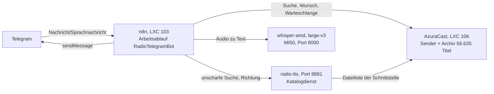
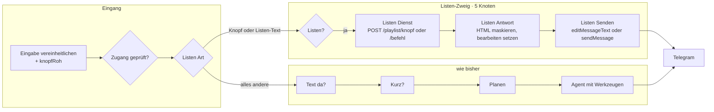
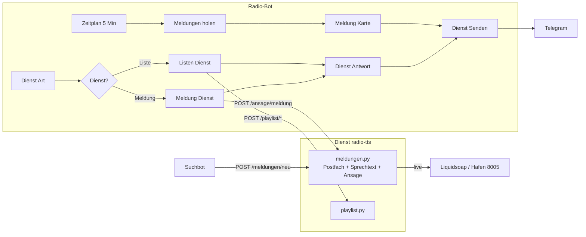

# Architektur des Radiobots

Stand: 2026-09-20

> **Der laufende Bot ist der Agent** (`RadioAgentBot`, **57 Knoten** in sieben Gruppen plus sieben
> Haftnotizen als Rahmen: Stufe 0 Kurzbefehle ohne
> KI → Analyse → Ausführung im Zyklus → Prüfung) + **zwei** Werkzeug-Arbeitsabläufe
> („Werkzeug – Radio" und „Werkzeug – AzuraCast", je 16 Knoten). Aufbau, Werkzeuge,
> Prüfschleife und Fallstricke: **Abschnitte 8 und 9 in `README.md`**, die Anordnung im Plan
> (Gruppen, Rahmen, Anmerkungen): **Abschnitt 10**.
> Mehrere passende Titel kommen als **anklickbare Knöpfe** (`callback_data` `w1`…`w8`, ein Tipp
> wird wie eine getippte Nummer ohne Modell aufgelöst) — Einzelheiten in Abschnitt 9.
> **Sicherung dieser Fassung:** `fassungen/radio-v1-2026-09-20/` (Radio v1, Stand 2026-09-20).
> Alles darunter beschreibt den **früheren** Wunschbot (`RadioTelegramBot`, **50 Knoten**,
> abgeschaltet) und die gemeinsamen Bausteine (Sender, Suche, Spracherkennung, Sofort-Spielen).

### Dreistufiger Aufbau (2026-09-20)

Trennung von **Verstehen**, **Tun** und **Nachsehen** — jede Stufe hat eine eigene
Modellinstanz, damit ein Fehler in einer Stufe die anderen nicht mitreißt:

| Stufe | Knoten im Ablauf | Aufgabe | Modell |
| --- | --- | --- | --- |
| 0 Kurzbefehl | `Kurz?`, `Kurzbefehl?`, `Steuerung?`, `Kurz Steuern`, `Steuerung Antwort` | Liedwunsch, Richtung ("was Peppiges"), Basissteuerung des Senders (skip/start/stop/neustart), Statusfragen und Fehlermeldungen — feste Regeln, feste Adressen | **keins** |
| 1 Analyse | `Planen`, `Plan Antwort`, `Plan da?`, `Plan merken`, `Plan nochmal?`, `Befehle lesen`, `Befehl da?` | Anweisung in **Befehle** zerlegen (JSON `{befehle:[…]}`), nichts am Sender tun; bis zu 3 Anläufe, danach Ersatzbefehl `art=direkt`; leerer Plan antwortet direkt | `qwen3.6:27b`, blanker Aufruf `POST /v1/chat/completions`, 3000 Token |
| 2 Ausführung | `Schleife`, `Direkt oder KI?`, `Ersatz Werkzeug`, `Ausfuehren`, `Ergebnis sammeln`, 6 Werkzeugknoten | **je Befehl** ein Durchlauf: ohne Modell über das Radio-Werkzeug, über die Senderadresse (Steuerung) oder mit dem Agenten (Titel/Richtung/Programm/Verwaltung) | `qwen3.6:27b` **mit** Werkzeugen, 3000 Token |
| 3 Prüfung | `Lage holen`, `Warteschlange holen`, `Befehle und Lage`, `Pruefen?`, `Pruefen`, `Pruefung Antwort`, `Pruefung lesen`, `Nachfassen?`, `Schleife 2`, `Nacharbeiten`, `Nachtrag sammeln`, `Antwort bauen` | Ergebnis **und** Senderzustand interpretieren, Urteil `{pruefung:[{nr,ok,grund}]}`, fehlgeschlagene Befehle einmal nacharbeiten; bei Kurzbefehl oder klarer Fehlermeldung nur Regelurteil | `qwen3.6:27b`, blanker Aufruf, 4000 Token (Nacharbeit als Agent, 3000) |

Der Zustand eines Laufs liegt in den **statischen Daten** des Ablaufs
(`d.lauf.befehle` mit `nr/art/befehl/ausgabe/ok/grund/versuche`, dazu `d.letzteAntwort` für
Bestätigungen und `d.planVersuche`). Die Schleifen geben nur `nr` weiter; zusammengeführt wird
am Ende — so bleiben die Elemente zwischen den Durchläufen klein.

Ausführliche Begründung, Prüftabelle und die Fallstricke (Ausgangsreihenfolge von
`splitInBatches` 3, leerer Modelltext, Tokenbudget/`/no_think`, Trockenlauf) stehen in
`README.md`, Abschnitt 9.

### Früherer Wunschbot (abgeschaltet)

Grundlage: erzeugter Arbeitsablauf `/tmp/radio-telegram.json` (**50 Knoten**, 19 HTTP- und
20 Code-Knoten, ~1290 Zeilen Generator). Diese Datei beschreibt dessen **Aufbau**.
Betrieb, Befehle und Fallstricke stehen in `README.md`.

**Vereinfachung durchgeführt (2026-09-19).** Aus 69 Knoten wurden 50; die Stufen 1–3 des früheren
Plans sind umgesetzt:

* **Sofort und Einreihen laufen über die Dateischnittstelle des Senders**
  (`PUT /files/batch` mit `do: immediate` bzw. `do: queue`). Entfallen sind der Umweg über die
  Wiedergabeliste 9, der Synchlauf `QueueInterruptingTracks`, der zweite Versuch nach 6 s Wartezeit
  (`Wait`-Knoten), die Prüfung „angenommen?", der Ersatzweg über die Wunsch-Schnittstelle samt
  Warteschlangen-Auswertung und der Zeitplan-Zweig zum Aufräumen liegengebliebener Unterbrecher.
* **Suche**: statt der Wort-Ratenkaskade („längstes Wort", „erstes Wort") wird mit den Feldern
  gesucht, die das Sprachmodell getrennt hat — Interpret und Titel.
* **Antworten**: ein Knotenpaar je Abspielart (`Sofort Text`, `Danach Text`) statt sechs Textbauern.

---

## 1. Bausteine



| Baustein | Rolle im Bot |
| --- | --- |
| **n8n** | der ganze Ablauf: Telegram-Eingang, Zerlegen, Suchen, Bewerten, Wünsche ausführen, antworten |
| **AzuraCast** | Archiv, Warteschlange, Dateischnittstelle (`/files/batch`) |
| **radio-tts** | Katalogdienst: `/suche` (unscharf), `/genre` (Richtung/Stimmung/Jahrzehnt), Wortlisten — und das **Listen-Modul** (`/playlist/befehl`, `/playlist/knopf`, `/playlist/vorschlag`, `/playlist/status`) für Wiedergabelisten |
| **whisper-amd** | Sprachnachricht → Text (whisper.cpp `large-v3` auf der MI50, LXC 112, Port 8000) |
| **Telegram** | Eingang und Ausgabe (ein Senden-Knoten für alles) |

## 2. Der Ablauf in Phasen

```mermaid
flowchart TD
  subgraph E[1 Eingang und Zugang · 12 Knoten]
    A1[Trigger oder Testeingang] --> A2[Eingabe vereinheitlichen]
    A2 --> A3{Sprachnachricht?}
    A3 -->|ja| A4[Datei holen → laden → Whisper → deuten]
    A3 -->|nein| A5[Zugang prüfen]
    A4 --> A5
    A5 --> A6{freigegeben?}
  end
  subgraph B[2 Auftrag verstehen · 8 Knoten]
    B1[Auftrag zerlegen<br/>Schraegstrich-Befehle genau] --> B3{Deutung noetig?}
    B3 -->|freier Text oder Sprache| B4[Kontext holen<br/>was laeuft, was lief] --> B5[Verstehen<br/>Sprachmodell qwen2.5:14b]
    B5 --> B6[Auftrag aufteilen<br/>1..N Auftraege]
    B3 -->|Schraegstrich-Befehl| B6
    B6 --> B2{Weiche<br/>6 Zweige}
  end
  subgraph S[3 Suchen · 11 Knoten]
    S1[Suche 1 im Sender] --> S2[Treffer 1] --> S3{2. Suche?}
    S3 --> S4[Suche 2/3 + Treffer 2] --> S5[Kluge Suche<br/>Katalogdienst]
    S6[Genre suchen → waehlen → da?]
  end
  subgraph W[4 Bewerten und Ausführen · 25 Knoten]
    W1[Bewerten je Auftrag] --> W0[Tracks bilden<br/>aus "mehrere Titel" einzelne Elemente]
    W0 --> W2[Auswahlliste oder Abspielplan]
    W2 --> W3[Wunschliste 8 bzw. Sofortliste 9 + Synchlauf]
    W4[Wunsch abgeben + Warteschlange] --> W5[Wunsch Text und Wunsch sammeln<br/>eine Antwort fuer alle Titel]
  end
  subgraph T[5 Antwort · 5 Knoten]
    T1[Text bauen] --> T2[Senden]
  end
  A6 -->|ja| B1
  B2 --> S1
  B2 --> S6
  B2 --> T1
  S5 --> W1
  S6 --> W1
  W3 --> T1
  W4 --> T1
```

### Zahlen

| Phase | Knoten | davon HTTP | Anmerkung |
| --- | --- | --- | --- |
| 1 Eingang und Zugang | 12 | 2 | Sprachnachricht braucht 4 Knoten extra |
| 2 Auftrag verstehen | 8 | 3 | Zerlegen, Kontext, Sprachmodell, Aufteilen (1..N) |
| 3 Suchen | 11 | 5 | drei Sendersuchen + Katalog + Richtung |
| 4 Bewertung/Auswahl | 5 | 0 | `Bewerten` ist mit ~150 Zeilen der größte Code |
| 4 Ausführung | 21 | 5 | Verteiler, Wunschweg, Sofortweg (mit Wiederholung) |
| 5 Antwort und Senden | 6 | 2 | Sammeln der Antworten, ein Senden-Knoten |
| Zeitplan (Aufräumen) | 5 | 2 | alle 10 Minuten, dazu das Modell warmhalten |
| **Summe** | **69** | **25** | 28 Code, 7 IF, 3 Switch, 1 Wait |

### Laufzeit eines Wunsches

| Weg | Aufrufe |
| --- | --- |
| `/jetzt`, `/letzte`, `/hilfe` | 1 HTTP |
| `/wunsch <titel>` (Schrägstrich-Befehl) | Suche 1 → Kluge Suche → Liste 8 → Wunsch → Queue ≈ 5 |
| dasselbe als **freier Text oder Sprache** | + Kontext (2) und Sprachmodell (1) ≈ 8 |
| `/wunsch was aus rock` | Genre → Kluge Suche → Liste 8 → Wunsch → Queue ≈ 6 |
| **mehrere Titel** („drei Lieder von …“) | die Suche einmal, danach je Titel Liste 8 + Wunsch + Queue |
| `/wunsch …` mit sofort | + Liste 9 setzen/leeren, Synchlauf, 6 s Warten ≈ 9 |
| Sprachnachricht | + 3 HTTP (Datei, Audio, Whisper) ≈ 1,5–15 s |
| Sprachmodell (Antwortzeit) | ~0,5–0,7 s, wenn es geladen ist; ~25 s nach 30 Minuten Pause |

## 3. Datenfluss in einem Satz

Jede Nachricht wird auf **einen** Datensatz vereinheitlicht (`chatId`, `text`, `befehl`,
`argument`, `modus`, `richtung`), durchläuft **einen** Such- und Bewertungsschritt, der genau
eine **Aktion** ergibt (`abspielen`, `auswahl`, `nichts`) — und endet in **einem** Senden-Knoten.

## 4. Wo der Aufbau einfacher wird

Belegt am erzeugten Arbeitsablauf, nicht geschätzt:

| Befund | Beleg | Ersparnis |
| --- | --- | --- |
| **Zwei Senden-Knoten sind zeichengleich** (nur Name/Position unterscheiden sich) | Vergleich der Parameter: identisch | 1 Knoten, 4 Kanten |
| **Weiche: 3 Zweige führen zum selben Knoten** (`wunsch`, `sofort`, `suche` → `Suche 1`); der Unterschied steckt schon in `modus` | 8 Regeln, 3 identische Ziele | 3 Zweige weniger; 1 Regel statt 3 |
| **Suchkaskade ist überholt.** `Suche 2/3` + `Treffer 2` + 2 IF-Knoten (7 Knoten, bis 2 HTTP-Aufrufe) stammen aus der Zeit vor dem Katalogdienst. Die unscharfe Suche findet Tippfehler und Einzelwörter besser und in einem Aufruf | Katalog liefert in 0,03–1,1 s; `Bewerten` mischt beide Quellen ohnehin | 5–7 Knoten, 1–2 HTTP |
| **Sofortkette: 9 Knoten** für „Liste 9 setzen → syncen → 6 s warten → syncen → Liste leeren → prüfen" | `Sofort merken`, `Sofort vergessen`, `Sofort pruefen` sind reine Zustandsverwalter | 2–3 Knoten (Zustand in `Abspielplan`/einem Code-Knoten) |
| **6 Textbauer** (`Jetzt Text`, `Verlauf Text`, `Wunsch Text`, `Sofort Text`, `Ende Text`, `Gehoert Text`) mit je eigenem Senden | 5 Knoten enden in `Senden` | 1 Antwortknoten mit Switch → 4 Knoten, aber 1 Stelle für Formatfragen |
| **Der Moderator wird nicht erzeugt**, sondern als `moderator-import.json` abgelegt und von `moderator-zurechtmachen.py` nachträglich gepatcht | zwei Werkzeuge für einen Ablauf; Adressen mit `=` müssen von Hand nachgezogen werden | eine Quelle statt zwei |
| **Generator: 1267 Zeilen**, davon 611 Zeilen JavaScript in 20 Textblöcken; die `Weiche`-Regeln sind 8-fach ausgeschriebene JSON-Gebilde (~120 Zeilen) | `grep -c '_JS = r"""'` = 20 | Helfer `regel(links, rechts)` und `zweig(...)`; JS in eigene Dateien |

### Vorschlag in Stufen

1. **Zeichengleiche Knoten zusammenlegen** (Senden, Weiche-Zweige): reine Aufräumarbeit, kein
   Verhalten ändert sich. 60 → 56 Knoten.
2. **Suchkaskade auf zwei Aufrufe verkürzen:** `Suche 1` (Sender) und `Kluge Suche` (Katalog)
   müssen bleiben; `Suche 2/3`, `Treffer 2`, `Zweite/Dritte Suche?` entfallen. `Treffer 1`
   übernimmt nur noch die Fehlermeldung des Senders. 56 → ~50 Knoten, weniger Aufrufe, weniger
   Stellen mit Bewertungslogik.
3. **Sofortkette straffen:** Zustand in `Abspielplan` mitschreiben, `Sofort vergessen`/`Sofort
   pruefen` zusammenlegen, Warten/Retry als einen Schritt mit Bedingung. 50 → ~46 Knoten.
4. **Antworten vereinheitlichen:** ein Knoten `Antwort bauen` mit Switch auf die Aktion statt
   sechs Textbauern. ~44 Knoten.
5. **Bauplan teilen:** Generator in `bauplan/` (Knoten und Kanten), `js/` (die Code-Bausteine als
   eigene Dateien) und `texte/` (Hilfe-, Wunsch-, Fehlertexte) zerlegen; den Moderator aus
   demselben Bauplan erzeugen statt zu patchen.

Nach Stufe 2 sind es ~50 statt 60 Knoten und je Wunsch ein bis zwei Aufrufe weniger; die
Wartungslast sinkt vor allem durch Stufe 5, weil dann Texte und Code ohne Generator-Kenntnisse
änderbar sind.

---

## 5. Der Wiedergabelisten-Zweig (2026-09-20)

Mehrschichtige Aufgaben rund um den Sender — Listen bauen, im Telegram-Menü auswählen,
abspielen — laufen **nicht** durch Analyse und Sprachmodell, sondern in einem eigenen Zweig
hinter der Betreiberprüfung. Die Logik liegt bewusst nicht im Ablauf, sondern im Dienst
`radio-tts` (`playlist.py`): sie braucht Zustand über mehrere Nachrichten hinweg und ist dort
ohne n8n prüfbar.



| Knoten | Rolle |
| --- | --- |
| `Listen Art` | Knopf des Menüs (`p1`…`p8`, `pa`, `pk`, `pf`, `px`, `l1`…, `j`, `n`, `v`) oder Text mit Listenwort **und** Tuwort |
| `Listen?` | Weiche: ja = eigener Zweig, nein = unveränderter Weg |
| `Listen Dienst` | ein Aufruf an das Listen-Modul, je nach Art Knopf oder Befehl |
| `Listen Antwort` | Antwort aufbereiten; Menü wird **bearbeitet** statt neu gesendet |
| `Listen Senden` | `editMessageText` (Menü) oder `sendMessage` |

Der Dienst antwortet mit `{antwort, tastatur, bearbeiten}` — der Bot kennt keine
Listenlogik, er reicht Text und Knöpfe durch. Damit kostet ein Schritt 0,2–0,7 s statt ~45 s
über den Agenten. Details, Befehle, Messwerte und Fallstricke: `README.md` §11.

---

## 6. Der Meldungs-Zweig: Suchbot und Moderation (2026-09-20)

Ein fremder Bot („Suchbot": Wetter, RSS-Feeds, Nachrichten) legt Meldungen in einem
**Postfach** ab (`dienst/meldungen.py` im Dienst `radio-tts`). Der Radio-Bot holt sie ab,
legt sie dem Betreiber im Telegram mit „▶️ Vorlesen" / „🗑️ Verwerfen" vor und spricht sie
auf Freigabe über den **DJ-Hafen** des Senders live in das laufende Programm
(Piper → MP3 → `input.harbor`, Port 8005; danach läuft der AutoDJ weiter).



| Baustein | Rolle |
| --- | --- |
| `meldungen.py` | Postfach (`/meldungen/*`), Textaufbereitung, Ansage (`/ansage/*`) |
| `Dienst Art` | eine Weiche für **beide** Dienste: Listenknoepfe, Meldungsknoepfe, Listentexte |
| `Meldung Dienst` | ruft `/ansage/meldung` bzw. `/meldungen/erledigt` auf (Zeitablauf 5 Minuten) |
| `Zeitplan Meldungen` … `Meldung anbieten` | Postfach alle 5 Minuten prüfen, Karte senden, als vorgelegt merken |
| `Werkzeug Meldungen` | Werkzeug `meldungen` im eigenen Ablauf `MeldungenWerkzeug` (Aufträge: anzeigen, lesen, ansagen, verwerfen, text) |

**Wichtig für den Bestand**: der bestehende Weg (Musikwunsch, Steuerung, Verwaltung über
den Agenten) ist unberührt. Die Dienstlogik liegt in Python, nicht im Ablauf — deshalb ist
sie ohne n8n prüfbar und ohne Ablaufumbau änderbar (`README.md` §12).
