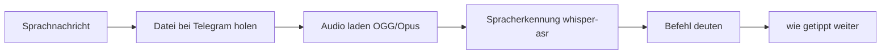
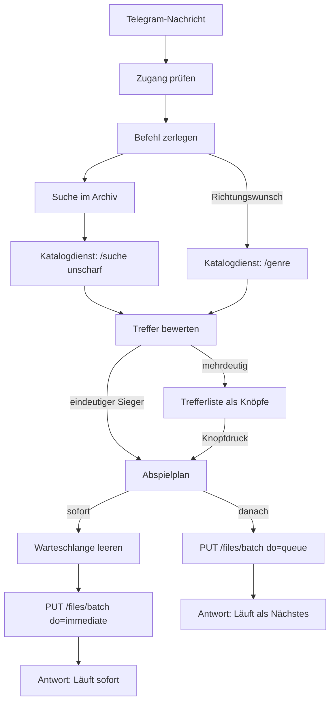
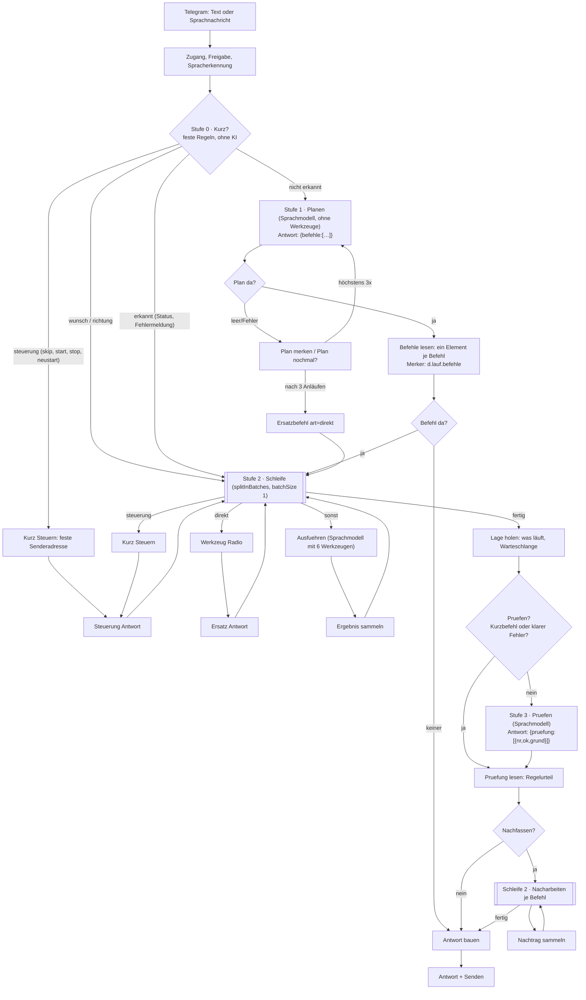
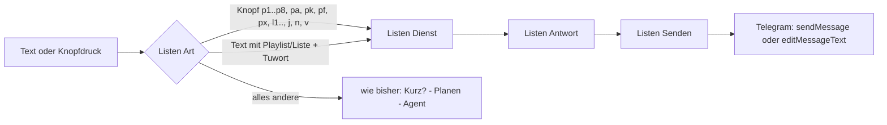
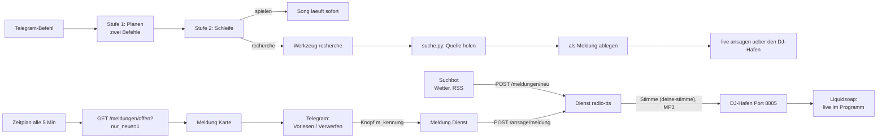

> **Entwicklungsdokumentation.** Die ausführliche Arbeitsfassung des Projekts
> (Aufbau, Entscheidungen, Knotenzahlen, Vorschläge zum Vereinfachen). Die
> aufbereiteten Bände für den Leser stehen in `DOKU/`; die Bilder liegen eine
> Ebene höher (`../ablauf-bot-*.png`). Frühere Versionssicherungen (`fassungen/`,
> v1–v21) wurden am 25.09.2026 entfernt — sie liegen gesammelt unter
> `<projektordner>/sicherungen/`.

# Radio "Deadline Beats" – Wunschbot und Moderator

Ein Telegram-Bot, der das Musikarchiv des eigenen Radios durchsucht — **unscharf** (auch bei
Tippfehlern und verhörten Sprachnachrichten) und **nach Richtung** („was aus rock", „etwas
ruhiges", „90er") — Titel sofort spielt oder einreiht. Dazu ein KI-Moderator, der Ansagen selbst
spricht und über den Sender ausspielt. Freier Text und Sprachnachrichten gehen an ein
**Sprachmodell** auf der 3090 Ti — damit versteht der Bot auch mehrere Aufgaben in einer
Nachricht und Bezüge auf das Laufende („davon noch zwei").
Die Dienstquellen liegen in `dienst/`, die Werkzeuge in `werkzeuge/`.

**Zweisprachig (seit 2026-09-25):** Der Bot versteht **deutsche und englische**
Nachrichten in **einem** Chat und antwortet in der Sprache der Frage — Kurzbefehle,
Werkzeuglisten, Modellantworten und Ansagen. Die Sprache wird am Eingang erkannt
(`sprache_raten` im Erzeuger) und reist als Feld `sprache` mit; Inhalte (Nachrichten,
Wetter) bleiben deutsch.

**Aufbau des Arbeitsablaufs, Knotenzahlen und Vorschläge zum Vereinfachen: [ARCHITEKTUR.md](ARCHITEKTUR.md).**
**Sprachmodell (Einrichtung, Warmhalten, Prüfen): [dienst/sprachmodell.md](../../dienst/sprachmodell.md).**

Stand: 2026-09-19

> **Der laufende Bot ist der Agent** („Radio – Telegram-Agent", `RadioAgentBot`) — siehe
> **Abschnitt 8**. Die Abschnitte 2 bis 7 beschreiben den früheren Wunschbot
> (`RadioTelegramBot`, abgeschaltet) und die gemeinsamen Bausteine: Senderanbindung,
> Sofort-Spielen, Suche, Spracherkennung, Testen. Sie gelten weiter, wo sie den Sender,
> die Suche und den Testweg betreffen.

---

## 1. Die drei Bausteine

| Baustein | Wo | Zweck |
| --- | --- | --- |
| **AzuraCast** | LXC `106` auf **192.168.178.163** (Datenserver) | Der Sender selbst: Archiv (56.635 Titel), Wiedergabelisten, Warteschlange, Icecast-Ausgabe |
| **n8n** | LXC `103` auf **192.168.178.32** (ai-server), IP `192.168.178.53`, Port 5678 | Steuerung: Telegram-Bot, Wunschlogik, Arbeitsabläufe |
| **radio-tts** | Docker-Container im LXC `103`, Ordner `/opt/radio-tts`, Port 8881 | Deutsche Sprachausgabe (**Vorgabe: eigene Stimme `deine-stimme`**, Piper wählbar), Live-Einspielung über den DJ-Zugang **und der Katalogdienst** (unscharfe Suche, Richtungsvorschläge) |
| **whisper-amd** | LXC `112` auf dem ai-server, **192.168.178.188:8000** | Spracherkennung für Sprachnachrichten: **whisper.cpp + Vulkan, `large-v3` auf der MI50** (seit 2026-09-23; Quelle `dienst/whisper-amd/`) |
| **whisper-stt** (Rückfall) | LXC `105`, Port 18790 | früherer Dienst (faster-whisper `large-v3` auf der 3090 Ti) — bleibt als Ausweichweg |
| **Ollama** | LXC `105` „ollama.nvidia“ auf dem ai-server, **192.168.178.187:11434**, RTX 3090 Ti | Sprachmodell **`qwen3.6:27b`**, angesprochen über die OpenAI-Schnittstelle (`/v1`): deutet freien Text und Sprachnachrichten und wählt das Werkzeug |

**Sender-Weboberfläche:** http://192.168.178.33 · **Stream:** http://192.168.178.33/listen/deadline_beats/radio.mp3
**n8n-Oberfläche:** https://DEIN-N8N-HOST

### Zugangsdaten

| Was | Wo |
| --- | --- |
| Sender-Zugang (Web, DJ, Schnittstelle) | `/var/azuracast/radio-zugang.txt` (600) im Container `azuracast`; Kopien: `/root/azuracast-zugang.txt` auf `.163` und `proxmox-ssh/azuracast-zugang.txt` |
| Schnittstellenschlüssel | `/var/azuracast/api_key.txt` (600) — Kennung `DEINE-API-SCHLUESSEL-KENNUNG`, Kommentar „Copilot" |
| DJ-Passwörter | `/var/azuracast/dj_passwort.txt` (600, Betreiber `betreiber`) und `/var/azuracast/bot_streamer_passwort.txt` (600, Bot-Konto `deine-stimme` für die Ansagen — Anzeigename „DEINE-STIMME“), Hafenzugang Port 8005 |
| Telegram-Bot | Anmeldedaten „Telegram account 2" in n8n (`DEINE-TELEGRAM-ZUGANGSKENNUNG`), Bot **@Kevin_N8N_BotBot**, Anzeigename *Kevin* |
| Schlüssel für den Testeingang | `NACHBAU/zugangsdaten/bot-test-schluessel.txt` (600) — steht zusätzlich in den statischen Daten des Arbeitsablaufs |

Zugriff auf die Container jeweils:

```bash
CFG=~/.ssh/config
# Sender
ssh -i ~/.ssh/id_ed25519 root@192.168.178.163 \
    "pct exec 106 -- docker exec azuracast bash -lc '<befehl>'"
# n8n
ssh -F $CFG ai-server "pct exec 103 -- bash -lc '<befehl>'"
```

---

## 2. Der Wunschbot in Telegram

Arbeitsablauf in n8n: **„Radio – Telegram-Wunschbot"**, Kennung `RadioTelegramBot`, aktiv.

### Befehle

| Befehl | Wirkung |
| --- | --- |
| *(Text ohne Befehl)* | „spiele Juliet von Modern Talking" – sucht und spielt **sofort** |
| `/sofort <titel>` | dasselbe ausdrücklich: sofort spielen |
| `/wunsch <titel oder interpret>` | reiht den Titel ein, ohne zu unterbrechen |
| `/danach`-Wörter | „… und **danach** etwas von Nirvana" reiht den zweiten Titel ein |
| `/suche <titel>` | zeigt nur die Trefferliste zum Auswählen |
| `/wunsch was aus rock` | **Richtungswunsch**: der Bot sucht selbst etwas Passendes aus |
| `/wunsch etwas ruhiges` | dasselbe für Stimmungen und Jahrzehnte (`90er`, `80er`) |
| `/jetzt` | was läuft, wie lange noch, was danach kommt, Zuhörerzahl |
| `/letzte` | die zuletzt gespielten Titel mit Uhrzeit (`🎁` = Musikwunsch) |
| `/hilfe` | Übersicht |
| **Sprachnachricht** | wird erkannt und wie ein Befehl behandelt (siehe unten) |
| *(Text ohne Befehl)* | wird vom Sprachmodell gedeutet (siehe unten) |

Das Telegram-Befehlsmenü ist eingerichtet (`setMyCommands`), die Befehle
erscheinen also direkt im Bot.

### Verstehen: Sprache, mehrere Aufträge, Bezug auf das Laufende

Freier Text und Sprachnachrichten gehen an ein **Sprachmodell** (`qwen2.5:14b` auf dem
ai-Server, siehe die Bausteine in Abschnitt 1). Es wandelt den Satz in eine **Liste von Aufträgen** um, die
dann einer nach dem anderen abgearbeitet wird. Beispiele aus dem Betrieb:

| Gesagt/geschrieben | Was der Bot tut |
| --- | --- |
| „spiele sofort Benzin von Rammstein **und danach** etwas von Nirvana“ | Benzin sofort, Nirvana danach in die Warteschlange — zwei Aufträge aus einem Satz |
| „mach **drei Lieder** von den Ärzten an“ | reiht **drei** verschiedene Titel ein und antwortet mit *einer* Sammelnachricht |
| „**davon** hätte ich gern noch zwei“ | löst „davon“ über das Laufende/Zuletztgehörte auf und reiht zwei weitere Titel ein |
| „Ure mehrere Ärzten“ (verhört) | erkennt „Die Ärzte“ und die Menge trotz Erkennungsfehler |
| „spiele mal was Ruhiges“ | Richtungssuche (Stimmung) |
| „was läuft gerade und wie viele hören zu“ | Statusantwort |

Der Bot schickt dem Modell dabei **den Kontext mit** (was läuft gerade, was lief zuletzt).
Der Systemhinweis enthält den Befehlssatz, die 45 häufigsten Interpreten des Archivs und die
Richtungs-/Stimmungswörter — alles beim Erzeugen des Arbeitsablaufs aus dem Katalogdienst
geladen, damit es nur eine Quelle gibt. Antwortet das Modell nicht, gilt der alte Weg
(freier Text = Musikwunsch, Richtungswörter werden erkannt) — der Bot führt trotzdem aus.
Schrägstrich-Befehle (`/wunsch`, `/jetzt`, …) gehen **nicht** über das Modell, sondern werden
genau zerlegt; das ist der schnelle Weg.

### Knöpfe

> Gilt für den **früheren** Wunschbot. Der laufende Agent nutzt eine eigene Kennung
> (`w1` … `w8`, ohne Doppelpunkt und 1-basiert) — siehe Abschnitt 9.

* **Trefferliste** – bis zu fünf Vorschläge als Knöpfe (`w:<nr>`). Der Zwischenspeicher
  gilt eine Stunde, danach meldet der Bot „Auswahl abgelaufen".
* **🔀 Lieber sofort spielen** bzw. **⚠️ Trotzdem sofort spielen** – erscheint nach einem
  eingereihten Wunsch und auch dann, wenn der Sender den Wunsch abgelehnt hat (z. B.
  Sperrfrist „wurde zu kürzlich abgespielt"). Der Knopf heißt `s:` und nimmt den zuletzt
  gemerkten Titel.

### Betreiber

Der Bot ist **auf einen Betreiber beschränkt**: die Liste `erlaubte` steht in den
statischen Daten des Arbeitsablaufs. Ist sie leer, wird der **erste schreibende
Telegram-Chat** automatisch Betreiber — also einmal `/start` an @Kevin_N8N_BotBot
schicken, danach ist der Bot gesperrt für alle anderen.

Der Testeingang (siehe unten) verlangt zusätzlich den geheimen Schlüssel; ohne ihn
antwortet der Bot nur „Kein Zugang" und trägt niemanden ein.

### Sprachnachrichten

Eine Sprachnachricht (oder Tonaufnahme) wird erkannt, in Text umgewandelt und wie ein
getippter Befehl behandelt. Der Bot antwortet zuerst mit einer Rückmeldung, was er
verstanden hat (`🎧 Verstanden: »…«`), danach folgt das Ergebnis.



**Deutung:** Zuerst wird der Befehl erkannt, dann werden Füll- und Stoppwörter entfernt
(„spiele bitte sofort Benzin von Rammstein“ → `/sofort Benzin Rammstein`). Erkannt werden:

| Gesprochen | Wird zu |
| --- | --- |
| „spiele …“, „ich möchte … hören“, „leg … auf“ | `/wunsch …` |
| „spiele sofort …“, „gleich …“, „unterbrich mal“ | `/sofort …` |
| „suche …“, „finde …“, „zeig mir …“ | `/suche …` |
| „was läuft gerade“, „wie heißt der Titel“ | `/jetzt` |
| „was lief vorher“, „letzte Titel“ | `/letzte` |
| „hilfe“, „was kannst du“ | `/hilfe` |

Die Filterung arbeitet über **Wortstämme**, damit auch „hören“/„spielen“/„laufen“ als
Füllwort erkannt werden. Bleibt nach dem Filtern nichts übrig, sucht der Bot dennoch mit
dem ungefilterten Rest. Wird gar nichts verstanden, kommt „🎧 Ich habe nichts verstanden“.

### Immer ausführen, nie ablehnen

Der Betreiber ist der einzige Nutzer — Befehle werden **immer** ausgeführt. Dafür gilt:

* **Keine Sperrfrist im Sender:** `request_threshold` steht auf **0**. Vorher (15 Minuten) wurde
  jeder Titel abgelehnt, der eben lief („Dieser Song oder Interpret wurde zu kürzlich
  abgespielt."). Geändert per `PUT /api/admin/station/1` mit dem **kompletten** Objekt aus dem
  vorherigen `GET` (siehe Fallstrick 10).
* **Klare Zuordnung → direkt spielen:** findet die Suche einen Treffer mit ≥ 60 Punkten, wird er
  ohne Rückfrage gespielt. Die Auswahlliste erscheint nur bei ausdrücklichem `/suche` oder wenn
  nichts Ordentliches gefunden wurde.
* **„Schon gewünscht" ist kein Fehler:** Antwortet der Sender „This song was already requested
  and will play soon.", gilt der Wunsch als erfüllt — der Bot schreibt „Eingereiht in der
  Warteschlange. ℹ️ Der Titel stand schon auf der Wunschliste."
* **Ersatzzweig:** Lehnt der Sender den Wunsch aus einem anderen Grund ab, spielt der Bot den
  Titel automatisch sofort (Unterbrecher). Klappt auch das nicht, sagt er es ehrlich — ohne
  Schleife und ohne Wiederholung.

### Suchen: unscharf, nach Richtung, aus dem Zusammenhang

Die normale Suche des Senders findet nur, was buchstabengenau passt. Ein **Katalogdienst**
im Container `radio-tts` (`dienst/katalog.py`, Port 8881) hält darum das ganze Archiv
(56.635 Titel) als eigenen Index vor und beantwortet drei Fragen:

| Endpunkt | Zweck |
| --- | --- |
| `GET /suche?q=&anzahl=&min_punkte=` | unscharfe Suche (Tippfehler, verhört Gesprochenes) |
| `GET /genre?wort=&anzahl=&mischen=` | Vorschläge zu einer Richtung, Stimmung oder einem Jahrzehnt |
| `GET /genre/liste` | Richtungs- und Hilfsworte (der Bot holt sie beim Bauen) |
| `GET /katalog/kuenstler?anzahl=` | häufigste Interpreten als Hinweis für die Spracherkennung |
| `POST /katalog/aktualisieren` | Katalog neu aus dem Sender holen (≈ 47 s) |
| `GET /katalog/status` | Zustand: Anzahl, Stand, Dauer des Aufbaus |

**Aufbau der unscharfen Suche** (`suche()`):

* `normalisieren()` legt Umlaute um (ä→ae …), Sonderzeichen werden zu Leerzeichen.
* Ein **Buchstaben-Bitmuster** (26 Bit) filtert die Kandidaten vor: erst streng über die
  Buchstaben von Interpret + Titel + Album, dann lockerer, zuletzt über das längste Wort.
  Ohne diesen Vorfilter dauerte eine Suche 4,4 s, mit ihm **0,03–1,1 s**.
* Bewertet wird je Suchwort mit `difflib.SequenceMatcher`; die Treffer gehen **längengewichtet**
  ein — ein sicheres langes Wort („rammstein") überstimmt ein verhörtes kurzes („Ben Zim").
* **Kernprüfung:** irgendein Suchwort muss als Ganzwort (oder mit ≥ 0,72 Ähnlichkeit) in
  **Interpret oder Titel** sitzen. Ohne sie zogen Anklänge aus Album- und Pfadnamen Unsinn nach
  oben — „Ben Tim Rammstein" (verhört) landete bei 50 Cent, weil „tim" als Teil von
  „every**tim**e" anschlug. Genau deshalb wird als **Ganzwort** geprüft.
* Abgezogen werden Videos und Ansagen; angespielte Bruchstücke (unter 45 s) fallen nach unten.

**Richtungswünsche** (`genre_vorschlag()`): Steht im Text *nur* eine Richtung („was aus rock",
„mal metal", „etwas ruhiges", „90er"), erkennt der Bot das schon beim Zerlegen (`Befehl`, siehe
`genreWort`) und fragt den Dienst statt den Sender. Der Dienst:

* ordnet das Wort über 71 Stichwörter (`SYNONYME`) mehreren Richtungen zu („deutschrap" →
  Hip-Hop/Rap, „hartes" → Metal/Punk/Hardrock), erkennt Stimmungen (`STIMMUNG_GEGEN` sperrt
  Gegenrichtungen: „ruhiges" zieht keine Metal-Ballade) und versteht Jahrzehnte;
* berechnet für jeden Titel die **Reinheit** (passende Genre-Wörter ÷ alle Genre-Wörter des
  Titels) und mischt danach aus den besten Kandidaten — so kommt bei „etwas ruhiges" nicht Alice
  Cooper, obwohl der „Ballads" mit im Genre stehen hat;
* liefert bei einem Jahrzehnt **Jahrestreffer** (Albumjahr zwischen `von` und `bis`, ohne
  Genrezwang, unter 2 Minuten aussortiert) und sagt den Zeitraum als Hinweis mit;
* kennt Mehr-Suchtiefe: findet die strenge Prüfung zu wenig, wird gelockert; findet gar nichts,
  läuft im Bot die normale Suche als Rückfall — der Kunde bekommt nie nur ein „geht nicht".

**Der Weg im Bot:** Die **Kluge Suche** (HTTP-Knoten auf `/suche`) läuft bei *jedem* Wunsch mit;
`Bewerten` führt die Treffer der Sender-Suche und der unscharfen Suche zusammen, entfernt Dubletten
und lässt die Punkte entscheiden. Ist es ein Richtungswunsch, wird die Reihenfolge des Dienstes
beibehalten (es gibt ja keine Wörter zu treffen) und direkt gespielt; die Antwort nennt die
Richtung. Für solche Fälle kommt der Zweig `Genre suchen` → `Genre waehlen` → `Genre da?`:
findet der Dienst nichts, geht es über die normale Suche weiter.

**Der Katalog nach dem Anlegen neuer Titel:** `POST /katalog/aktualisieren` (oder Neustart des
Containers, der ihn beim Start aufbaut, wenn die Datei fehlt). Die Datei liegt in `./daten/katalog.json`
(≈ 44 MB, Aufbau ≈ 47 s, Speicherbedarf des Containers ≈ 215 MB).

**Was das Archiv hergibt:** Es ist überwiegend Rock und Metal (56.635 Titel). Richtungen wie
„metal" (2.010 Treffer), „rock" (10.477) und „90er" (3.746) sind reich gefüllt; **ruhige Musik gibt
es fast nicht** — bei „etwas ruhiges" bleiben nach der strengen Prüfung 71 Titel, praktisch alle von
den Backstreet Boys. Der zweite Stolperstein sind die **Sammler-Genres**: tausende Titel tragen
denselben langen Tag (`Rock | Hard Rock | Heavy Metal | … | Folk`), der alles gleichzeitig ist.
Bei Stimmungswünschen werden solche Einträge deshalb übersprungen (> 4 Genre-Wörter) und erst ab
90 Sekunden Laufzeit zugelassen.

### Der Weg eines Wunsches



Es gibt **keine** Wiedergabelisten und **keine** Wunsch-Schnittstelle mehr im Weg: der Befehl geht
unmittelbar an den Sender (Abschnitt 3).

**Die Bewertung** (Knoten `Bewerten`) ist der Kern der Datenverarbeitung:
* **Titel und Interpret getrennt** (die Felder der Deutung): exakter Titel +130, Anfang +90,
  enthalten +60 · exakter Interpret +110, enthalten +60. Damit wird „Du hast" von Rammstein nicht
  gegen den ganzen Satz „Rammstein Du hast" gemessen.
* exakter Titel +130, Anfang +95, enthalten +75 · Interpret exakt +110, enthalten +65 (auf die
  ganze Eingabe bezogen)
* Abdeckung der Suchwörter über Titel, Interpret, Album und Pfad: bis +55
* Wortbonus je Wort in Titel (+12) bzw. Interpret (+8)
* Musikdatei +6, Video −14, Ansagen-Ordner (`moderation/`) −60
* Länge zwischen 0 und 15 Minuten +6, sonst −25; Bruchstücke unter 45 s zusätzlich −35
* Treffer der unscharfen Suche bringen ihre Ähnlichkeitspunkte (`punkteFuzzy`) mit
* Dubletten (gleicher Interpret + Titel) werden zusammengefasst, die fünf besten bleiben
* **Fassungen und Titelnummern** zählen nicht als verschiedene Vorschläge: „Juliet",
  „Juliet (remastered)" und „Juliet (Jeo's remix)" sind ein Treffer, „01. Smells Like Teen Spirit"
  ist „Smells Like Teen Spirit". Ohne das fragte der Bot bei eindeutigen Wünschen nach.

Gesucht wird über **vier Wege**, die Bewertung führt sie zusammen:

| Weg | Quelle | Suchbegriff |
| --- | --- | --- |
| `Suche 1` | Sender, `/files?searchPhrase=` | die ganze Eingabe |
| `Kluge Suche` | Katalogdienst, `/suche` | die ganze Eingabe, unscharf (Tippfehler-tolerant) |
| `Suche 2` | Sender, `/files?searchPhrase=` | der **Interpret** aus der Deutung |
| `Suche 3` | Sender, `/files?searchPhrase=` | der **Titel** aus der Deutung |

Die Wege 2 und 3 sind der Kern der Verbesserung vom 2026-09-19: gesucht wird mit den Feldern, die
das Sprachmodell **getrennt** hat. Aus „spiele raamstein du hast" wird Interpret *Rammstein* + Titel
*Du hast*; den Titel gibt es im Archiv nicht, also bleiben die übrigen Titel des **richtigen**
Interpreten übrig — der Bot zeigt sie zur Auswahl. Vorher stand die falsche Schreibweise des
Interpreten im Weg. Beispiel „oops i did it again": über den Titel findet der Sender 105 Dateien, an
der Spitze steht *Britney Spears – Oops!…I Did It Again*. Erst wenn alle vier Wege leer bleiben,
meldet der Bot „Nichts gefunden" mit Tipps.

**Spielen oder fragen?** Gespielt wird, wenn der beste Treffer klar vorn liegt (≥ 90 Punkte und
≥ 20 Punkte Vorsprung), wenn es ein Richtungswunsch ist (`/genre`) oder wenn **nur ein Interpret**
genannt wurde („leg mal was von den toten hosen auf"). Sonst zeigt der Bot bis zu fünf Treffer als
Knöpfe — auch schwache. Der Betreiber kommt damit entweder direkt auf den Titel oder bekommt eine
Auswahl im Chat.

### Spracherkennung: bestes Modell auf der Grafikkarte

Der Dienst läuft auf dem **ai-Server** (LXC 105, RTX 3090 Ti) unter
`http://192.168.178.187:18790/transcribe` — `whisper_server.py`, Modell **`large-v3`**
(faster-whisper, `int8_float16` auf CUDA). Vorher lief im Bot-Container der CPU-Dienst
`whisper-asr` mit `faster-whisper-small`; das große Modell versteht Eigennamen deutlich besser.

Drei Einstellungen machen den Unterschied:

* **Sprache fest auf `de`** statt Autokennung — kurze Sätze werden sonst gelegentlich als Englisch
  erkannt. **Englisch funktioniert trotzdem** (am 2026-09-25 geprüft: `large-v3`
  transkribiert englische Sprachnachrichten auch mit `de`-Hinweis sauber; der Bot
  erkennt die Sprache danach am Text).
* **Hinweistext (`initial_prompt`)**: der Bot schickt die 45 häufigsten Interpreten des Archivs mit
  (`GET /katalog/kuenstler`), gebaut beim Erzeugen: „Musikwunsch an einen Radiosender. Bekannte
  Interpreten: Nirvana, Alice Cooper, Scooter, …". Whisper benutzt das als Kontext und trifft
  Eigennamen dadurch häufiger.
* `vad_filter` und `condition_on_previous_text=false` gegen Leerlauf und Wiederholungen.

Gemessen am 2026-09-19 (Piper-Stimme `de_DE-eva_k-x_low` → Whisper):

| gesprochen | vorher (`small`) | jetzt (`large-v3`) |
| --- | --- | --- |
| „mach mal mehrere Lieder von den Ärzten an" | „Ure mehrere Ärzten" | „Mach mal mehrere Lieder von den Ärzten an." |
| „Ich hätte gern was von Nirvana" | verhört | „Ich hätte gern was von Nirvana." |

Selbst wenn Restfehler bleiben, greift die Deutung: „Spiele bitte Juliet von Modern Talking" wurde
als *Julid* erkannt, das Sprachmodell machte daraus Interpret *Modern Talking* + Titel *Juliet* und
der Titel lief sofort.

## 3. Sofort spielen: ein Befehl an den Sender

Der Bot legt **keine Wiedergabelisten mehr an** und benutzt auch nicht mehr die Wunsch-Schnittstelle
(`/request/…`). Beide Wege haben Hürden: eine Sperrfrist für Wünsche, „This song was already
requested", „This song or artist was played too recently" und die Regel, dass der Sender nur **einen**
Unterbrecher gleichzeitig annimmt (`Interrupting queue: Queue is not empty!`). Der Bot schickt den
Befehl deshalb unmittelbar an die **Dateischnittstelle** des Senders:

```bash
PUT /api/station/1/files/batch   {"do": "immediate", "files": ["<Pfad>"]}   # sofort
PUT /api/station/1/files/batch   {"do": "queue",     "files": ["<Pfad>"]}   # danach
```

* `immediate` ist genau der Knopf **„Play Now"** in der Dateiliste des Senders
  (`BatchAction::doPlayImmediately`) — der Titel geht in die unterbrechende Warteschlange
  (`interrupting_requests`) und schneidet die AutoDJ-Rotation ab.
* `queue` ist **„Queue"** und hängt den Titel hinten an.

**Vorher wird die Warteschlange geleert.** Der Sender spielt Unterbrecher nämlich *der Reihe nach*:
liegt dort noch ein Wunsch, startet der neue erst nach ihm — bei vier Wünschen also nach 16 Minuten.
Der Bot schickt deshalb zuerst:

```bash
PUT /api/admin/debug/station/1/telnet   {"command": "interrupting_requests.flush_and_skip"}
```

Das ist die offizielle AzuraCast-Schnittstelle für Liquidsoap-Befehle (der Rohkanal ist
`POST http://127.0.0.1:8004/telnet` mit dem Kopf `x-liquidsoap-api-key`; Port 8004 ist **nicht**
nach außen veröffentlicht). `flush_and_skip` wirft die wartenden Einträge weg **und** beendet den
gerade laufenden Unterbrecher. Danach geht der neue Titel sofort raus — **der neueste Wunsch
gewinnt immer**, ältere wartende Wünsche verfallen dabei (so gewollt: der Betreiber will hören, was
er zuletzt gesagt hat).

Belegte Wirkung (14:43, drei Wünsche im Abstand von je 3 s):

```text
14:43:18 [interrupting_requests] Prepared "…/05. Lithium.mp3" (RID 481)   <- läuft
14:43:24 [interrupting_requests] Prepared "…/09 - Benzin - Rammstein…"    <- schneidet ab
14:43:30 [interrupting_requests] Prepared "…/01 Lady.flac" (RID 485)      <- schneidet ab
```

**Beide Wege kennen keine Sperre.** Ein neuer Wunsch geht immer durch; nichts wird abgelehnt und
nichts fällt still in eine Warteschlange zurück.

Was dabei zu wissen ist:

* Ist die unterbrechende Warteschlange frei, startet der Wunsch **sofort** — mitten im laufenden
  Titel (der wird ausgeblendet).
* Ist dort noch ein Wunsch unterwegs, reiht sich der neue **dahinter** ein und startet, sobald der
  vorige fertig ist. Es geht nichts verloren, mehrere Wünsche werden der Reihe nach gespielt.
* Die Wiedergabelisten des Senders (8 „Wuensche", 9 „Wuensche sofort") werden vom Bot **nicht mehr
  angefasst**. Sie bleiben für die Wunsch-Funktion auf der Shop-Seite bestehen; der Zeitplan-Zweig,
  der liegengebliebene Unterbrecher aufräumte, ist entfallen.

Nachweis im Protokoll des Senders
(`/var/azuracast/stations/deadline_beats/config/liquidsoap.log`):

```text
13:51:07 [next_song:3] Prepared "/data/Die Ärzte/[1998] 13/01 Lady.flac" (RID 442).   <- AutoDJ
13:53:42 [interrupting_requests:3] Prepared "/data/Modern Talking/[2002] Juliet/…"     <- Wunsch,
         mitten im laufenden Titel
14:00:55 [interrupting_requests:3] Prepared "/data/Die Ärzte/[1998] 13/01 Lady.flac"   <- naechster
         Wunsch, direkt im Anschluss
```

## 4. Der KI-Moderator

Arbeitsablauf **„Radio – AI-Moderator"**, Kennung `bjFSfXGqpLg7AAXw`, aktiv.

Auslöser: Formular (`/webhook/radio-moderator`), Webhook (`radio-moderator-api`) oder
der Testeingang „Manuell". Inhalt: laufender Titel → Recherche → Moderationstext
(Ollama `mistral:7b` auf `192.168.178.187:11434`) → Sprachdatei → entweder **live
sprechen** über den Hafen oder als Datei hochladen und Playlist 7 zuordnen.

Der Sprachdienst `radio-tts` bietet:

| Endpunkt | Zweck |
| --- | --- |
| `GET /health` | Lebenszeichen |
| `GET /v1/audio/voices` | verfügbare Stimmen |
| `POST /v1/audio/speech` | Text → MP3 (OpenAI-kompatibel, `voice`, `speed`; ohne Angabe Vorgabe `deine-stimme`) |
| `POST /live` | Text direkt in den Sender sprechen (Hafen) |

**Wichtig beim Live-Sprechen:** Der Hafen verwirft die ersten ~4 Sekunden. Deshalb
schickt der Dienst **5,5 s Stille** voran (`schweigen`) und 1,5 s danach. Die Daten
werden im Sendetakt (128 kbit/s) übertragen — ein Schub auf einmal führt zu
„Generator max buffered length exceeded", dann hört man nur eine Sekunde.

Piper-Stimmen liegen in `/voices` als `<name>.onnx` + `<name>.onnx.json`. Mitgeliefert:
`de_DE-thorsten-medium`, `de_DE-kerstin-low`, `de_DE-eva_k-x_low`,
`de_DE-ramona-low`. **Vorgabe der Ansagen ist seit 2026-09-23 die eigene Stimme
`deine-stimme`** (externer Stimmendienst auf CT 111, Port 10205; Entstehung und Nachbau:
`docs/projects/DOKU/STIMME.md`) — ohne `voice`-Angabe nimmt der
Dienst sie, bei Ausfall des Stimmendienstes ersatzweise `de_thorsten` (`EIGENE_STIMME_ERSATZ`).

---

## 5. Bekannte Fallstricke

Diese Punkte haben beim Bau Zeit gekostet — sie gelten weiter:

1. **n8n löst `{{ … }}` in einer Adresse nur auf, wenn ein `=` davor steht.**
   `http://host/file/{{ $json.id }}` schickt den Ausdruck wortwörtlich und liefert 404.
   Richtig ist entweder `={{ … }}` (ganzer Wert ein Ausdruck) oder die Adresse im
   Code-Knoten bauen. Das war der Fehler in drei Knoten des Moderators und in vier
   Knoten des Bots. Prüfskript: `werkzeuge/url-test-bauen.py`.
2. **Code-Knoten in n8n haben keinen Netzzugang.** Abrufe immer über HTTP-Knoten.
3. **Die Schnittstelle des Senders:** Wünsche werden über `unique_id` angesprochen, nicht
   über die Datenbank-Kennung. Der Anfrage-Endpunkt lehnt Bot-Kennungen ab → es muss eine
   Browser-Kennung (`User-Agent`) mitgeschickt werden. In Warteschlange und Verlauf trägt
   `song.id` die **Song**-Kennung, nicht die Datei-Kennung.
4. **Beim Import überschreibt n8n die statischen Daten.** Schlüssel und Betreiberliste
   deshalb **im gestoppten Zustand** setzen: `docker stop n8n` → Datenbank schreiben →
   `docker start n8n`. Sonst wird die Änderung beim nächsten Lauf überschrieben.
5. **Der HTTP-Knoten legt die Antwort unter `options.response.response.*` ab** (doppeltes
   `response`!), sonst entsteht kein Binärfeld und der nächste Knoten meldet
   „The item has no binary field“. Für Dateidownloads: `responseFormat: "file"` +
   `outputPropertyName` (z. B. `audio`).
6. **Spracherkennung nie mit erfundenen Sätzen prüfen, ohne die Stimme zu prüfen.**
   Piper-Stimmen werden unterschiedlich gut verstanden:
   `de_DE-eva_k-x_low` und `de_DE-kerstin-low` liefern saubere Ergebnisse, `de_thorsten`
   und `de_DE-ramona-low` verfälschen Eigennamen. Prüfskript: `werkzeuge/stimme-pruefen.sh`.
   Das Whisper-Modell läuft auf dem Server unter `192.168.178.53:8000` (aus dem n8n-Container
   heraus, nicht `127.0.0.1` — der Container hat ein eigenes Netz).
5. **Verwaiste Webhook-Einträge** blockieren die Aktivierung („The URL path … is already
   taken"), wenn ein Arbeitsablauf gelöscht und mit neuer Kennung neu angelegt wird.
   Aufräumen: `werkzeuge/webhooks-aufraeumen.py`.
6. **Nach jedem Import muss n8n neu gestartet werden**, sonst läuft die alte Fassung
   im Speicher weiter (`docker restart n8n`, danach ~20 s warten).
7. **Ein Sondertitel („Interrupt") blockiert den nächsten.** Liquidsoap hält nur einen;
   der Synchlauf meldet `Interrupting queue: Queue is not empty!` und der Titel wird
   stillschweigend nicht gespielt. Der Bot wartet deshalb 6 s und versucht erneut, danach
   geht es über die Warteschlange (siehe Abschnitt 3).
8. **Sperrfrist des Senders (`request_threshold`, Minuten):** Ein Titel oder Interpret, der eben
   lief, wird als Wunsch abgelehnt („This song or artist was played too recently."). Steht
   seit 2026-09-19 auf **0** = aus, damit keine Bestellung mehr abgelehnt wird.
9. **Ablehnungen kommen englisch** („This song was already requested and will play soon.")
   — der Bot übersetzt die bekannten Gründe ins Deutsche und wertet sie **nicht** als Fehler.
10. **Sender-Einstellungen nur komplett schreiben.** `PUT /api/admin/station/1` mit einem
   Teil-Objekt setzt fehlende Felder auf Vorgaben (z. B. `podcasts`-Sammlung → Fehler
   „must be one of Doctrine\Common\Colle…"). Immer erst `GET`, dann das ganze Objekt mit
   einer Änderung zurück.
11. Nicht jede Antwort der Schnittstelle enthält alle Felder — im Zweifel prüfen.
12. **Nach jedem Import die statischen Daten neu setzen.** Der Import schreibt `staticData`
   aus der Importdatei — Betreiberliste und Testschlüssel sind danach weg (der Testeingang
   antwortet dann „Kein Zugang"). Deshalb nach dem Import immer: stoppen → Daten schreiben
   → starten. Fertig: `werkzeuge/statische-daten-patchen.py` (leert nur die Zwischenspeicher,
   Betreiber und Schlüssel bleiben) und `werkzeuge/erlaubte-setzen.py DEINE-CHAT-ID`.
13. **Teilwort-Treffer verfälschen jede Ähnlichkeitssuche.** "tim" steckt in "every**tim**e",
   "ben" in "**ben**zin". Wer `wort in text` prüft, findet Unsinn. Im Katalogdienst wird
   deshalb als **Ganzwort** geprüft (`f" {wort} " in f" {text} "`) und die Ähnlichkeit
   **längen­gewichtet** gemittelt.
14. **Der Katalogdienst braucht einen Neubau, wenn neue Titel im Archiv liegen.**
   `POST /katalog/aktualisieren` im Container `radio-tts` (≈ 47 s). Sonst findet die
   unscharfe Suche und die Richtungssuche die neuen Titel nicht.
15. **Aus dem n8n-Container ist `127.0.0.1` er selbst.** Dienste im selben LXC sind über die
   IP des LXCs `192.168.178.53` erreichbar (Katalogdienst 8881, whisper 8000); das Sprachmodell
   läuft dagegen im Container `105` und ist unter **192.168.178.187:11434** erreichbar.
16. **Wen n8n als „ein Element“ ausführt, der gibt auch nur ein Element zurück.** Im Modus
   `runOnceForEachItem` bricht `return [{ json: … }]` mit „A 'json' property isn't an object“
   ab — dort ist `return { json: … }` richtig. Umgekehrt gilt im Standardmodus
   („für alle Elemente“) `return [ … ]`.
   **Und:** im Modus „je Element“ sind `$input.all()` und `.item()` verboten
   („Can't use .all() here“) — dort ist `$json` das eigene Element, `$('Knoten').item` das
   passende Vorgängerelement. Geprüft mit `werkzeuge/zaehlen.js` und `werkzeuge/feld.js`.
17. **Achtung bei Verzweigungen, die wieder zusammenlaufen.** Läuft ein Weg auf zwei Zweige
   (z.B. „schon in der Wiedergabeliste?“ mit ja/nein) und treffen sie sich danach wieder,
   führt n8n die folgenden Knoten **je Zweig einmal** aus. Bei mehreren Aufträgen in einer
   Nachricht entstehen dann zwei Antworten statt einer. Der Wunschweg ist deshalb ein einziger
   Strang (die Wiedergabeliste wird immer gesetzt — der Aufruf ist wiederholbar).
18. **Im Einzelmodus keine Liste aus einem Knoten erwarten.** „Spiele drei Lieder“ löst deshalb
   zwei Knoten: `Bewerten` legt die Titel in das Feld `mehrere`, der Knoten `Tracks bilden`
   (für alle Elemente) macht daraus einzelne Elemente.
19. **Das Modell muss geladen bleiben.** Ohne Aufruf entlädt Ollama es nach 30 Minuten; die
   nächste Nachricht wartet dann ~25 s. Der Zeitplan (alle 10 Minuten) schickt deshalb einen
   winzigen Aufruf (`Modell wecken”). Das kostet rund 10 GB Grafikspeicher auf der 3090 Ti.

20. **Eine undefinierte Variable im Code-Knoten killt den ganzen Lauf.** Im Knoten `Bewerten` stand
    `felder.modus === 'sofort' && sofortGut` — `sofortGut` gab es nie. JavaScript wertet `||` von
    links aus, deshalb fiel es nur auf, wenn die Punkte davor nicht schon „sicher" ergaben: genau
    bei „sofort"-Wünschen mit unklarem Treffer brach der Lauf mit `ReferenceError` ab, ohne Antwort.
    Vor dem Einspielen `code-pruefen.py` laufen lassen; es prüft die Syntax, **nicht** undefinierte
    Variablen — ein Blick auf jede Bedingung mit `&&` lohnt.
21. **Ein Knopfdruck ist kein Auftrag.** Der Knoten `Auftrag aufteilen` baute für Rückrufe einen
    leeren Auftrag und machte daraus `hilfe` — der Bot antwortete auf jeden Knopf mit der Übersicht.
    Für `isCallback` muss der Weg **vor** der Auftragsbildung abzweigen (heute: `befehl: 'auswahl'`).
22. **Der Webhook ist nach einem Neustart einige Sekunden lang 404.** `/healthz` meldet schon 200,
    solange n8n die Webhooks noch nicht registriert hat. Prüfskripte müssen warten, bis
    `POST /webhook/DEIN-WEBHOOK-PFAD` nicht mehr 404 liefert (`einspielen.sh` macht das).
23. **Ordner in n8n sind eine Lizenz-Funktion** (`feat:folders`), ein **Schlagwort** ist es nicht.
    Siehe Abschnitt 6, „Ordnung in der n8n-Übersicht".
24. **Archivierte Sicherung nur mit `shared_workflow`-Zeile.** Ein Arbeitsablauf, den man direkt in
    `workflow_entity` einfügt, taucht in der Oberfläche nicht auf — ohne Eintrag in `shared_workflow`
    (Projekt) gehört er niemandem. `archiv-anlegen.py` setzt beides.

25. **Der Sender spielt Unterbrecher der Reihe nach — nicht der neueste gewinnt.** Wer nur
    `do: immediate` schickt, hängt sich hinter wartende Wünsche; bei vier Wünschen à vier Minuten
    kommt der letzte nach einer Viertelstunde. Deshalb erst
    `PUT `/api/admin/debug/station/1/telnet`` mit `interrupting_requests.flush_and_skip`, dann den
    Titel eintragen (Abschnitt 3). Das Leeren wirft ältere wartende Wünsche weg — gewollt.

### Ohne Telegram testen

* `S=$(cat …/bot-test-schluessel.txt)` — jeder Testlauf braucht den Schlüssel.
* Vor dem Testlauf die Testkennung eintragen: `python3 /tmp/erlaubte-setzen.py 1 DEINE-CHAT-ID`
  (Chat `1` → Betreiber), sonst antwortet der Bot „Kein Zugang". **Danach wieder entfernen:**
  `python3 /tmp/erlaubte-setzen.py DEINE-CHAT-ID`.
* Wegen der Sendeknoten ist die Webhook-Antwort kein Ergebnis — der Bot kann Chat `1` nicht
  beliefern („chat not found"). Die **Antworten liest man aus den Ausführungen**:
  `werkzeuge/antworten.js` zeigt zu jedem Lauf Frage, Richtung, Antwort und Fehler:
  `cat …/antworten.js | ssh … "pct exec 103 -- bash -c 'cat > /tmp/antworten.js'"` und dann
  `docker cp /tmp/antworten.js n8n:/tmp/ && docker exec -u node n8n node /tmp/antworten.js 8`.
* `werkzeuge/kontext-test.sh <schluessel>` prüft die neuen Wege: Tippfehler, verhörte Namen,
  Richtungen, Jahrzehnte und Titel, die wie eine Richtung klingen („rock me amadeus").
* `werkzeuge/kontext2-test.sh <schluessel>` prüft **mehrere Aufträge in einer Nachricht**,
  Mengen („drei Lieder von …") und den Bezug auf das Laufende („davon noch zwei").
  `werkzeuge/sprache2-test.sh <schluessel>` macht dasselbe mit fünf Sprachnachrichten.
* Wenn ein Lauf schiefgeht, zeigen zwei kleine Skripte im n8n-Container, was die Knoten
  gemacht haben: `werkzeuge/zaehlen.js <nr>` (Elemente je Knoten und je Lauf — damit findet man
  Verluste sofort) und `werkzeuge/feld.js <nr> <knoten> <feld>` (ein einzelnes Feld).
  `werkzeuge/eine.js <nr>` gibt einen ganzen Lauf aus, `werkzeuge/auswertung.py` liest diese
  Ausgabe und zeigt die wichtigen Felder je Knoten.

---

## 6. Testen ohne Telegram

Der Arbeitsablauf hat einen zweiten Eingang: **`Test-Eingang`** (Webhook `DEIN-WEBHOOK-PFAD`).
Er nimmt eine Telegram-Nachricht als JSON entgegen und antwortet mit dem Ergebnis.

```bash
CFG=~/.ssh/config
S=$(cat <dokuordner>/NACHBAU/zugangsdaten/bot-test-schluessel.txt)

# Nachricht senden
ssh -F $CFG ai-server "pct exec 103 -- curl -s -X POST \
  'http://127.0.0.1:5678/webhook/DEIN-WEBHOOK-PFAD?schluessel=$S' \
  -H 'Content-Type: application/json' \
  -d '{\"message\":{\"chat\":{\"id\":1},\"text\":\"/jetzt\"}}'"
```

Fertige Prüfläufe: `werkzeuge/keine-ablehnung-test.sh <schluessel>` (prüft, dass Wünsche nicht
mehr abgelehnt werden), `werkzeuge/bot-test.sh` (alle Befehle, Knöpfe, leere Suche),
`werkzeuge/kontext-test.sh <schluessel>` (unscharfe Suche und Richtungen),
`werkzeuge/kontext2-test.sh <schluessel>` (mehrere Aufträge, Mengen, Bezug auf das Laufende),
`werkzeuge/sprache2-test.sh <schluessel>` (dasselbe gesprochen) und
`werkzeuge/sofort-knopf-test.sh`. Sie senden an Chat `1`; **danach die Betreiberliste
zurücksetzen** (`werkzeuge/erlaubte-setzen.py DEINE-CHAT-ID`), sonst bleibt die Testkennung Betreiber.
`werkzeuge/sperrfrist-aus.sh` setzt `request_threshold` im Sender auf 0.

Den **Katalogdienst** allein prüft `werkzeuge/katalog-test.sh` (läuft im LXC 103 oder mit Adresse:
`bash katalog-test.sh http://192.168.178.53:8881`).

**Sprachnachrichten testen:** Telegram liefert die Audiodatei nur über die eigene Schnittstelle,
deshalb nimmt der Testeingang im Feld `voice.test_url` eine beliebige Adresse an. So läuft der
ganze Weg (Datei holen → Audio laden → erkennen → deuten) ohne echtes Telegram:

```bash
# 1. Sprachdatei erzeugen und bereitstellen -> /tmp/audio-test, Port 8899
# 2. Nachricht mit voice.test_url schicken
# 3. danach: pkill -f "http.server 8899"   (sonst bleibt der Testserver im Netz stehen)
```

Fertiges Skript: `werkzeuge/sprache-test.sh <schluessel>` (erzeugt fünf Beispiele,
stellt sie bereit und speist sie ein).

**Sofortweg prüfen:** `werkzeuge/sofort-bot-test.sh <schluessel>` schickt `/sofort <titel>` und
beobachtet 30 s lang, was der Sender spielt. Ohne Bot: `werkzeuge/sofort-jetzt.sh <datei-id>`
legt einen Titel in Liste 9, löst den Synchlauf aus und zeigt die Meldungen
(`Submitting request to AutoDJ` = angenommen, `Queue is not empty` = gerade belegt).

**Achtung:** Der Testeingang ist über `https://DEIN-N8N-HOST/webhook/DEIN-WEBHOOK-PFAD`
öffentlich erreichbar. Deshalb der Schlüssel — ohne ihn geht nichts. Wer ihn nicht mehr
braucht, kann den Knoten `Test-Eingang` beim Erzeugen entfernen.

### Ausführungen ansehen

`werkzeuge/ausfuehrungen.sh` zeigt die letzten Läufe samt Knotenergebnis:

```bash
cat werkzeuge/ausfuehrungen.sh | ssh -F $CFG ai-server "pct exec 103 -- bash -s -- 5"
```

### Arbeitsablauf ändern

```bash
cd ../../werkzeuge
AZ_KEY=<Schnittstellenschlüssel> TG_TOKEN=<Bot-Kennung> python3 telegram-wf-bauen.py   # baut /tmp/radio-telegram.json
python3 import-vorbereiten.py                        # macht die Importdatei daraus
python3 code-pruefen.py /tmp/radio-telegram-import.json   # prüft alle Code-Knoten auf Syntax
# dann kopieren, importieren, aktivieren, neu starten (siehe README der Werkzeuge)
```

### Ordnung in der n8n-Übersicht

Die beiden Radio-Arbeitsabläufe sollen zusammengehören. Dafür gibt es zwei Wege,
und nur einer davon funktioniert ohne Lizenz:

| Weg | Sichtbar ohne Lizenz? | Wo |
| --- | --- | --- |
| **Ordner** "Radio" | nein | `folder` in der n8n-Datenbank (`vEDODlq4jIKCUDmf`), beide Abläufe mit `parentFolderId` |
| **Schlagwort** "Radio" | ja | `tag_entity` / `workflows_tags` (`fVaT0x5DHxhX7rkR`) |

Warum: Ordner sind eine Lizenz-Funktion (`feat:folders`). Die Oberfläche zeigt sie
nur, wenn `license.isFoldersEnabled()` wahr ist — die Instanz läuft aber ohne
Lizenz (`n8n license:info` → `isValid: false`). **Der Ordner liegt trotzdem
bereit** und erscheint automatisch, sobald die Lizenz eingetragen ist:

1. unten links die drei Punkte → **Einstellungen** → **Nutzung und Tarif**
2. **Freischalten** → E-Mail-Adresse eintragen → „Send me a free license key"
3. Schlüssel aus der Mail in **Nutzung und Tarif → Aktivierungsschlüssel eingeben** eintragen

Das ist die kostenlose *Registrierte Community-Edition* (kein Abonnement, nur eine
E-Mail-Adresse). Das **Schlagwort** ist als Übergang gesetzt: Es steht in der
Übersicht neben dem Namen und lässt sich oben filtern. Skript zum Nachziehen:
`werkzeuge/schlagwort-anlegen.py` (n8n dafür stoppen, siehe unten).

---

## 7. Offene Punkte

* Der Moderator-Workflow enthält noch die **Wetter- und Nachrichtenrecherche im
  Code-Knoten** — die hat keinen Netzzugang und liefert darum nichts. Muss auf
  HTTP-Knoten umgebaut werden.
* **Der Katalog wird nicht von selbst aktuell.** Neue Titel finden unscharfe Suche und
  Richtungen erst nach `POST /katalog/aktualisieren`. Denkbar wäre eine nächtliche Aufgabe
  (n8n-Zeitplan, 03:30 Uhr) — bisher nicht eingerichtet.
* **Das Sprachmodell hält Grafikspeicher.** Der Weck-Aufruf alle 10 Minuten belegt rund 10 GB
  auf der 3090 Ti. Wer den Speicher für anderes braucht (ComfyUI, Whisper auf der GPU), kann
  den Knoten „Modell wecken“ entfernen — dann wartet die erste Nachricht nach einer Pause ~25 s.
* **Der zweite Titel bei „davon noch zwei“ ist manchmal schief.** Die unscharfe Suche liefert
auch ähnliche Namen (Rammstein – Benzin, dann Benzino). Wünschenswert wäre, bei mehreren
Titeln nur Treffer zu nehmen, die denselben Interpreten haben.
* **Spracherkennung:** Tippfehler und verhörte Namen werden inzwischen über die unscharfe Suche
  aufgefangen. Für noch bessere Ergebnisse wären `faster-whisper-medium` (langsamer) oder ein
  eigenes Wörterbuch der häufigsten Fallverwechslungen denkbar.
* **Richtungen ohne Inhalt im Archiv** (z. B. „deutschrap" — es gibt keinen deutschen Rap)
  liefern die nächstbeste Richtung; der Bot sagt das in der Antwort. Eine Warnung vorher
  („davon gibt es nichts, stattdessen Hip-Hop?") wäre ehrlicher.
* Die Bot-Kennung steht in den Adressen der Sendeknoten (statt in Anmeldedaten).
  Sauberer wäre ein HTTP-Anmeldedatensatz.
* AzuraCast (LXC 106) hat `onboot = 0` — nach einem Neustart des Datenservers muss der
  Sender von Hand gestartet werden (`pct start 106`), sonst schweigt der Stream.
* Der Sender steht derzeit ohne Verschlüsselung im Heimnetz (Port 8000/8005); die
  Oberfläche wäre über `.33` erreichbar. Für Dauerbetrieb absichern.

---

## 8. Der Agent und seine Werkzeuge (der laufende Bot)

Arbeitsablauf in n8n: **„Radio – Telegram-Agent"**, Kennung `RadioAgentBot` (**57 Knoten** in
sieben Gruppen, dazu sieben Haftnotizen als Rahmen), aktiv.
Er hat den früheren Wunschbot (`RadioTelegramBot`) am **2026-09-19** abgelöst; seit dem
**2026-09-20** ist er **dreistufig** aufgebaut (Analyse → Ausführung im Zyklus → Prüfung mit
zweitem Versuch) mit einer **Vorschaltstufe ohne KI** für einfache Befehle. Der Umbau steht in
Abschnitt 9, die vorige Fassung liegt als
**„Radio – Telegram-Agent (Fassung 19.09.2026, vor dem Umbau)"** in n8n (inaktiv) und als
`werkzeuge/agent-fassung-2026-09-19.json`. Wie der Ablauf im Plan aussieht (Gruppen, Rahmen,
Anmerkungen), steht in Abschnitt 10.

Statt einer langen Wenn-Dann-Kette entscheidet ein **KI-Agent** (n8n-Knoten „AI Agent",
Werkzeug-Agent), welches Werkzeug er braucht. Jedes Werkzeug ist ein eigener kleiner
Arbeitsablauf; er läuft als Unter-Arbeitsablauf und **muss aktiv sein** (siehe Fallstricke).

### Ein Werkzeug-Arbeitsablauf, drei Werkzeuge darin

Damit die Übersicht klein bleibt (und nur **ein** Unter-Arbeitsablauf aktiv sein muss), steckt
alles in **einem** Ablauf: `RadioWerkzeug` („Werkzeug – Radio“). Der Agent hängt **drei
Werkzeugknoten** daran; welcher Zweig läuft, entscheidet die Eingabe am Auslöser
(`richtung` → Vorschläge, `frage` → Programmstatus, sonst `suchtext` → Titelsuche).

| Werkzeug (für das Modell) | Eingaben | Wirkung |
| --- | --- | --- |
| `titel_suchen` | `suchtext` (Interpret/Titel **oder** Nummer aus der letzten Auswahlliste), `einreihen` | Klarer Treffer: **spielt sofort** (bzw. reiht ein bei `einreihen=true`). Mehrere verschiedene Titel: nummerierte Auswahlliste, im Ablauf gemerkt |
| `richtung_suchen` | `richtung` (party, ruhig, 90er …), `einreihen` | Holt gemischte Vorschläge passend zur Stimmung und **spielt den ersten sofort** |
| `was_laeuft` | `frage` | Was läuft, was kommt danach, wie viele Zuhörer |

Dazu kommt der Sender-Ablauf `AzuraWerkzeug` (siehe „Sender-Verwaltung“ weiter unten).

Im Ablauf: `Eingang → Richtung? → … → Treffer da? → Einreihen? → Warteschlange leeren →
Sofort eintragen / Danach eintragen → Ergebnis` (16 Knoten). Beide Zweige (Suche und Richtung)
laufen vor dem Abspielen zusammen — die Spielkette gibt es nur einmal.

**Der Dateipfad bleibt im Werkzeug.** Das Modell nennt nur Suchbegriff, Nummer oder
Richtung — es kopiert keine Pfade. Kleinere Modelle erfinden sonst Pfade, und der Sender
nimmt stillschweigend nichts an. Aus demselben Grund löst der Ablauf die Nummer aus
der letzten Liste selbst auf (Merker in seinen statischen Daten).

### Sender-Verwaltung: der AzuraCast-Ablauf

Neben den Musik-Werkzeugen gibt es einen zweiten Unter-Arbeitsablauf, mit dem der Betreiber den
**Server selbst** bedienen kann: `AzuraWerkzeug` („Werkzeug – AzuraCast", 16 Knoten). Der Agent
hängt drei Werkzeugknoten daran — wie beim Radio-Ablauf entscheidet die Eingabe, welcher Zweig
läuft:

| Werkzeug (für das Modell) | Eingaben | Wirkung |
| --- | --- | --- |
| `azura_endpunkte` | `suche` (Stichwort) | Liest die **OpenAPI-Beschreibung** des Senders (`GET /api/openapi.yml`, 263 Endpunkte) und gibt die passenden Adressen mit Kurzbeschreibung zurück. Damit muss das Modell keine Adressen raten |
| `azura_aufruf` | `methode`, `pfad`, `koerper`, `bestaetigt` | Ruft **jede** Adresse des Senders auf. `GET` liest; `POST`/`PUT`/`DELETE` ändern |
| `azura_ueberblick` | `frage` | Anlagen, Zustand (Sendeteil/Ausgabe), Wiedergabelisten mit Titelzahl |

**Sicherheitsnetz (Knoten `Wache`):** Der Pfad muss mit `/api/` beginnen, die Methode muss bekannt
sein — und **Schreiben geht nur mit `bestaetigt=true`**. Ohne diese Bestätigung passiert nichts;
das Werkzeug liefert einen **Trockenlauf** zurück („Trockenlauf (nichts geändert): DELETE
/api/station/1/playlist/10"), den der Agent dem Betreiber vorlegt. Der Systemprompt verlangt:
vor jedem Ändern oder Löschen kurz nachfragen und erst nach der Zustimmung mit `bestaetigt=true`
aufrufen. Antworten werden auf 4000 Zeichen gekürzt (sonst läuft der Gesprächsspeicher voll,
z. B. beim Musikarchiv mit 56.635 Titeln).

**Geprüft (2026-09-19), alles über den Telegram-Chat:**

| Auftrag | Ergebnis |
| --- | --- |
| „wie ist der zustand vom sender?" | „Sendeteil und Ausgabe laufen, vier Wiedergabelisten …" ✓ |
| „welche adressen gibt es für wiedergabelisten?" | 20 echte Endpunkte aus der Beschreibung ✓ |
| „lege eine Wiedergabeliste ‚Test Copilot' an" | Rückfrage → „ja" → **angelegt** (id 10, per Schnittstelle geprüft) ✓ |
| „lösche die Wiedergabeliste wieder" | Rückfrage → „ja" → **gelöscht** (Bestand wieder wie vorher) ✓ |
| „spiele Benzin von Rammstein" (danach) | Musikweg unverändert ✓ |

**Wichtig zu wissen:** Verwaltungsaufträge haben **keinen** Ersatzweg ohne Sprachmodell (dafür
gibt es zu viele Möglichkeiten). Fällt das Modell bei so einer Nachricht aus, antwortet der Bot
ehrlich „bitte noch einmal schicken" — und sucht **nicht** nach Musik. Musikwünsche laufen
weiterhin auch ohne Modell (siehe „Ausfallsicherheit").

### Warum der OpenAI-Knoten und nicht der Ollama-Knoten

Ollama spricht unter `/v1` dieselbe Schnittstelle wie OpenAI. Der n8n-Knoten
„Ollama Chat Model" verliert in dieser n8n-Fassung (2.34.6) die **Werkzeugaufrufe**: das
Modell antwortet mit leerem Text, der Agent bricht ab, der Bot sagt „Das habe ich nicht
verstanden." Der Knoten „OpenAI Chat Model" (Fassung 1.2, damit **nicht** die
Responses-API) mit der Anmeldekennung *Ollama (OpenAI-Schnittstelle)*
(`openAiApi`, Basisadresse `http://192.168.178.187:11434/v1`) reicht sie sauber durch.

### Warum `qwen3.6:27b`

`qwen2.5:14b` schreibt gelegentlich den Werkzeugaufruf als Text (`_icall_ {...}`) statt ihn
aufzurufen. `qwen3.6:27b` ruft zuverlässig auf (gemessen: 2,5–4 s warm, RTX 3090 Ti).
Zwei Bremsen sind eingebaut:

* `maxTokens: 1500` — qwen3 verliert sich sonst in einer Wiederholung und schreibt endlos
  (im Betrieb aufgefallen: über 18.000 Token, der Aufruf lief 180 s in den Zeitablauf). Mit 600
  war bei verwickelten Sätzen („spiele X und danach was von Y") das Budget aufgebraucht,
  **bevor** der Werkzeugaufruf kam — der Bot antwortete dann „Das habe ich nicht verstanden".
  1500 lässt dem Modell Luft zum Nachdenken und bremst trotzdem.
* `/no_think` am Ende der **Nutzernachricht** (nicht nur im Systemprompt) — schaltet den Denkmodus
  ab. Der Schalter wirkt nur in der Nutzernachricht zuverlässig; die Denk-Token verbrauchen sonst
  das ganze Token-Budget, und es kommt **leerer Text** zurück (am 2026-09-19 gemessen: Antwort
  `''` bei genau 1500 verbrauchten Token).
* Trotzdem bleibt ein Restrisiko: das Modell antwortet gelegentlich leer. Deshalb rechnet der Bot
  **nicht** mit einer Antwort — die Analyse wird bis zu dreimal wiederholt (`Plan da?` /
  `Plan merken` / `Plan nochmal?`), und wenn sie nichts liefert, greift das **Regelurteil** (siehe
  „Ausfallsicherheit").

### Antworten, die der Bot kennt

* `OK: "<Interpret - Titel>" läuft jetzt sofort.` — gespielt, nichts weiter zu tun
* `Mehrere Titel passen zu "…": 1. … 2. …` — der Agent fragt nach; die nächste Nachricht
  („2", „nummer 2") wird vom Werkzeug aufgelöst
* `OK: "…" läuft danach (nach dem laufenden Titel).` — eingereiht
* `FEHLER: …` / `KEINE TREFFER …` — der Agent sagt den Fehler weiter, ohne zu raten

### Ausfallsicherheit: der Befehl läuft auch ohne Sprachmodell

Der Agent ist der **erste** Weg, nicht der einzige — und seit dem Umbau ist er selbst
ausfallsicher aufgebaut:

1. **Analyse wiederholen.** Liefert „Planen" nichts (leerer Text, Fehler), geht es über
   `Plan da?` zurück in die Analyse — höchstens dreimal (`Plan merken` zählt in den statischen
   Daten, `Plan nochmal?` entscheidet).
2. **Ersatzweg ohne Modell.** Danach zerlegt `Befehle lesen` den Text selbst: Befehlsworte
   („spiele", „leg", „bitte", „mal") fallen weg, „danach/anschließend" setzt `einreihen`, und
   der Rest geht als Befehl `art=direkt` an das Radio-Werkzeug — das sucht **und spielt selbst**.
3. **Regelurteil in der Prüfstufe.** Antwortet das Prüfmodell nicht, entscheidet `Pruefung lesen`
   nach Regeln: leere Ausgabe = nicht erledigt, Fehlerworte = nicht erledigt, eine **Rückfrage**
   gilt als „wartet auf Antwort" (kein zweiter Versuch), sonst gilt der Zustand des Senders
   (läuft der Titel? steht er in der Warteschlange?).
4. **Zweiter Versuch.** Was als nicht erledigt gilt, bekommt über `Nacharbeiten` einen zweiten
   Anlauf mit dem Grund; danach steht das Ergebnis in der Antwort. Eine leere Antwort des zweiten
   Versuchs löscht die Ausgabe des ersten **nicht** mehr (siehe unten).

Zusätzlich: alle Modellknoten haben `retryOnFail` (2 Versuche) und `onError: continueRegularOutput`
— ein Modellfehler bricht den Lauf nicht ab. Bei Sprachnachrichten prüft `Verstanden?` den
erkannten Text; ist er leer, kommt sofort die Rückmeldung statt eines sinnlosen Modellaufrufs.

**Geprüft (2026-09-20):** mit absichtlich falschem Modellnamen (`export OLLAMA_MODELL=gibtsnicht:1b`
vor `./agent-einspielen.sh`) lief „spiele Benzin von Rammstein" trotzdem durch: drei
Analyseanläufe scheiterten, `Befehle lesen` setzte den Ersatzbefehl „Benzin von Rammstein", das
Werkzeug spielte **Rammstein – Benzin**, die Antwort war `✅ OK: "Rammstein - Benzin" laeuft
jetzt sofort.` mit dem ehrlichen Zusatz `(Analyse unlesbar)` — nach 15 s statt 45 s im
Normalbetrieb, weil die Modellaufrufe sofort scheitern.

### Übersicht in n8n: Ordner und Schlagwörter

n8n zeigt **Ordner** (mit der kostenlosen registrierten Community-Lizenz). Die beiden
Senderfassungen liegen getrennt:

| Ordner | Inhalt |
| --- | --- |
| **Deadline Beats** | RadioAgentBot, die drei Werkzeuge, Konfiguration, StimmenBot |

Gesetzt wird die Zuordnung von **`werkzeuge/n8n-ordner-setzen.sh`** (läuft automatisch
am Ende von `konfiguration-einspielen.sh` und `agent-einspielen-nur.sh`). Wichtig: `n8n import:workflow` übernimmt
**keine** Ordner-Zuordnung — ohne diesen Schritt landen neue Abläufe ohne Ordner.

Die **Schlagwörter** bleiben als zweite Ebene (oben in der Übersicht filterbar):

| Schlagwort | Arbeitsabläufe |
| --- | --- |
| **Deadline Beats** | die sechs Abläufe des Bots |
| **Radio**, **Radio-Werkzeug** (Altbestand) | ältere Kennzeichnung |

„Aktiv" heißt in n8n nicht „Bot": der Werkzeug-Ablauf **muss** aktiv sein, sonst lehnt n8n den
Aufruf eines Unter-Arbeitsablaufs ab („Workflow is not active and cannot be executed."). Nur der
Agent hat einen Telegram-Auslöser — ein Bot-Token kann auch nur einen Webhook haben.

### Nachrichten ohne Text

Knopfdrücke alter Nachrichten, Bilder oder Sticker enthalten keinen Text. Der Knoten `Text da?`
fängt sie vor dem Agenten ab und antwortet kurz — ohne Modellaufruf und ohne sinnlose Suche
(vorher lief der Ersatzweg mit leerem Suchbegriff und antwortete „FEHLER: Kein Suchbegriff").

### Einspielen, Prüfen, Ändern

```bash
cd ../../werkzeuge
export AZ_KEY=$(cat /tmp/.azkey)          # Schnittstellenschlüssel des Senders
export TG_TOKEN=$(cat /tmp/.tgtok)        # Bot-Kennung
./agent-einspielen.sh 1 DEINE-CHAT-ID        # erzeugt, importiert, schaltet, setzt Testdaten
```

`agent-einspielen.sh` ruft `agent-wf-bauen.py` (erzeugt alle Arbeitsabläufe),
`import-agent-vorbereiten.py` (Importdateien) und `agent-nachbereiten.py` (Ordner
„Deadline Beats", Projektrechte, Testschlüssel, Webhook-Leichen, alte Werkzeuge stilllegen). Das Schalten
selbst läuft über den offiziellen Befehl `n8n update:workflow --active=…` und einen Neustart.

```bash
CFG=~/.ssh/config
ssh -F $CFG ai-server "pct exec 103 -- bash /tmp/frage.sh 'spiele Juliet von Modern Talking' 1"
ssh -F $CFG ai-server "pct exec 103 -- bash /tmp/sprache-test.sh $SCHLUESSEL"      # Sprachnachrichten
ssh -F $CFG ai-server "pct exec 103 -- bash -lc 'docker exec -u node n8n node /tmp/letzte.js 6'"
```

### Charakter der Stimme (2026-09-25)

Der Wunsch: der Stimme „DEINE-STIMME“ einen Charakter geben können — ohne den Erzeuger anzufassen.
Die Rolle steht deshalb als Klartext in `charakter.md` (im Projektordner). Zeilen mit `#` am Anfang sind Notizen; alles
andere ist der Charaktertext.

* **Weg:** Der Erzeuger liest die Datei und legt sie als Feld `charakter` in den Knoten
  `Werte` der Zentrale. Seit dem Abend haengt sie beim **Hauptbot** der Knoten `Planen`
  **zur Laufzeit** an seinen Systemtext und formuliert damit freie Ansagen (art=ansage);
  die Agenten der Ausfuehrung kennen sie absichtlich nicht, damit die Telegram-Antworten
  sachlich bleiben.
  `/no_think` bleibt jeweils der Schluss.
* **Ändern ohne Neubau:** `python3 werkzeuge/charakter-einspielen.py` exportiert die
  laufende Zentrale, ersetzt nur dieses Feld, importiert sie zurück und prüft gegen
  (Sicherung nach `/tmp/`, kein n8n-Neustart). Ein voller Neubau liest dieselbe Datei.
* **Grenzen:** Feste Kurzantworten der Stufe 0 (Steuerung, Status, Postfach,
  Wiedergabelisten über `Dienst Art`) und die vom Dienst erzeugten Materialtexte
  (Feeds, Wetterdaten) folgen dem Charakter nicht — er färbt die frei formulierten
  Ansagen.
* **Nebenfund:** `agent-patchen.sh` las den Postfach-Schlüssel noch aus dem Projektordner;
  nach dem Aufräumen liegt er in `NACHBAU/zugangsdaten/` — das Skript sucht jetzt an
  beiden Stellen.
* **Fund beim Nachrichten-Test (2026-09-25):** Der Hinweis „Tippe den passenden Knopf
  oder antworte mit der Nummer." hing an **jedem „?"** der Antwort (Rückfrage-Erkennung
  `FRAGE_WORT` in `agent-patchen`/Erzeuger). Die lebhafte Figur fragt aber gern rhetorisch
  („War das nicht einfach großartig?") — und Knöpfe gab es gar nicht. Jetzt erscheint der
  Hinweis nur noch, wenn wirklich Knöpfe entstehen (Prüfung auf `tastatur` in
  `ANTWORT_BAUEN_JS`). Live geprüft: Die Antwort endet
  mit „…vorlesen lassen?" **ohne** den Hinweis; die echten Auswahllisten tragen ihn weiter.

### Ansage-Schutz: ein Befehl, eine Ansage (2026-09-25 abends)

Zwei Sprachnachrichten kurz hintereinander („Gebe mir News über die Börse." und „Erzähle
mir, was Informatik ist.") liefen **parallel**; der Börse-Lauf rief die Recherche **dreimal**
auf (Nachrichten 22,7 s, dann ein 500er mit `ConnectionResetError`, dann ein
**1,4-Minuten-Überblick**) und dauerte 5:21 min — seine Ansagen kamen dadurch **nach** der
Informatik-Erklärung an („fängt auf einmal an, Börse zu erklären"). Der zweite
(fehlgeschlagene) Aufruf hatte die Meldung schon abgelegt; der 5-Minuten-Zeitplan bot sie
später als Karte an („danach nochmal eine alte Meldung"). Die Schutzstufen wurden abends auf den Hauptbot übertragen:

| Schutz | Wo | Wirkung |
| --- | --- | --- |
| „Rufe jedes Werkzeug HOECHSTENS EINMAL je Befehl auf … Eine Ansage wird genau EINMAL gesprochen" | `AUSFUEHREN_SYSTEM` + Beschreibungen `meldungen`/`recherche` | Das Modell wiederholt seine Aufrufe nicht mehr |
| `maxIterations` 4 (`Ausführen`) / 3 (`Nacharbeiten`) | Agenten-Knoten | Notbremse, falls das Modell doch schleift |
| `ANSAGE_SPERRE_SEK` (90) | `dienst/meldungen.py` | Derselbe frei formulierte Text wird nicht kurz hintereinander gesprochen („lief gerade eben schon") |

Geprüft (2026-09-25): ein Befehl „Gebe mir News über Börse, aber lies sie nicht vor" →
**genau ein** Werkzeugaufruf; Sperre live (1. Aufruf 9,3 s gesprochen, 2. Aufruf sofort
unterdrückt). Die durch den Fehlversuch offene Meldung wurde verworfen. Fassung
`radio-v24-2026-09-25-ansageschutz`.

### Sachliche Nachrichten mit „DBeats: " (2026-09-25 abends)

Der Wunsch: Telegram-Nachrichten des Hauptbots **ohne Schnickschnack und Emotionen**,
der **Zahlencode am Anfang** („U0001f3a7 Verstanden: …") verschwindet, und jede
Meldung beginnt mit **`DBeats: `**.

* **Was der „Zahlencode" war:** In JavaScript gibt es nur `\uXXXX` (4 Stellen).
  Die Python-Schreibweise `\U0001f3a7` (🎧) versteht JS nicht — der Schrägstrich fällt
  weg und **`U0001f3a7` steht wörtlich in der Nachricht**. Die Erzeuger hatten mehrere
  solcher Escapes in JS-Texten („Verstanden: …", Meldungs-Karte, Knopf „Verwerfen").
* **Behoben:** `werkzeuge/agent-wf-bauen.py` schreibt die Texte schlicht,
  **ohne** Zeichen davor.
* **Präfix:** Die vier Sende-Knoten (`Dienst Senden`, `Dienst Ersatz senden`, `Senden`,
  `Senden (Kurzmeldung)`) setzen `'DBeats: ' + …` davor; Meldungs-Karte, Knopfhinweise
  und Modelltexte bleiben innen schlicht (Knopfhinweis nur, wenn wirklich Knöpfe da sind).
  Für die Telegram-Antworten bleibt `AUSFUEHREN_SYSTEM` maßgeblich („sachlicher
  Dienstkanal: keine Emojis, keine Ausrufezeichen"); `charakter.md` färbt seit dem Abend
  nur noch die **gesprochenen** Ansagen (siehe „Voice Lines: so spricht DEINE-STIMME").
* **Dienst:** `dienst/meldungen.py`, `playlist.py`, `suche.py` liefern ihre Texte ohne
  Emojis (der Sprechtext wurde schon vorher bereinigt).
* **Geprüft (live, echte Sendungen im Betreiber-Chat):**
  `DBeats: Wiedergabelisten: …` und
  `DBeats: Die aktuelle Nachricht wurde als Meldung im Postfach abgelegt.` —
  keine Emojis, kein `U0001f…`; der Modellweg bleibt bei **genau einem** Werkzeugaufruf. Fassung
  `radio-v25-2026-09-25-sachlich`.
* **Postfach aussortiert:** 39 offene Meldungen (Testreste vom 20./21.09. und die beiden
  Proben) wurden als *verworfen* vermerkt (bleiben in der Kontrolle sichtbar). Sonst
  hätte der 5-Minuten-Zeitplan nach dem Neueinspielen wieder **alte** Karten angeboten —
  genau das „nochmal eine alte Meldung" von vorhin.

### Voice Lines: so spricht DEINE-STIMME (2026-09-25 abends)

Der Wunsch: **deine gesprochenen Zeilen** sollen den Charakter der Figur tragen — die
Telegram-Nachrichten aber nicht. Beim Nachsehen fiel auf, dass der Planer freie Ansagen
bisher gar nicht formulierte, sondern die Anweisung wörtlich vorlas: „sag eine kurze
Begrüßung für die Hörer an" wurde tatsächlich als *„eine kurze Begrüßung für die
Hörer"* gesprochen (Ausführungen 4785/4791). Drei Änderungen:

* **Der Planer formuliert und färbt (Regel 5 in `PLANEN_SYSTEM`):** neu zwei Fälle —
  a) Wortlaut vorgegeben („sag durch: …") = **wörtlich** übernehmen; b) Wortlaut dem Bot
  überlassen („sag eine Begrüßung an") = **selbst formulieren**, ein, zwei kurze Sätze.
  Dafür hängt der Knoten `Planen` den Charakter zur Laufzeit an seinen Systemtext
  (`CHARAKTER_PLAN` im Erzeuger, Feld `charakter` der Zentrale) — mit klarer Grenze:
  „Die Rolle gilt NUR für das Feld `text` bei art=ansage."
* **Die Ausführung bekommt den Charakter nicht mehr:** `Ausführen`/`Nacharbeiten` lesen
  nur noch `aufgaben.ausfuehren` + `/no_think` — die Telegram-Antworten bleiben sachlich,
  auch wenn die Figur lebhaft ist.
* **Die festen Zeilen des Dienstes** (`VORSPANN`/`NACHSPANN` in `dienst/meldungen.py`)
  sind auf deinen Ton umgeschrieben — z. B. „Und nun der Blick zum Himmel - ich habe für
  euch nachgesehen." statt „Und nun der Blick aufs Wetter." (`19-meldungen-test.py` und
  `werkzeuge/meldungen/README.md` mitgezogen).

Geprüft (2026-09-25 abends, echte Ansagen im Sender): frei formuliert kam „Hallo ihr
Lieben, schön, dass ihr da seid! Ich bin DEINE-STIMME, eure Hausherrin hier bei Deadline Beats. …"
(16,8 s gesprochen), während die Chat-Antwort sachlich blieb („DBeats: Die Ansage wurde im
Radio gesprochen."); ein vorgegebener Text wurde **wörtlich** gesprochen („Hier ist DEINE-STIMME -
bleibt dran, gleich geht es weiter!", 10,4 s). Der Wetter-Trockenlauf zeigt den neuen
Vorspann („Und nun der Blick zum Himmel …"). Fassung `radio-v26-2026-09-25-sprachcharakter`.

### Nachrichten sauber und zusammenhängend gesprochen (2026-09-25 abends)

Der Wunsch: „die Nachrichten sind manchmal merkwürdig, weil du nicht nur reinen Text
liest, sondern auch tags; baue den Beitrag zusammenhängender und keine Wiki-Definitionen,
wenn Themen der Nachrichten erfragt werden." Beim Nachhören (Trockenläufe) kamen vier
Ursachen heraus:

1. **Autorenzeilen wurden mitgelesen:** Der Tagesschau-Feed endet mit „Von Stephan
   Ueberbach." — das stand als Satz in der Ansage.
2. **Etiketten statt Text:** Quelle und Schlagzeile standen getrennt („boerse: EQS-News:
   …", „SZ: …"), Draht-Meldungen der Börsenportale landeten im Beitrag, und die
   gelesene Seite lieferte Kurse-Beiwerk („Keine Gewähr …", „Infront …").
3. **Abgeschnittene Sätze** mitten im Stück und Doppelsatzzeichen („… bangen?.").
4. **Wikipedia-Definitionen** kamen fest in jeden Themen-Überblick („Wikipedia: Eine
   Börse ist ein …").

Behoben in `dienst/suche.py` und `dienst/meldungen.py`:

* `_saeubern()` entfernt Agentur-Klammern („(dpa/afp)"), Autorenzeilen — auch mit
  Initialen („Von M. Rödle und P. Kuntschner.") —, Draht-Kürzel („EQS-News:"),
  Lesehinweise („Mehr zum Thema …") und räumt Satzzeichen auf. Sie wirkt beim Holen
  (`_text_von_html`) UND als Sprechfilter (`sprechbar`) — „das sagte von der Leyen"
  bleibt unberührt.
* `_stueck()` schneidet am Satzende und baut „Titel. Anfang" ohne Etikett; die Quelle
  folgt als eigener Satz („Das meldet die Tagesschau.") — nur einmal je Quelle
  hintereinander. Bekannte Namen werden sprechbar („SZ" → „die Süddeutsche Zeitung").
* Der Themen-Überblick überspringt Draht-/Werbequellen der Presse-Suche
  (`PRESSE_VERBOTEN`) und Seiten, die wie ein Kassenbon klingen (`SEITE_VERBOTEN`:
  „Keine Gewähr", „Datenschutzerklärung" …); aus der Websuche kommen nur Seiten
  **bekannter Nachrichten-Anbieter** (`SEITEN_LISTE`).
* **Wikipedia ist aus dem Nachrichten-Überblick raus** (`RECHERCHE_THEMA_WIKI` = 0;
  `=1` holt ihn zurück). Für „was ist X" bleibt die Kurzinfo `art=wikipedia`.

Geprüft (Trockenläufe): Nachrichten ohne Autorenzeile und ohne
„?."; „börse" → „Zum Thema Börse." + Schlagzeilen mit „Das meldet das Manager
Magazin. / die Welt. / die Tagesschau." + Feed-Bericht, **wiki 0**, keine Werbe-Reste.
Fassung `radio-v27-2026-09-25-nachrichten-sauber`.

### Stimmenwahl: Standard und DEINE-STIMME auf Wunsch (2026-09-25 abends)

Der Wunsch: „warum kommt nicht mehr die Wunschstimme? ich will die Wahl haben —
wenn nichts gesagt wird, dann Standardstimme; wenn nach DEINE-STIMME gefragt wird, dann
eigene Stimme."

**Ursache des Ausfalls (gemessen):** Der Stimmendienst auf CT 111 antwortete mit
**HTTP 500 `torch.OutOfMemoryError`** — die Karte war bis auf 59–179 MB belegt
(Ollama 18,3 GB, dazwischen Reste früherer Versuche). `radio-tts` nahm den Ersatzweg
(„Ersatzstimme: de_thorsten", 18:28 und 18:33 UTC). Zwei Verbesserungen in
`NACHBAU/eigene-stimme/sprechdienst.py` (nach CT 111 ausgerollt): **vor und nach jeder
Wandlung wird der CUDA-Zwischenspeicher freigegeben**, und bei einem Speicherfehler
wird **einmal neu versucht** (nach 2 s) — vorher blieben 3,2–3,3 GB liegen und
verschärften den Folgefehler. Drei Proben mit geladenem Sprachmodell: HTTP 200,
102–105 KB WAV, 1,5–2,0 s.

**Die Wahl ist eingebaut:**

* `TTS_DEFAULT_VOICE` ist **`de_thorsten`** (Server `/opt/radio-tts/geheim.env` und
  `docker-compose.yml`; Sicherung `geheim.env.bak-2026-09-25`).
* Die Werkzeuge („Werkzeug Meldungen", „Werkzeug Recherche") haben ein Feld
  **`stimme`**; der Werkzeug-Ablauf reicht es an `/ansage/text`, `/ansage/meldung`
  und `POST /recherche` weiter (`suche.py`: `stimme` in der Anfrage). Die
  Beschreibungen sagen: `stimme=deine-stimme` **nur** auf ausdrücklichen Wunsch
  („mit eigener Stimme") — der Zusatz gehört nur ins Feld und **nicht** in den
  vorgelesenen Text.
* Der Dienst schreibt je Erzeugung **`Stimme: <name>`** ins Protokoll.

Geprüft (live über den Testeingang): ohne Wunsch → `x-stimme: de_thorsten` und
Protokollzeile `Stimme: de_thorsten`; „… mit eigener Stimme" → Werkzeugaufruf
`stimme=deine-stimme`, `x-stimme: deine-stimme`, Protokollzeile `Stimme: deine-stimme`, gesprochener Text
ohne den Zusatz („Probe Nummer drei"). Fassung `radio-v28-2026-09-25-stimmenwahl`.

**Nachtrag 2 (Betreiber-Befund „in eigener Stimme geht nicht"):** Der echte Telegram-Wunsch
„antworte mir in eigener Stimme, wie das Wetter … wird" kam trotzdem mit der Standardstimme
(gemessen: Werkzeugwerte `stimme: ""` in den Läufen 4869/4889) — die Wahl hing allein
am Sprachmodell, das „in eigener Stimme" nicht als Stimmenwunsch las. **Neu, vier Stufen:**
(1) der Eingang erkennt den Wunsch **fest** (`stimme_wunsch`: „mit eigener Stimme",
„in der eigenen Stimme", „mit eigener Stimme", „mit deiner Stimme", „mit meiner Stimme"); (2) **„Befehle
lesen"** schreibt ihn in jeden Sprech-Befehl (`ansage`/`recherche` → `b.stimme`);
(3) die Ausführung gibt das Feld unverändert an das Werkzeug weiter; (4) der Dienst
zählt jede Schreibweise mit „DEINE-STIMME" in eigener Stimme-Wunsch. Live geprüft:
Original-Formulierung → Werkzeug `stimme="deine-stimme"`, Protokoll `Stimme: deine-stimme`;
Test-Meldung danach verworfen (Postfach 0 offen).

### Fallstricke, die Zeit gekostet haben

1. **Unter-Arbeitsabläufe müssen aktiv sein.** Sonst antwortet n8n mit
   „Workflow is not active and cannot be executed." — das Modell sieht nur einen Fehler und
   sagt „Es gab einen Fehler".
2. **Ein Werkzeugaufruf ohne Argumente geht verloren.** Deshalb hat auch `was_laeuft` ein
   Feld (`frage`, mit Vorgabewert, also freiwillig).
3. **Ein Pflichtfeld bricht ab, wenn das Modell es weglässt** („Received tool input did not
   match expected schema"). Felder, die nur der Vollständigkeit dienen, bekommen einen
   Vorgabewert.
4. **`$fromAI()` macht das Eingabefeld.** Ohne `$fromAI` hat der Werkzeugknoten nur einen
   einzigen Textparameter und der Unter-Arbeitsablauf bekommt `null`.
5. **HTTP-Knoten ersetzen die Eingabe.** Im Werkzeug immer `$('Eingang').first().json.…`
   lesen, nicht `$json.…` — nach dem ersten HTTP-Schritt ist die Eingabe weg.
6. **Aktivieren nur über die Befehlszeile.** Ein Schreiben der Spalte `active` in der
   Datenbank wird beim nächsten Start überschrieben (`activeVersionId`).
7. **Webhook-Zeile blockiert.** Bleibt eine Zeile in `webhook_entity` liegen, lässt sich der
   neue Bot nicht aktivieren („The URL path … is already taken"). `agent-nachbereiten.py`
   räumt sie weg.
8. **Der Katalog versteht „Peppiges" nicht.** Der Agent übersetzt Stimmungen selbst auf ein
   Wort der Liste; ohne Suchbegriff liefert der Sender sonst sein **ganzes** Archiv
   (56.635 Titel) — daraus wurden einmal wahllos russische Titel vorgeschlagen.
9. **Die Volltextsuche des Senders verknüpft Wörter mit ODER.** Mit dem rohen Satz
   „spiele Benzin von Rammstein" kamen Titel zurück, in denen nur „von" vorkam (K.I.Z –
   „Produziert **Von** Biztram"). Deshalb befreit der Knoten-Ausdruck `SUCHTEXT`
   (`werkzeuge/agent-wf-bauen.py`) den Suchtext **vor** beiden Suchen von Füllwörtern;
   im Ersatzweg (ohne Modell) passiert dasselbe noch einmal in `Befehle lesen`.
10. **Ein Titel, in dem nicht alle genannten Wörter vorkommen, ist kein Treffer.** Sonst spielt
    „spiele Sweet Dreams von Eurythmics" am Ende „Sweet Dreams My Love" von jemand anderem
    (im Test aufgefallen). `nenntAlle()` prüft Interpret, Titel **und** Pfad; fehlt ein Wort,
    kommt die Auswahlliste — lieber eine Rückfrage als der falsche Titel.
11. **Ergebnisse des Ersatzwegs heißen `ergebnis`,** nicht `output`. Wer beide Wege in einem
    Code-Knoten einsammelt, muss beide Felder lesen — sonst steht „(keine Ausgabe)" in der
    Antwort, obwohl das Werkzeug geantwortet hat.

---

## 9. Dreistufiger Umbau: Analyse, Ausführung, Prüfung (2026-09-20)

Der alte Agent war **eine** Instanz, die alles auf einmal tat (verstehen, entscheiden, Werkzeuge
rufen, antworten). Der Betreiber wünschte das entkoppelt — mit der Begründung, dass der Bot
„manchmal die Anweisung nicht versteht" und dass später **zusammenhängende Aufgaben**
(„lege eine Wiedergabeliste an und fülle sie") automatisiert werden sollen. Später kam die
Vorgabe dazu, **einfache Befehle ohne KI** zu lösen (Tempo, Ausfallsicherheit) — das ist
**Stufe 0** (siehe unten).



**57 Knoten** in sieben Gruppen (vorher 56, davor 51, vor dem Umbau 33), dazu sieben Haftnotizen.
Ein Knoten ist dazugekommen: `Senden (Kurzmeldung)` — derselbe Aufruf wie `Senden`, nur für die
kurzen Wege im Eingang (Abschnitt 10). Die Modellstufen 1 und 3 sind **keine
Agentenknoten**, sondern blanke Aufrufe von `POST /v1/chat/completions` — Begründung in den
Fallstricken.

### Stufe 0: Kurzbefehle ganz ohne KI (2026-09-20)

Einfache Befehle brauchen kein Sprachmodell. Vor der Analyse prüft der Codeknoten `Kurz?`
den Text gegen feste Regeln (geprüft an einer Beispielsammlung); was erkennt wird, geht **direkt**
in die Ausführung — kein Modellaufruf, keine Analyse, keine Urteilsstufe:

| Erkannt als | Beispiele | Was passiert |
| --- | --- | --- |
| `wunsch` | „spiele X", „wechsel song auf: X", „leg mal was von Y auf", „danach X", „X bitte", „spiele 3" | Das Radio-Werkzeug sucht und spielt selbst (klarer Treffer) oder zeigt die Auswahlliste |
| `richtung` | „was peppiges", „mal was ruhiges", „etwas rockiges", „was rockiges" | Stimmung wird ohne Modell auf ein Richtungswort abgebildet (Tabelle aus `/genre/liste`) und gespielt |
| `steuerung` | „wechsel song", „nächster Titel", „skip", „weiter", „pause", „lauter", „sender neu starten/starten/stoppen" | Feste Adressen des Senders: `POST /api/station/1/backend/{skip,start,stop,restart}`; „pause" und „lauter" werden ehrlich erklärt statt ausgeführt |
| `status` | „was läuft", „wie viele hören zu", „läuft der stream", „der sender spinnt", „Fehler ..." | Zustand des Senders im Klartext (läuft / danach / Zuhörer) |
| `postfach` | „was gibt es für Meldungen", „was liegt im Postfach", „welche Mitteilungen warten" | Liste der offenen Meldungen aus dem Postfach — **ohne Ansage** |

Alles andere — Verwaltungsaufträge, gemischte Sätze, mehrere Aufträge, unbekannte Stimmungen —
geht **unverändert** an die Analyse. Die Stufe greift bewusst nur, wenn sie sich sicher ist:
„spiel was peppiges" ist eine Richtung, „rock von nickelback" dagegen ein Titelwunsch.

**Gemessen (2026-09-20):**

| Nachricht | Weg | Dauer | Modellaufrufe |
| --- | --- | --- | --- |
| „wechsel song" | Kurzbefehl | 0,34 s | 0 |
| „was läuft gerade" / „wie viele hören zu" | Kurzbefehl | 0,4 s | 0 |
| „spiele Benzin von Rammstein" | Kurzbefehl | 1,2–2,3 s | 0 |
| Sprachnachricht „Spiele bitte sofort Benzin von Rammstein" | Kurzbefehl | 2,9 s | 0 |
| „was peppiges" | Kurzbefehl (Richtung) | 0,5 s | 0 |
| „mach mal was peppiges" (mit Füllwort) | Kurzbefehl (Richtung) | 1,5 s | 0 |
| „spiele Sweet Dreams" (mehrere Treffer) → Auswahlliste | Kurzbefehl | 2,6 s | 0 |
| Knopf `w2` dieser Liste angetippt | Kurzbefehl (Nummer) | 1,0 s | 0 |
| „7" getippt ohne offene Liste | Kurzbefehl (Nummer) | 1,8 s | 0 |
| „lege eine Wiedergabeliste Testlauf an" | KI (Verwaltung) | ~58 s | 2 |
| „was peppiges für den abend" | KI (unbekannte Stimmung) | ~42 s | 2 |

Zusätzlich: ist der Plan leer („hallo", „danke"), antwortet der Knoten `Befehle lesen` über
`Befehl da?` direkt — ohne Ausführungsschleife, ohne Zustandsabfrage und ohne Urteilsstufe.
Und wenn die Ausführung schon eine klare Fehlermeldung liefert (`FEHLER: …`, `KEINE TREFFER …`),
läuft die Urteilsstufe nach Regeln statt über das Modell (`Pruefen?`).

#### Auswahlliste als anklickbare Knöpfe (2026-09-20)

Passen mehrere Titel, kommt die Liste **zum Antippen** statt zum Abtippen:

* Ein Knopf je Titel, Beschriftung „Interpret – Titel". Der Knopf trägt als `callback_data` nur
  `w` + die Nummer aus der Liste (`w1` … `w8`) — bei Telegram ist `callback_data` auf **1–64
  Bytes** begrenzt, und der Dateipfad soll den Chat nicht verlassen (er bleibt im Werkzeug).
* Der Eingangsknoten `Eingabe` macht aus dem Knopfdruck die **Nummer**; `Kurz?` erkennt eine
  Ziffer als Wunsch und das Radio-Werkzeug löst sie aus seiner gemerkten Liste auf — der
  Knopfdruck läuft damit **genau wie eine getippte Nummer ganz ohne Modell** (gemessen 1,0 s).
* Die Liste wird nur gezeigt, wenn **zwei Treffer gleich stark** sind (sonst wird sofort gespielt);
  mit `auswahl` gehen nur die Titel an den Bot, der Rest bleibt im Werkzeug.

**Wie viele Vorschläge?** Der Ablauf zeigt bis zu **acht** (`AUSWAHL_MAX` im Werkzeug; vorher fünf).
Für Inline-Tastaturen nennt die Telegram-Schnittstelle **keine** numerische Obergrenze — hart sind
nur 64 Bytes je `callback_data` und 4096 Zeichen je Nachricht; die Oberflächen stellen rund acht
Knöpfe je Zeile bequem dar. Deshalb ein Knopf je Zeile (Titel sind lang) und acht Vorschläge: das
passt auf jeden Bildschirm, ohne dass die Nachricht zur Wand wird.

Getippt geht weiterhin („3" nach der Liste). Ohne offene Liste antwortet der Bot ehrlich
„Es steht keine Auswahlliste bereit. Suche erst nach einem Titel." Offen: `answerCallbackQuery`
(Der kleine Ladekreis am Knopf bleibt sonst kurz stehen) — der Bot antwortet stattdessen mit einer
neuen Nachricht.

### Der Vertrag zwischen den Stufen

Stufe 1 antwortet **nur** mit JSON, ohne Werkzeuge und ohne etwas am Sender zu tun:

```json
{"befehle": [
  {"art": "spielen",  "suchtext": "Rammstein Benzin", "einreihen": false},
  {"art": "richtung", "richtung": "party"},
  {"art": "programm", "frage": "was laeuft gerade"},
  {"art": "verwalten", "auftrag": "Wiedergabeliste Testlauf anlegen", "bestaetigt": false}
]}
```

* **Eine Aufgabe = ein Befehl**, in der Reihenfolge der Nachricht. „spiele X und danach was von Y"
  ergibt zwei Befehle (`einreihen: false` / `true`).
* **Zusammenhängendes bleibt ein Befehl.** „lege eine Wiedergabeliste an und fülle sie mit Rock"
  wird **nicht** zerlegt; die Ausführung darf mehrere Werkzeugaufrufe brauchen (die Schleife
  arbeitet einen Befehl ab, nicht eine Zeile).
* `bestaetigt` ist nur dann `true`, wenn der Betreiber gerade zugestimmt hat. Damit „ja" weiß,
  worauf es sich bezieht, schickt der Knoten `Auftrag` die **letzte Antwort des Bots** mit (in den
  statischen Daten gemerkt von `Antwort bauen`).
* Der Merker für einen Lauf liegt in den **statischen Daten** des Ablaufs: `d.lauf.befehle` mit
  `nr, art, befehl, ausgabe, ok, grund, versuche`, dazu `d.letzteAntwort` und `d.planVersuche`.
  Die Schleife übergibt nur `nr`-weise Elemente; zusammengeführt wird am Ende.

Die Ausführung (Stufe 2) bekommt **einen** Befehl, **kein** Gedächtnis und **keinen** Chatverlauf —
so kann sie nicht mehrere Aufträge in einer Antwort vermischen (`Ausfuehren` antwortet nur über
seinen eigenen Befehl). Das Werkzeug spielt selbst; das Modell formuliert nur den Satz.

Die Prüfung (Stufe 3) liest die Ausgaben **und** den echten Zustand (was läuft, was ist
eingereiht) und markiert je Befehl `ok`/`grund`. Was nicht erledigt ist, läuft **einmal** über
`Nacharbeiten` erneut (mit dem Grund im Auftrag); die Antwort zeigt danach den Stand.

**Eine Rückfrage ist kein Fehlschlag (Lehre vom 2026-09-20).** Die Sprachnachricht „Spiele mir
was von Michael Jackson und wie wird das Wetter in Ludwigsburg?" hat das Wetter korrekt
angesagt, die Titelliste aber verloren: die Prüfung wertete „Welchen Titel soll ich spielen?" als
nicht erledigt, der zweite Versuch antwortete nichts, und `Nachtrag sammeln` überschrieb die
brauchbare Liste mit „(keine Ausgabe)" — der Nutzer sah am Ende „⚠️ (keine Ausgabe) / Nicht
erledigt: Nr. 1". Seitdem gilt:

* Eine leere Antwort darf eine vorhandene Ausgabe **nie** ersetzen (gilt für `Ergebnis sammeln`,
  `Ersatz Antwort`, `Nachtrag sammeln`).
* Erkennt `Pruefung lesen` eine Rückfrage („welchen/welche", „Frage kurz", ein Fragezeichen …),
  wird sie **nicht** nachgefasst, sondern als `❓` angezeigt.
* `Antwort bauen` baut aus der nummerierten Liste **anklickbare Knöpfe** (`callback_data` `w1`, `w2` …, auch wenn das Modell sie in eine Zeile gezogen hat) und schneidet sie nicht mehr bei 300 Zeichen ab. Der Knopfdruck läuft wie eine getippte Nummer und löst die vom Werkzeug gemerkte Liste auf.

### Was der Umbau bringt (gemessen am 2026-09-20)

| Nachricht | Ergebnis |
| --- | --- |
| „spiele Benzin von Rammstein" | 1 Befehl, `Ausfuehren` → „läuft jetzt sofort", Prüfung `ok`, 43 s |
| „spiele Benzin von Rammstein und danach was von Nirvana" | 2 Befehle, 2 Schleifendurchläufe, Nr. 1 ok, Nr. 2 Rückfrage → **zweiter Versuch** reihte „Nirvana – D7" ein (in der Warteschlange geprüft) ✓ |
| „was läuft gerade für ein Lied" | `art=programm`, 1 Satz, `ok`, 39 s |
| „wie viele Hörer hören gerade zu" | `art=programm`, „Gerade hört 1 Zuhörer mit." ✓ |
| Sprachnachricht „Spiele bitte sofort Benzin von Rammstein" | Whisper → Plan → gespielt, Prüfung beanstandete den (verzögerten) Senderzustand, zweiter Versuch bestätigte ✓ |
| „erstelle eine neue Wiedergabeliste mit dem Namen Testlauf" | Trockenlauf, Frage „soll ich anlegen?", Prüfung `ok` (Trockenlauf ist kein Fehler) ✓ |
| „ja, bitte anlegen" | Plan nimmt den Auftrag aus der letzten Antwort, `bestaetigt: true` → **angelegt** (per Schnittstelle geprüft, danach wieder gelöscht) ✓ |
| „spiele Sweet Dreams von Eurythmics" (Titel nicht im Archiv) | **keine** falsche Platte, sondern Auswahlliste + „Nicht erledigt: Nr. 1" ✓ |
| Modell kaputt (`gibtsnicht:1b`) | Ersatzweg spielte trotzdem, Antwort mit Hinweis `(Analyse unlesbar)` ✓ |

### Fallstricke des Umbaus

1. **`splitInBatches` (Fassung 3) hat die Ausgänge andersherum als erwartet:**
   Ausgang **0 = `done`**, Ausgang **1 = `loop`** (Quelltext: `return [[], returnItems]`,
   `outputNames: ['done','loop']`). Vertauscht man sie, läuft die Schleife **null Mal** und
   „fertig" bekommt das Element (im ersten Test genau so passiert: `Schleife -> #0[out0:0 out1:1]`).
2. **Die Schleife darf keine zwei Elemente an einen Knoten außerhalb geben.** Deshalb sammelt
   `Ergebnis sammeln` nur `nr`/`fertig`, alles andere steht im Merker.
3. **`$getWorkflowStaticData` im Ausdruck eines Agenten-Knotens ist riskant** („No prompt
   specified", wenn der Ausdruck nicht auswertet). Statische Daten gehören in einen **Code-Knoten**
   davor (`Auftrag`).
4. **Ein leerer Modelltext ist kein Fehler, den `retryOnFail` fängt.** `retryOnFail` greift nur bei
   Ausnahmen — deshalb die eigene Wiederholung `Plan da?` → `Plan merken` → `Plan nochmal?` und das
   Regelurteil in `Pruefung lesen`.
5. **Token-Budget und `/no_think` gehören zusammen.** Ohne Denk-Schalter in der Nutzernachricht
   verbraucht das Modell das Budget und antwortet leer. Gesetzt: 3000 Token für Planen/Ausführen/
   Nacharbeiten, 4000 für die Prüfung.
6. **Ein Trockenlauf ist kein Fehler.** Bei `verwalten` ohne `bestaetigt` ist der Trockenlauf das
   gewollte Verhalten; Prüfregel und Regelurteil kennen diesen Sonderfall (sonst kam
   „Nicht erledigt: Nr. 1" nach einer völlig richtigen Rückfrage).
7. **`agent-einspielen.sh` erzeugt die Abläufe selbst** (`python3 agent-wf-bauen.py`). Wer mit
   Umgebungsvariablen wie `OLLAMA_MODELL` prüfen will, muss sie **exportieren** — sonst wird die
   Änderung beim Einspielen stillschweigend überschrieben.
8. **Der Sender löscht Wiedergabelisten unter der Einzahl-Adresse** (`DELETE
   /api/station/1/playlist/{id}`); `/playlists/{id}` antwortet mit 405. Die Adresssuche im
   Werkzeug findet das selbst — von Hand ist es eine Stolperfalle.
9. **Ein Codeknoten darf das Element nicht neu aufbauen.** `Kurz?` gab zunächst ein Element aus
   `$('Eingabe').first().json` zurück — damit war `auftrag` weg, die Analyse bekam `undefined`
   und lieferte `{"befehle": []}` (im Protokoll des Modells wörtlich nachzulesen:
   *„The user provided undefined as the input message"*). Nicht erkannter Text wird jetzt als
   `Object.assign({}, $json, { kurz: null })` weitergegeben.
10. **n8n lehnt einen Import mit Strukturfehlern still ab.** Eine liegengebliebene
    Verbindungszeile (`Gedaechtnis Planen`, obwohl der Knoten entfernt war) führte zu
    „Workflow structure is invalid" und Exit 1 — der Importwechsel fand nie statt, es lief
    weiter die alte Fassung (drei Deploys lang, am 2026-09-20 aufgefallen). Seitdem prüft
    `agent-wf-bauen.py` alle Verbindungen vor dem Schreiben, und `agent-einspielen.sh` bricht
    bei einem Importfehler ab.
11. **Werkzeuglose Modellstufen nicht als Agentenknoten bauen.** Analyse und Prüfung sind
    blanke `POST /v1/chat/completions`-Aufrufe. Der Agentenknoten hängt eigene Anweisungen an;
    derselbe Auftrag ergab darin einen leeren Plan, direkt gestellt den richtigen. Das gilt nur
    für die Stufen **ohne** Werkzeuge — `Ausfuehren` und `Nacharbeiten` brauchen den Agenten.
12. **Füllwörter auch mitten im Satz entfernen.** „Spiele bitte sofort Benzin von Rammstein"
    suchte sonst nach „sofort benzin von rammstein" und lieferte irgendwelche Titel; „sofort",
    „gleich", „jetzt", „schnell" stehen jetzt in derselben Liste wie „bitte" und „mal" —
    sowohl in `Kurz?` als auch im Suchtext-Ausdruck des Werkzeugs.
13. **Ein Feld, das nur ein Knoten kennt, ist im nächsten schon weg.** Die Auswahlliste kam
    beim Bot als `tastatur: null` an, obwohl das Werkzeug `auswahl` lieferte: `Werkzeug Ergebnis`
    (der Ausgabeknoten des Werkzeugs) baute sein Ergebnis neu zusammen und ließ das Feld fallen.
    Wer ein Feld durch die Kette schickt, muss es an **jedem** Knoten mitnehmen, der die Nutzlast
    neu aufbaut (hier zusätzlich `Ersatz Antwort`/`Ergebnis sammeln` in den Merker).

### Dateien

| Datei | Rolle |
| --- | --- |
| `werkzeuge/agent-wf-bauen.py` | erzeugt alle drei Abläufe (Radio-Werkzeug, AzuraCast-Werkzeug, Bot) |
| `werkzeuge/agent-wf-bauen-v2-dreistufig.py` | Abzug genau dieser Fassung (Vergleich/Archiv) |
| `werkzeuge/agent-fassung-2026-09-19.json` | die **vorige** 33-Knoten-Fassung (Rückfall) |
| `fassungen/radio-v1-2026-09-20/` | **Sicherung der laufenden Fassung (Radio v1)** vom 2026-09-20: Exporte der vier Abläufe aus n8n, Generator, Einspielskripte, Doku-Abzug und die Anleitung zum Wiederherstellen |
| `werkzeuge/agent-einspielen.sh` | erzeugt, importiert, schaltet, setzt Testdaten |
| `werkzeuge/vorschau.py` | zeichnet einen Ablauf als Bild (Kästchen, Kanten, Rahmen) - prüft die Anordnung ohne n8n-Anmeldung |

Prüfhilfen (im n8n-Container bzw. auf dem LXC):

```bash
# einen Lauf Schritt für Schritt ansehen (Stufen, Merker, Urteile)
ssh -F $CFG ai-server "pct exec 103 -- bash -lc 'docker exec -u node n8n node /tmp/neu.js 1'"
# alle Knoten eines Laufs mit Ausgängen und Fehlern
ssh -F $CFG ai-server "pct exec 103 -- bash -lc 'docker exec -u node n8n node /tmp/neu2.js'"
# eine Nachricht einspeisen (900 s Zeitausgleich für die dreistufige Kette)
ssh -F $CFG ai-server "pct exec 103 -- bash /tmp/frage900.sh 'spiele Benzin von Rammstein' 1"
# eine Sprachnachricht einspeisen
ssh -F $CFG ai-server "pct exec 103 -- bash /tmp/sprach900.sh"
```

---

## 10. Die Oberfläche in n8n: Rahmen, Farben und Anmerkungen (2026-09-20)

Ein Ablauf mit 78 Knoten ist in n8n nur benutzbar, wenn er sortiert ist — und die
Sortierung muss **nachvollziehbar** sein, nicht von Hand gepflegt. Deshalb wird die
Fläche aus der Position gerechnet:

1. **Positionen** stehen in einer Tabelle je Ablauf (`ANORDNUNG` im Erzeuger
   `werkzeuge/agent-wf-bauen.py`). Sie sind maßgeblich; die Zahlen in den
   Knotendefinitionen sind nur Platzhalter.
2. **Bereiche** stehen in `BEREICHE` als Liste `(Rahmenname, Farbe, Text, [Knoten])`.
   Jeder Knoten gehört zu **genau einem** Bereich — der Erzeuger bricht ab, wenn ein
   Knoten fehlt oder in zwei Bereichen steht.
3. Der **Rahmen** (Haftnotiz) wird aus den Knotenkästen des Bereichs berechnet
   (`rahmen_setzen`, `bereich_kasten`): oben so viel Platz, wie die Überschrift
   braucht, unten so viel, wie die Beschriftung unter den Knoten braucht.
4. `bereiche_entzerren()` schiebt ganze Bereiche auseinander, bis sich keine Rahmen
   mehr überlagern (schmaler Überlappungsstreifen in x → nach rechts, sonst nach
   unten). Die Pfeile bleiben gültig, weil sich nur Positionen ändern.
5. Eine **Übersichtsnotiz** oben links nennt Zweck, Weg einer Nachricht, Farben und
   wo der Ablauf erzeugt wird.

**Acht Bereiche**, in der Leserichtung des Ablaufs:

| Rahmen | Farbe | Knoten | Inhalt |
| --- | --- | --- | --- |
| Sprachnachricht | 1 rot | 6 | Datei holen, umwandeln, erkennen (Whisper), Rückmeldung |
| Eingang und Zugang | 2 orange | 9 | zwei Eingänge, Betreiberprüfung, kurze Wege über `Senden (Kurzmeldung)` |
| Dienste: Wiedergabelisten und Meldungen | 3 gelb | 12 | Knopf oder Text → `Dienst Art` → Modul im Dienst radio-tts |
| Postfach (Suchbot → Moderator) | 4 grün | 6 | alle 5 Minuten neue Meldungen als Karte mit Knöpfen |
| Stufe 0 und Stufe 1 | 5 blau | 9 | Kurzbefehle ohne KI, Analyse mit Wiederholung |
| Stufe 2: Ausführung im Zyklus | 6 violett | 13 | Schleife, drei Wege, Sprachmodell |
| Werkzeuge (Unterschnittstellen) | 6 violett | 8 | die acht Werkzeugknoten des Modells |
| Stufe 3: Prüfung, Nachfassen und Antwort | 7 grau | 15 | Belege, Urteil, zweiter Versuch, Antwort, `sendMessage` |

**Beschriftung an jedem Knoten:** alle 78 Knoten tragen ihren Zweck als Notiz
(`notes`) und zeigen ihn **im Plan unter dem Namen** (`notesInFlow`), höchstens rund
70 Zeichen. Ausführlicheres steht in den Rahmentexten (und in `ANORDNUNG.md`), nicht
in einem zweiten Notizfeld — ein Feld heißt in n8n nur „notes“.

**Warum ein zweiter Sende-Knoten?** Ohne ihn liefen die Kanten der kurzen Wege (kein
Zugang, kein Text, Sprachnachricht unverständlich, nur Transkript) quer über die
ganze Fläche bis zum `Senden` am Ende. `Senden (Kurzmeldung)` ist derselbe
`sendMessage`-Aufruf und sitzt dort, wo diese Fälle auftreten.

**Die Werkzeuge** sind nach demselben Muster gebaut und ebenso geprüft:

| Ablauf | Knoten | Rahmen |
| --- | --- | --- |
| `Werkzeug – Radio` | 16 | Weichen, Richtung, Titel suchen, Was läuft, Abspielen, Ausgabe |
| `Werkzeug – AzuraCast` | 16 | Weichen, Adressen, Aufruf, Überblick |
| `Werkzeug – Meldungen` | 13 | Weichen, Recherche, Ansagen, Postfach, Ausgabe |

### Prüfen und dokumentieren (ohne in n8n zu klicken)

```bash
cd ../../werkzeuge
bash anordnung-doku.sh            # holt die laufenden Abläufe, prüft, schreibt ANORDNUNG.md
python3 anordnung-pruefen.py /tmp/radio-agent.json    # nur prüfen
python3 anordnung-uebersicht.py /tmp/radio-agent.json # Knotenliste als Markdown
```

`anordnung-pruefen.py` meldet: Knoten ohne Rahmen, Knoten in zwei Rahmen, Knoten,
die aus ihrem Rahmen ragen, überlagerte Rahmen, fehlende Notizen. **Ziel: 0
Befunde** (Stand 2026-09-20: 0 für alle vier Abläufe). `ANORDNUNG.md` ist die
erzeugte Übersicht: je Rahmen die Erklärung und darunter jeder Knoten mit
Beschriftung und Position.

**Einspielen:** `agent-patchen.sh --aufraeumen` übernimmt Positionen, Notizen und
Rahmen **vollständig** aus dem Plan (entfernt auch alte Rahmen) und lässt
Verbindungen, Inhalte, Kennungen und Anmeldedaten unangetastet; danach
`agent-einspielen-nur.sh /tmp/radio-agent-neu.json`. Der Patcher prüft am Ende, dass
kein Logik-Knoten verloren geht und keine Altlast hängen bleibt.

**Kontrolle als Bild:** `werkzeuge/vorschau.py` zeichnet einen Ablauf als Karte
(Kästchen, Kanten, Rahmen) — damit lässt sich eine Anordnung ansehen, ohne n8n zu
öffnen. Die Bilder unten sind aus dem **ausgerollten** Ablauf erzeugt.

```bash
# eine Gruppe groß ansehen (links, oben, rechts, unten im n8n-Raster)
python3 werkzeuge/vorschau.py /tmp/radio-agent.json /tmp/gruppe.png 0.35 -2000 -700 -200 300
# Übersichtskarte ohne Knotennamen
VORSCHAU_OHNE_NAMEN=1 python3 werkzeuge/vorschau.py /tmp/radio-agent.json /tmp/karte.png 0.22
```


*Eingang, Sprachnachricht und die beiden Modellstufen. Die kurzen Wege enden im eigenen
`Senden (Kurzmeldung)`.*


*Ausführung im Zyklus, Werkzeuge, Prüfung mit Nachfassen und die Antwort.*

---

## Tempo-Änderung (2026-09-20, nachmittags)

Eine einfache Ansage brauchte 163 s, weil das Modell bei jedem der sechs Aufrufe
hunderte Denk-Token erzeugte und die Prüfstufe einen korrekten Befehl als
„nicht ok" einstufte (Nacharbeit mit drei weiteren Aufrufen). Gemessen und
behoben:

| | vorher | nachher |
|---|---|---|
| „Ich spiele mir etwas von Scooter." (gesprochen formuliert) | 163 s | **1,7 s** |
| Verwaltungsauftrag (KI-Weg) | 70–163 s | **45 s** |

Drei Änderungen: `reasoning_effort: "none"` in den direkten Modellaufrufen
(`Planen`, `Prüfen`: 51 s → 2,3 s), Regelurteil statt Modell, wenn das Werkzeug
selbst `OK: …` meldet, und der modellfreie Schnellweg (`Kurz?`) versteht jetzt
auch gesprochene Formulierungen („ich spiele mir etwas von X", „kannst du was
von X spielen"). Zusätzlich stand der Ollama-Dienst in LXC 105 auf
`OLLAMA_KEEP_ALIVE=5m` – ein Neuladen kostet gemessen 43,7 s; jetzt 30m.

Details, Messwerte und die offenen Punkte: `werkzeuge/tempo/README.md`.
Sicherung der vorigen Fassung: `fassungen/radio-v2-2026-09-20-vor-tempo/`.

---

## 11. Wiedergabelisten: bauen, verwalten, abspielen (2026-09-20)

Der Bot kann jetzt **mehrschichtige Aufgaben rund um den Sender** abarbeiten — allen voran
Wiedergabelisten. Er baut sie aus einer Suche, **zeigt die Kandidaten im Telegram-Menü zum
Antippen**, legt die Auswahl an und spielt sie auf Wunsch sofort. Die bestehenden Wege
(Musikwunsch, Steuerung, Verwaltung über den Agenten) sind unverändert; die Listenaufgaben
kommen als eigener Zweig dazu.

### Was man schreiben kann

| Satz | Was passiert |
| --- | --- |
| „welche Wiedergabelisten gibt es" | Übersicht mit Titelzahl je Liste |
| „baue eine Playlist Sommer aus Scooter" | Sucht 8 Kandidaten → Menü zum Antippen |
| „mach mir eine playlist 90er hits" | dasselbe (Suchbegriff wird selbst erkannt) |
| „baue eine playlist aus scooter und spiele sie" | anlegen **und** sofort starten, ohne Rückfrage |
| „spiele die Playlist Sommer" | startet die Liste (Warteschlange leeren, dann der Reihe nach) |
| „spiele eine playlist" | fragt, welche (Knöpfe mit allen Listen) |
| „was ist in der Playlist Sommer" | Inhalt (bis 20 Titel, „Interpret – Titel") |
| „nimm Hyper Hyper in die Playlist Sommer" | Menü zum Ergänzen einer bestehenden Liste |
| „leere die Playlist Sommer" / „loesche die Playlist Sommer" | mit Rückfrage (Ja/Nein-Knöpfe) |
| „benenne die Playlist Sommer in Sommer 2026 um" | neuer Name |
| „entferne Hyper Hyper aus der Playlist Sommer" | sagt ehrlich, dass das noch nicht geht |

Das **Auswahlmenü** ist der Kern der mehrschichtigen Aufgabe: ein Kandidat ist mit Abstand der
beste Treffer, acht stehen zur Wahl (✅/⬜ je Zeile, dazu „Alle", „Keine", „Fertig",
„Abbrechen"). Nach „Fertig" fragt der Bot „Soll sie gleich laufen?" (▶️ / 👍) — oder er startet
direkt, wenn der Satz „… und spiele sie" enthielt. Das Menü wird **bearbeitet**, nicht neu
gesendet: eine Nachricht bleibt stehen, die Knöpfe wechseln nur ihre Haken.



### Wo die Logik liegt: ein eigener Dienst, nicht im Arbeitsablauf

Die Listenaufgaben stecken in **`playlist.py`** und laufen im Dienst `radio-tts`
(LXC 103, Port 8881, Quellen in `dienst/`, Kopie im Repo unter `werkzeuge/playlist/`). Der Bot
schickt nur noch Text oder Knopfdruck dorthin und sendet die Antwort zurück. Gründe:

- **Zustand über mehrere Nachrichten** (welche Titel sind angehakt, welche Liste ist gemeint)
  gehört nicht in einen zustandslosen Ablauf; in n8n bräuchte das statische Daten je Chat.
- **Prüfbar ohne n8n**: die gesamte Logik läuft mit `python3 10-zerlegen-test.py` und
  `bash 09-dienst-test.sh` ohne Telegram und ohne Sendebetrieb.
- **Änderbar ohne Ablaufumbau**: neue Sätze brauchen keinen Import und keinen Neustart von n8n.

| Adresse | Zweck |
| --- | --- |
| `POST /playlist/befehl` | `{chatId, text}` — ein Satz, Antwort mit `antwort`/`tastatur` |
| `POST /playlist/knopf` | `{chatId, daten}` — Knopfdruck (`p3`, `pf`, `j`, `v` …) |
| `POST /playlist/vorschlag` | Kandidaten zu einem Suchbegriff |
| `GET /playlist/status` | offene Auswahlen, Senderschnittstelle |

Die Kandidaten kommen aus dem **Katalogdienst** (`GET /suche`, unscharf, tippfehlertolerant) mit
der Volltextsuche des Senders als zweiter Quelle; doppelte Titel fliegen raus.

### Die fünf neuen Knoten im Bot

| Knoten | Typ | Aufgabe |
| --- | --- | --- |
| `Listen Art` | Code | entscheidet: Knopf des Menüs (`p1`…, `pf`, `v` …) oder Text rund um Listen |
| `Listen?` | If | ja → eigener Zweig, nein → weiter wie bisher (`Text da?`) |
| `Listen Dienst` | HTTP | POST an `/playlist/knopf` bzw. `/playlist/befehl` |
| `Listen Antwort` | Code | Text und Knöpfe aufbereiten, HTML maskieren, `bearbeiten` setzen |
| `Listen Senden` | HTTP | `editMessageText` (Menü) oder `sendMessage` |

Sie hängen **hinter `Freigegeben?`** (Betreiberprüfung bleibt davor) und tragen eine eigene
Haftnotiz (`Notiz Listen`). Die Texte gehen mit `parse_mode: HTML` an Telegram — deshalb werden
`&`, `<`, `>` in `Listen Antwort` maskiert.

### Gemessen

| Schritt | Dauer |
| --- | --- |
| „welche Wiedergabelisten gibt es" (Text) | 0,3–1,2 s |
| Menü aufbauen (Suche + 8 Kandidaten) | 0,6 s |
| Titel antippen (Menü bearbeiten) | 0,2 s |
| „Fertig" → Liste anlegen | 0,2–0,3 s |
| alles ohne Sprachmodell | — |

Zum Vergleich: derselbe Auftrag über den Agenten („lege eine Wiedergabeliste an") brauchte
rund 45 s.

### Fallstricke, die Zeit gekostet haben

1. **`isCallback` ≠ `istCallback`.** Die Weiche prüfte ein Feld mit Tippfehler, jeder Knopfdruck
   lief daran vorbei („Das habe ich nicht verstanden"). Der Prüflauf deckte es **nicht** auf, weil
   er die Felder selbst erfand. Lehre: den Prüflauf die **echte `EINGABE_JS`** benutzen lassen
   (`11-dienst-art-test.sh`) — dann stimmen die Feldnamen.
2. **`<Name>` in einer Antwort bricht den Versand.** „spiele die Playlist `<Name>`" kam mit
   `parse_mode: HTML` als unbekanntes Tag an: `400 can't parse entities`. Spitze Klammern raus
   **und** in `Listen Antwort` maskieren.
3. **Ein Menü muss bearbeitet, nicht gesendet werden.** Ohne `editMessageText` entsteht bei jedem
   Antippen eine neue Nachricht; `bearbeiten: true` kommt nur vom Dienst, und nur dann wird
   bearbeitet.
4. **`files/batch` mit `do: immediate`/`queue` prüft nichts.** Ein unbekannter Pfad antwortet
   trotzdem mit `success: true` — Pfade immer aus der Quelle (`/files` oder Katalog) nehmen.
5. **Abspielen braucht zwei Schritte:** erst
   `PUT /api/admin/debug/station/1/telnet {"command": "interrupting_requests.flush_and_skip"}`
   (der neueste Wunsch muss gewinnen), dann `do: immediate` für den ersten Titel und
   `do: queue` für den Rest.
6. **Titel statt Dateinamen:** `/export/m3u` liefert nur Pfade, `?format=m3u` zusätzlich
   `TitleN=Interpret – Titel`. Beide Pfadlisten sind gleich (geprüft), die Titel sind die
   schönere Anzeige.
7. **Die Absicht gehört nicht in den Suchbegriff.** „baue eine playlist aus Scooter und spiele
   sie" suchte nach „scooter und spiele sie" (`_ohne_absicht()` schneidet das jetzt ab).
8. **Playlists aus Tests sofort wieder löschen.** Eine angelegte Liste ist `default` und
   spielbereit — sie geht sonst ins Programm.

### Grenzen (bewusst)

- Einzelne Titel aus einer Liste entfernen kann der Dienst noch nicht; er sagt das offen und
  schlägt „leeren und neu bauen" vor.
- Acht Kandidaten je Suche; mehr wären im Telegram-Menü unübersichtlich.
- Der Menüzustand liegt im Arbeitsspeicher des Dienstes (je Chat); ein Neustart des Dienstes
  verwirft eine offene Auswahl (der Bot sagt dann „Die Auswahl ist abgelaufen").

### Prüfen

```bash
cd ../../werkzeuge/playlist
python3 10-zerlegen-test.py          # Auftragserkennung (Sätze -> Name, Suchbegriff)
bash 11-dienst-art-test.sh           # Weiche: Telegram-Update -> Entscheidung (37 Fälle)
bash 08-dienst-einspielen.sh         # Modul in den Dienst einspielen und neu bauen
bash 09-dienst-test.sh               # alle Listenwege ohne Telegram
python3 15-bot-listen-test.py        # Ende-zu-Ende über den Bot (echte Nachrichten)
python3 15-bot-listen-test.py --spielen   # zusätzlich Abspielen (unterbricht den Sendebetrieb)
bash kurz-test.sh                    # Stufe 0: Kurzbefehle und Postfachfragen (19 Fälle)
bash antwort-test.sh                 # Ausgabe behalten, Rückfrage, Auswahlknöpfe (18 Fälle)
bash 13-listen-patchen.sh            # Neubau erzeugen, vergleichen, in den Ablauf patchen
bash 14-listen-einspielen.sh         # die gepatchte Fassung einspielen
bash 16-ausfuehrungen.sh 4           # letzte Läufe im Bot ansehen
```

### Dateien

| Datei | Rolle |
| --- | --- |
| `dienst/playlist.py` | die Listenaufgaben (läuft im Dienst `radio-tts`) |
| `werkzeuge/playlist/08-dienst-einspielen.sh` | spielt `playlist.py` ein und baut den Dienst neu |
| `werkzeuge/playlist/10-zerlegen-test.py` | Prüflauf der Auftragserkennung |
| `werkzeuge/playlist/11-dienst-art-test.{sh,js}` | Prüflauf der Weiche durch die echte `EINGABE_JS` |
| `werkzeuge/kurz-test.{sh,js}` | Prüflauf der Vorschaltstufe `Kurz?` (auch Postfachfragen) |
| `werkzeuge/antwort-test.{sh,js}`, `werkzeuge/js-holen.py` | Prüflauf für Urteil, Nacharbeit und Antwortaufbau (Auswahlliste, Rückfrage, Knöpfe) |
| `werkzeuge/playlist/12-neubau-vergleich.py` | vergleicht Neubau und laufende Fassung |
| `werkzeuge/playlist/13-listen-patchen.{sh,py}` | setzt die Erweiterung chirurgisch in den Ablauf |
| `werkzeuge/playlist/14-listen-einspielen.sh` | importiert, aktiviert, prüft |
| `werkzeuge/playlist/15-bot-listen-test.py` | Ende-zu-Ende über den Testeingang |
| `werkzeuge/playlist/16-ausfuehrungen.sh` | letzte Ausführungen des Bot-Ablaufs |
| `fassungen/radio-v4-2026-09-20-mit-listen/` | Sicherung dieser Fassung |

---

## 12. Meldungen, Recherche und Moderation (2026-09-20)

Der Bot kann **selbst recherchieren** (Wetter, Nachrichten, Feeds, Kurzinfos) und die
Ergebnisse als **Moderator in den laufenden Sendebetrieb sprechen**. Recherchiert wird
genau dann, wenn der Betreiber es im Telegram verlangt — nichts läuft von selbst.
Zusätzlich kann ein fremder Bot Meldungen ins Postfach legen; der Radio-Bot legt sie
dem Betreiber mit zwei Knöpfen vor.

### Was der Betreiber tun kann

| Satz | Was passiert |
| --- | --- |
| „suche nach dem Wetter für Marbach am Neckar" | holt das Wetter **und sagt es im Radio an** |
| „lies die Nachrichten vor" | oberste Meldung aus dem Nachrichten-Feed, angesagt |
| „suche nach dem Wetter für Marbach am Neckar, aber lies es nicht vor" | legt nur eine Meldung ab (`ansagen=false`) |
| „spiele Hyper Hyper von Scooter und suche nach dem Wetter für Marbach am Neckar" | **zwei Aufgaben**: erst läuft der Song, dann kommt die Wetteransage |
| „was gibt es für Meldungen" | listet offene Meldungen mit Kennung (Werkzeug `meldungen`) |
| „lies die Wetteransage vor" / „sag das an" | baut den Sprechtext und spricht ihn **live** in den Sender |
| „lies mal die Meldung m260920-0021 vor" | dasselbe mit Kennung |
| „verwirf die Meldung" | legt sie weg |
| „sag durch: die Sendung beginnt in fünf Minuten" | freier Text (`auftrag=text`) |

Dazu kommt der **Zeitplan**: alle 5 Minuten holt der Bot neue Meldungen und schickt
eine Karte in den Betreiberchat — mit „▶️ Vorlesen" und „🗑️ Verwerfen". Jede Meldung
wird nur **einmal** vorgelegt (`angeboten_am`).



### Recherche: woher die Daten kommen

Alles kostenlos und ohne Schlüssel (`dienst/suche.py`, `POST /recherche`):

| `art` | Quelle | was daraus wird |
| --- | --- | --- |
| `wetter` (`wort`=Ort) | Open-Meteo (Ortssuche + Vorhersage) | „In Marbach am Neckar sind es aktuell 24 Grad, dazu bedeckt. Heute werden bis 24 Grad erreicht, in der Nacht kühlt es auf 10 Grad ab. Die Regenwahrscheinlichkeit liegt bei 35 Prozent." |
| `nachrichten` | oberste Meldung von tagesschau.de (RSS), optional mit Stichwort | Titel + Anfangstext |
| `rss` (`wort` = Adresse oder Kurzname `tagesschau`, `heise`, `spiegel`, `deutschlandfunk`, `sport`, `wetter`) | der Feed | Titel + Anfangstext |
| `wikipedia` (`wort`=Stichwort) | Wikipedia-Einleitung | Kurzinfo |

Der Dienst baut daraus eine **Meldung im Postfach** (`status=offen`) — dieselbe Meldung
ist Grundlage für die Ansage *und* für die Vorschau im Telegram. `ansagen=true`
(Standard bei ausdrücklichem Wunsch) spricht sie sofort, `ansagen=false` legt sie nur
ab, `trocken=true` erzeugt nur das Audio. Unbekannter Ort → HTTP 404, unbekannte Art →
HTTP 422, mit klarer Meldung.

**Mehrere Aufgaben in einer Nachricht** gehen über Stufe 1: der Planer macht daraus
zwei Befehle in der Reihenfolge der Nennung, Stufe 2 arbeitet sie nacheinander ab —
deshalb läuft der Song sofort und die Ansage kommt, sobald sie fertig ist (im
Liquidsoap-Protokoll nachvollziehbar: 13:20:21 `interrupting_requests: Prepared
…Hyper Hyper.mp3`, danach die Live-Ansage).

### Der Weg in den Sender

Gesprochen wird über den **DJ-Hafen** des Senders (`POST /live` im Dienst, Port 8005):
Der Text geht durch die Sprachausgabe (Vorgabe: eigene Stimme `deine-stimme`, ersatzweise
Piper), wird zu MP3 und im Sendetakt hochgeladen —
mit Vorlauf- und Nachlaufstille, weil Liquidsoap den Hafen erst nach ein paar Sekunden
durchschaltet. Der AutoDJ verstummt für die Ansage und läuft danach weiter (geprüft:
danach spielte sofort wieder die normale Rotation). Alternativ könnte der Dienst die
Ansage als Datei in die Medienbibliothek legen — live klingt es wie ein Moderator,
deshalb ist das der Standard.

Der Sprechtext wird **aufbereitet**: Links und Markdown fliegen raus, Emojis werden
entfernt, Abkürzungen ausgeschrieben (z. B. → zum Beispiel, ca. → circa), Einheiten
gesprochen (°C → Grad, % → Prozent, km/h → Kilometer pro Stunde) und zu lange Texte
an der letzten Satzgrenze gekürzt (700 Zeichen). `GET /meldungen/text/<kennung>`
zeigt vorher genau, was gesprochen würde.

### Lautstärke der Moderation (2026-09-20)

Piper liefert die Stimme mit **voller Spitze** (0 dBFS), aber mit weitem Abstand
zwischen Spitze und Effektivwert (-16,6 LUFS). Das Musikprogramm ist dagegen hart
begrenzt (gemessen **-9,8 LUFS**) — die Ansage klang deshalb zu leise. Einfaches
Verstärken war nicht möglich (die Spitzen lagen schon an der Decke). Deshalb macht
`lautstaerke_anpassen()` in `dienst/main.py` vier Schritte (reines 16-Bit-PCM, kein
ffmpeg im Container):

1. **Tiefen weg** (Hochpass 80 Hz) — schafft Kopfraum und macht die Sprache klarer.
2. **Verdichten** (Kompressor 3:1 ab -19 dBFS, 10 ms Hüllkurve, 5 ms Angriff, 80 ms
   Freigabe) — verkleinert den Abstand zwischen Spitze und Effektivwert. Ohne das
   müsste der Begrenzer ständig eingreifen, und es wurde trotzdem nicht lauter.
3. **Pegel anheben** auf den Zielwert (`TTS_ZIEL_RMS_DB`, Standard -11,5 dBFS
   Sprache) — in bis zu vier Durchgängen nachgeregelt, weil der Begrenzer wieder
   etwas wegnimmt.
4. **Begrenzen mit Vorausschau**: die Verstärkung sinkt schon 3 ms vor einer Spitze
   (gleitendes Minimum) und wird in 40 ms freigegeben; Decke -1,0 dBFS. Die kurze
   Freigabe ist wichtig — bei 120 ms senkte der Begrenzer auch die folgenden Silben.

**Gemessen:** Stimme -16,6 → **-13,1 LUFS** (Datei), auf Sendung -11,8 LUFS in der
lautesten Sekunde (Mitschnitt mit `24-live-pegel.py`), Spitze -1,0 dBFS, also rund
**4 dB lauter** und im üblichen Bereich zwischen den Musiktiteln. Feinabstimmung ohne
Codeänderung: `LIVE_LAUTSTAERKE_DB=+2` (Ziel um 2 dB höher) bzw. `TTS_ZIEL_RMS_DB`,
`TTS_KOMPRESSOR_SCHWELLE_DB`, `TTS_BEGRENZER_DB` in `/opt/radio-tts/geheim.env`.
Prüflauf: `python3 werkzeuge/meldungen/23-lautstaerke-test.py` (rechnet mit einer
rohen Piper-Probe und fragt zusätzlich den laufenden Dienst).

### Die Schnittstelle für den Suchbot

| Adresse | Zweck |
| --- | --- |
| `POST /meldungen/neu` | Meldung abgeben (einzeln oder als Liste) |
| `GET /meldungen/offen` | offene Meldungen (Radio-Bot) |
| `GET /meldungen/text/<kennung>` | Vorschau des Sprechtextes |
| `POST /meldungen/angeboten` | als vorgelegt merken |
| `POST /meldungen/erledigt` | gesagt / verworfen / abgelaufen |
| `POST /ansage/meldung` | Meldung live sprechen (`trocken: true` = nur erzeugen) |
| `POST /ansage/text` | freien Text live sprechen |
| `GET /meldungen/status`, `GET /ansage/status` | Kontrolle (ohne Schlüssel) |

Alles andere verlangt die Kopfzeile `X-Meldung-Schluessel` (Wert in
`meldung-schluessel.txt`, im Dienst `/daten/meldung-schluessel.txt`). Ausführlich mit
Beispielen: `werkzeuge/meldungen/README.md`; ein lauffähiges Beispiel für den Suchbot
ist `werkzeuge/meldungen/22-suchbot-beispiel.py`.

### Der neue Zweig im Bot (modular)

Der bestehende Weg bleibt unangetastet: Die Weiche heißt jetzt **`Dienst Art`** und
leitet Knopfdrücke und Texte an das passende Modul — Wiedergabelisten (playlist.py)
oder Meldungen (meldungen.py). Alles andere läuft wie vorher durch Analyse und Agent.

| Knoten | Rolle |
| --- | --- |
| `Dienst Art` | Knopf (`p1`…, `m<kennung>`, `x<kennung>`) oder Text → `dienstArt` |
| `Dienst?` / `Meldung?` | Weichen: Dienst-Zweig? Meldung oder Liste? |
| `Meldung Dienst` | `/ansage/meldung` bzw. `/meldungen/erledigt` (5 Minuten Zeitablauf) |
| `Dienst Antwort` / `Dienst Senden` | Antwort aufbereiten (HTML) und senden bzw. bearbeiten |
| `Senden fehlgeschlagen?` / `Dienst Ersatz senden` | geht `editMessageText` nicht, kommt die Antwort als neue Nachricht |
| `Ende` | Sammelpunkt: der Lauf endet mit einer klaren Ausgabe |
| `Zeitplan Meldungen`, `Meldungen holen`, `Meldung da?`, `Meldung Karte`, `Angebot?`, `Meldung anbieten` | der Postfach-Weg (alle 5 Minuten) |
| `Werkzeug Meldungen` | das Werkzeug `meldungen` für den Agenten (eigener Ablauf `MeldungenWerkzeug`) |

Die Meldungslogik liegt in `dienst/meldungen.py` (Zustand, Textaufbereitung, Ansage) —
der Bot reicht nur durch. Damit gelten dieselben Vorteile wie bei den
Wiedergabelisten: prüfbar ohne n8n, änderbar ohne Ablaufumbau.

### Gemessen

| Schritt | Dauer |
| --- | --- |
| Meldung abgeben (Dienst) | 0,05 s |
| Knopf „Verwerfen" bis Antwort im Telegram | 1,2–1,3 s |
| Sprechtext bauen (Vorschau) | 0,02 s |
| Ansage live (15 s Text) | 19,1 s (Sprechdauer + Vorlaufstille) |
| „was gibt es für Meldungen" über den Agenten | 11–14 s |
| „suche nach dem Wetter für Marbach am Neckar" | 49,9 s (davon ~28 s Ansagen) |
| „spiele Hyper Hyper von Scooter und suche nach dem Wetter für Marbach am Neckar" | 58,7 s — Song läuft nach ~5 s, Ansage danach |
| dasselbe „… aber lies es nicht vor" | 15,1 s (keine Ansage) |

### Fallstricke, die Zeit gekostet haben

1. **`\\b` nach einem Punkt passt nie.** Die Abkürzungsmuster endeten mit `\.\b` — nach
   einem Punkt vor einem Leerzeichen gibt es keine Wortgrenze, deshalb blieb „z.B."
   stehen und wurde buchstabiert. Jetzt enden sie auf `(?![A-Za-zÄÖÜ…])`.
2. **`editMessageText` kann scheitern** („message can't be edited"): Nachricht zu alt
   oder gelöscht. Dann muss die Antwort als **neue** Nachricht kommen
   (`Senden fehlgeschlagen?` → `Dienst Ersatz senden`), sonst hört der Betreiber nichts.
3. **Ein Knoten ohne Ausgang beendet den Testeingang mit HTTP 500.** Der Sammelknoten
   `Ende` gibt dem Dienst-Zweig eine definierte Ausgabe.
4. **Eine Ausdruck in `jsonBody` auf einen nicht gelaufenen Knoten bricht ab**
   (`$('Meldung Karte')` im Knopfweg) — deshalb die Weiche `Angebot?`
   (`$('…').isExecuted`).
5. **Der Erzeuger hatte ein kaputtes Muster im Archiv-Filter** (`/^_Archiv\\//i` statt
   `\/`). Aufgefallen beim Vergleich *vor* dem Einspielen; die Werkzeug-Abläufe wurden
   deshalb zunächst nicht angetastet (siehe Lehre 6).
6. **Vor jedem Einspielen vergleichen.** `agent-patchen.py` zeigt genau, welche Knoten
   neu sind, welche Inhalte übernommen werden und ob Knoten verloren gehen — sonst
   hätte ein Neubau die Werkzeugnamen gegenüber dem Modell geändert.
7. **Ein neues Dienstmodul muss auch mitkopiert werden.** `dienst-einspielen.sh` hatte eine
   feste Dateiliste; `suche.py` fehlte damit im Container und `/recherche` antwortete mit
   HTTP 404. Jetzt nimmt das Skript **alle** `dienst/*.py` automatisch mit.
8. **Der Auftrag „nur suchen" muss beim Modell ankommen.** Ohne den Hinweis im Planer
   („ansagen=true nur, wenn er es hören will") hätte jede Recherche ungefragt gesprochen.
   Mit „… aber lies es nicht vor" bleibt es bei einer abgelegten Meldung.

### Prüfen

```bash
cd ../../werkzeuge/meldungen
python3 19-meldungen-test.py            # Dienst: Aufbereitung + alle Wege (37 Proben)
python3 19-meldungen-test.py --live     # zusätzlich eine echte Ansage in den Sender
python3 21-bot-meldungen-test.py        # Bot: Knöpfe, Werkzeug, Freigabe
python3 21-bot-meldungen-test.py --live --warten   # mit Ansage und Zeitplan
python3 22-suchbot-beispiel.py          # Beispiel: Meldungen eines fremden Bots
```

Ablauf ändern (statt neu bauen):

```bash
cd ../../werkzeuge
bash fassung-sichern.sh radio-v5-<datum>-<kurzname> /tmp/beschreibung.md   # vorher sichern
bash agent-patchen.sh --inhalt "Knoten1,Knoten2" --umbenennen "Alt=Neu"    # bauen + patchen
bash agent-einspielen-nur.sh /tmp/radio-agent-neu.json                    # einspielen
```

### Dateien

| Datei | Rolle |
| --- | --- |
| `dienst/meldungen.py` | Postfach, Textaufbereitung und Ansage (läuft im Dienst `radio-tts`) |
| `dienst/suche.py` | Recherche: Wetter (Open-Meteo), Nachrichten/RSS-Feeds, Wikipedia |
| `werkzeuge/meldungen/README.md` | die Schnittstelle für den Suchbot und die Recherche ausführlich |
| `werkzeuge/meldungen/18-live-zugang-setzen.sh` | DJ-Zugang in die Dienstkonfiguration eintragen |
| `werkzeuge/meldungen/19-meldungen-test.py` | Prüflauf des Dienstes |
| `werkzeuge/meldungen/21-bot-meldungen-test.py` | Prüflauf über den Bot |
| `werkzeuge/meldungen/22-suchbot-beispiel.py` | Beispiel: Meldungen abgeben |
| `werkzeuge/dienst-einspielen.sh` | alle Dienstmodule einspielen und neu bauen |
| `werkzeuge/agent-patchen.py`, `agent-patchen.sh` | Änderungen chirurgisch in den laufenden Ablauf |
| `werkzeuge/agent-einspielen-nur.sh` | gepatchten Ablauf und Werkzeuge einspielen |
| `fassungen/radio-v5-2026-09-20-mit-meldungen/` | Sicherung dieser Fassung |


