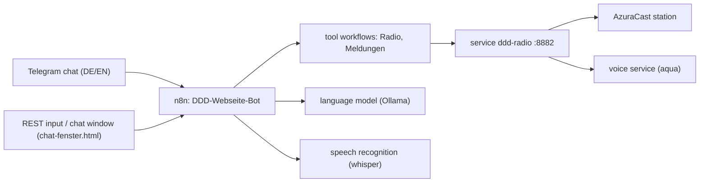

# DDD-Webseite — Rebuild Guide (English)

This guide rebuilds this edition from scratch: **one bot for German and
English** on **one station** — four n8n workflows, one service, one Telegram
bot. The addresses, IDs and numbers below are those of the reference
installation; replace them with your own.

The short overview (what is running where, how the bilingual chat works) is in
`../README.md`. This guide is the detailed rebuild.

---

## 1. What you are building

| Part | Reference | Job |
| --- | --- | --- |
| Station “Axis Church Radio” | AzuraCast, station number **2**, shortcode `ddd_webseite` | plays **only** the playlist “GEMA-frei”, accepts requests (from that playlist), carries the announcements |
| Service `ddd-radio` | LXC 103 (192.168.178.53), port **8882** | catalogue search, playlist tasks, mailbox, research, speech output |
| Bot (four workflows) | n8n (LXC 103), ids `DDD-Webseite-…` | listens, skips, takes playlist-bound wishes, speaks announcements — **no administration** (see §3.1) |
| Telegram | one bot token | the one chat window for both languages |
| REST input (optional) | webhook `ddd-webseite-rest` + test key | commands and answers without Telegram — used by the chat window |
| Voice `aqua` | voice service (CT 111, port 10205); fallback `de_thorsten` | speaks the announcements in the language of the text |



The four workflows after a successful build:

| Workflow (id) | Display name | Nodes |
| --- | --- | --- |
| `DDD-Webseite-Konfiguration` | DDD-Webseite Konfiguration - alle Werte | 4 |
| `DDD-Webseite-Radio` | DDD-Webseite Werkzeug Radio | 21 |
| `DDD-Webseite-Meldungen` | DDD-Webseite Werkzeug Meldungen | 22 |
| `DDD-Webseite-Bot` | DDD-Webseite Bot - Telegram-Agent (DE/EN) | 95 |

The former administration tool `DDD-Webseite-AzuraCast` is gone with the rights
profile (§3.1); `einspielen.sh` also removes it from existing installations.

**The language principle:** one chat, two languages. The language of the
message is detected on entry (`sprache_raten` — umlauts and German function
words against English ones); the field `sprache` travels through the whole run.
Shortcuts, tool replies and announcements answer in that language; numbers and
button presses reuse the last language of the chat. Details: `../README.md` §2.

---

## 2. Prerequisites

* A Linux host with Docker (reference: one LXC for n8n **and** the service).
* **n8n** — reference: 2.34.6, running as a Docker container named `n8n`.
* **AzuraCast** — reference: 0.23.4, reachable at `http://192.168.178.33`.
* **Language model:** Ollama with the OpenAI-compatible interface
  (reference: `http://192.168.178.187:11434`, model `qwen3.6:27b`).
* **Speech recognition:** whisper.cpp server with `POST /transcribe`
  (reference: `http://192.168.178.188:8000/transcribe`).
* **Voice service** (default): `aqua-tts` (reference:
  `http://192.168.178.116:10205/tts`). The fallback voice `de_thorsten` ships
  with the service image.
* Optional: **SearXNG** for web research (reference:
  `http://192.168.178.26:8888`; the limiter must be off).
* A **Telegram bot token** from @BotFather — only needed when the bot goes
  live.
* SSH access to the hosts; the scripts use one SSH config alias (ours:
  `ai-server`). Adapt the paths and aliases inside the scripts.

---

## 3. Step 1 — the station (AzuraCast)

1. Create the station (AutoDJ) in AzuraCast; choose a shortcode, e.g.
   `ddd_webseite`. **Note the station number** — ours is 2, it becomes
   `AZ_STATION_ID`.
2. Put music into the station (media folder) and create a playlist that is
   used as **rotation**.
3. Keep an eye on the media index: if it stalls while indexing (we saw it
   stop at 123 of 245), check the album-art files on the **PVE host** —
   ownership/permissions — then force a re-check inside the container:
   `azuracast_cli azuracast:sync:task check_media --force`.
4. Station settings: `request_threshold = 0` (no “played too recently”
   blocking for requests); enable requests/streamers as needed.
5. Create two **streamer accounts** (DJ access): one for the bot voice
   (reference: `aqua`), one for the operator (your own DJ account).
6. **Enable** the station, then restart it so AzuraCast writes the
   configuration (including the listener route):
   `azuracast_cli azuracast:radio:restart ddd_webseite`.
7. Create an **API key** (Administration → API keys) for this station. The
   key has the form `identifier:verifier`.
8. Listener address: `http://<host>/listen/<shortcode>/radio.mp3` (reference:
   `http://192.168.178.33/listen/ddd_webseite/radio.mp3`, alternatively the
   published port `:8010`). The DJ/harbour port is per station — ours is
   **8015**.

### 3.1 Restricted rights, the demo playlist “GEMA-frei” and the key

The demo bot must not be able to administrate the station. Two things enforce
that: the **API key** (rights) and the **playlist gate** in the tool workflow
(music).

**Role, user, key** (all calls with the administrator key):

1. Create a role — the permissions are only applied by the **update** call; the
   create call ignores them:
   `POST /api/admin/roles`
   `{"name":"Demo-Bot","permissions":{"global":[],"station":[{"id":2,"permissions":["manage station broadcasting"]}]}}`
   → then `PUT /api/admin/role/<id>` with the same `permissions` object.
2. Create the user: `POST /api/admin/users`
   `{"email":"demo-bot@…","password":"…","name":"Demo-Bot","roles":[{"id":<role id>}]}`;
   log in once and change the password if the panel demands it.
3. Create the key: `POST /api/admin/api-keys` `{"user":<user id>,"comment":"Demo-Bot"}`
   — the value (`identifier:verifier`) is shown **once**; it goes into
   `zugangsdaten/api_key.txt`. Keep the earlier administrator key as
   `api_key.txt.bak-<date>` (needed for media work).
4. Probes with the new key: `POST /api/station/2/backend/skip` → 200;
   `PUT /api/station/2/files/batch` → 403; `GET /api/station/1/…` → 403;
   `GET /admin/users` → 403.

**The playlist** (the only music the station plays):

1. Upload the tracks: `POST /api/station/2/files/upload`, multipart field
   `file`. **A comma in the filename breaks `curl -F`** (HTTP 000) — send a
   comma-free name via `-F "file=@/path;filename=Name ohne Komma.mp3"`.
2. Clean up title/artist if wanted: `PUT /api/station/2/file/<id>` with
   `title` and `artist`.
3. Create the playlist: `POST /api/station/2/playlists`
   `{"name":"GEMA-frei","type":"default","source":"songs","include_in_requests":true}`.
4. Assign the files: `PUT /api/station/2/file/<id>` `{"playlists":[<id>]}`
   (the list is **replaced** — always send all IDs).
5. Switch off every other playlist (they stay in the library):
   `PUT /api/station/2/playlist/<id>` `{"is_enabled":false}` — otherwise the
   AutoDJ keeps drawing from them.
6. Rebuild the catalogue so the fuzzy search finds the new tracks:
   `POST http://<service>:8882/katalog/aktualisieren`.
7. Set the playlist name for the bot: `zugangsdaten/demo-playlist.txt`
   (one line); `bauen.sh` exports it as `DEMO_PLAYLIST`. Empty → wishes are
   locked. The bot checks every music path against
   `GET /playlist/titel?name=…` of the service — a hit outside the list is
   answered “Diesen Titel gibt es nicht in der Demo-Playlist.”
8. Clean on-air names: the stream shows the **file tags** and the stored
   `station_media.text` column — patching only the media row through the API is
   not enough (measured 2026-09-25). Set artist/album/title in the files
   (`ffmpeg -y -i in.mp3 -c copy -metadata artist=… -metadata album=…
   -metadata title=… out.mp3`), refresh a stale stored text
   (`update station_media set text = concat(artist, ' - ', title) where id in (…)`)
   and rebuild the queue with `PUT /api/admin/debug/station/<id>/clearqueue`
   (the endpoint is **PUT**, not POST) — new queue entries then carry the clean
   text.

---

## 4. Step 2 — the service `ddd-radio`

The service (sources in `../dienst/`) does five jobs: speech output (TTS for
announcements), the catalogue for fuzzy search and mood suggestions, the
playlist tasks, the news mailbox, and research (weather, news, feeds,
Wikipedia, topic overview). It is a FastAPI container built from
`python:3.12-slim` with `piper-tts`, `fastapi` and `lameenc`.

### 4.1 Install and configure

1. Copy the `dienst/` folder to the service host, e.g. `/opt/ddd-radio`.
2. Fill in **`geheim.env`** (chmod 600). Reference values:

   | Variable | Meaning / reference |
   | --- | --- |
   | `AZ_URL` | station base URL (`http://192.168.178.33`) |
   | `AZ_KEY` | AzuraCast API key (`identifier:verifier`) |
   | `AZ_STATION_ID` | station number (`2`) |
   | `KATALOG_DIR` | catalogue directory inside the container (`/daten`) |
   | `MELDUNG_SCHLUESSEL` | key for mailbox and announcement endpoints (header `X-Meldung-Schluessel`) |
   | `LIVE_HOST` | station host (`192.168.178.33`) |
   | `LIVE_PORT` | DJ/harbour port (`8015`) |
   | `LIVE_MOUNT` | mount point (`/`) |
   | `LIVE_USER` | streamer account (`aqua`) |
   | `LIVE_PASSWORD` | password of that streamer account |
   | `LIVE_NAME` | name sent when connecting (`Axis Church Radio Moderation`) |
   | `TTS_HOCHPASS_HZ` | speech high-pass (`50`) |
   | `TTS_KOMPRESSOR_SCHWELLE_DB` | compressor threshold (`-18`) |
   | `TTS_KOMPRESSOR_VERHAELTNIS` | compressor ratio (`2.0`) |
   | `TTS_ZIEL_RMS_DB` | target loudness (`-12.5`) |
   | `ANSAGE_SPERRE_SEK` | free-text repeat lock in seconds (`90` — the same `/ansage/text` is not spoken twice within this window; protects against tool loops) |

   The four `TTS_*` values are the “variant 3” loudness chain used on air.

3. Start it: `docker compose up -d --build` in `/opt/ddd-radio`. The
   compose file maps **`8882:8881`** (host:container), mounts `./voices` and
   `./daten`, and defaults `TTS_DEFAULT_VOICE=aqua`, `AQUA_TTS_URL`,
   `AQUA_ERSATZ=de_thorsten`, `RECHERCHE_SEARX_URL`.
4. Put **Piper voices** into `./voices`. The reference deploy script copies
   them from the main service (`/opt/radio-tts/voices`).
5. Build the **catalogue** once (reads all tracks from the station, writes
   `daten/katalog.json`, ≈ 44 MB, takes ≈ 47 s):
   `curl -X POST http://127.0.0.1:8882/katalog/aktualisieren`.
   Rebuild it after adding music, otherwise the fuzzy search will not find
   the new tracks.
6. Check: `GET /health`, `GET /katalog/status`, `GET /meldungen/status`.

**Pitfall:** the Dockerfile must copy **every** module
(`COPY app/meldungen.py /app/meldungen.py` …). If one is missing, the
container starts but reports `No module named 'meldungen'` and endpoints are
missing.

### 4.2 Endpoints (overview)

| Group | Endpoints | Purpose |
| --- | --- | --- |
| Speech | `POST /v1/audio/speech`, `GET /v1/audio/voices`, `POST /live` | TTS; live announcement into the stream |
| Catalogue | `GET /suche`, `GET /genre`, `GET /genre/liste`, `GET /katalog/status`, `POST /katalog/aktualisieren`, `GET /katalog/kuenstler` | fuzzy search, mood/genre suggestions, artist hints |
| Playlists | `POST /playlist/befehl`, `POST /playlist/knopf`, `POST /playlist/vorschlag`, `GET /playlist/titel`, `GET /playlist/status` | build and manage playlists in the station; `/playlist/titel?name=…` returns the tracks of one playlist (used by the bot’s demo gate) |
| Mailbox | `POST /meldungen/neu`, `GET /meldungen/offen`, `GET /meldungen/text/<id>`, `POST /meldungen/angeboten`, `POST /meldungen/erledigt` | news items waiting to be read out |
| Announce | `POST /ansage/meldung`, `POST /ansage/text`, `GET /ansage/status` | speak a mailbox item or a free text |
| Research | `POST /recherche`, `GET /recherche/feeds` | weather, news, feeds, Wikipedia, topic overview |

Everything except the `status` endpoints requires the header
`X-Meldung-Schluessel` (the value from `geheim.env` / `daten/meldung-schluessel.txt`).

The playlist selections live in the service’s memory — a restart forgets
them. The mailbox is stored in `daten/meldungen.json`.

---

## 5. Step 3 — the bot (four n8n workflows)

### 5.1 Sources and values

| Path | Content |
| --- | --- |
| `../werkzeuge/agent-wf-bauen-ddd.py` | the generator: builds the configuration workflow and the three others (Radio, Meldungen, Bot; fork of `../../werkzeuge/agent-wf-bauen.py`) |
| `../werkzeuge/bauen.sh` | build script — reads the value files, runs the generator |
| `../werkzeuge/pruefen.sh` | checks: layout, JavaScript syntax, contracts (IDs, one service, one test entry, language plumbing, texts) |
| `../werkzeuge/einspielen.sh` | imports the workflows into n8n, removes the ten older single-language ones **and the former administration workflow `DDD-Webseite-AzuraCast`**, activates, restarts n8n, verifies |
| `../werkzeuge/dienst-einspielen.sh` | deploys `dienst/` to the service host and (re)starts it |
| `../werkzeuge/ausfuehrung-lesen.js` | reads the last execution of a workflow from the n8n database |
| `../zugangsdaten/` | the value files (see below), mode 700/600 |

Value files in `../zugangsdaten/`:

| File | Content |
| --- | --- |
| `api_key.txt` | AzuraCast API key of this edition |
| `meldung-schluessel.txt` | mailbox key of the `ddd-radio` service |
| `test-schluessel.txt` | key that protects the test entry |
| `erlaubte-chats.txt` | operator chat IDs (one per line → comma list) |
| `telegram-bot-token.txt` | Telegram token (placeholder until the bot exists) |
| `streamer-aqua.txt`, `streamer-marc.txt` | streamer passwords |
| `demo-playlist.txt` | name of the demo playlist (e.g. `GEMA-frei`); empty = music wishes locked |

### 5.2 Build, check, import

```bash
cd DDD-Webseite/werkzeuge
bash bauen.sh        # -> /tmp/ddd-webseite-{konfiguration,werkzeuge,agent}.json
bash pruefen.sh      # layout + code + contracts
bash einspielen.sh   # import + activate (restarts n8n, ~1 minute)
```

* `pruefen.sh` works on the built files in `/tmp`; it calls the three helper
  scripts from `../../werkzeuge/` (they ship with the branch). The package build
  (`veroeffentlichung-bauen.py`) reads `../../LICENSE` from there as well.

* `bauen.sh` substitutes the value files into the workflows (including
  `DEMO_PLAYLIST` from `demo-playlist.txt`; `DEMO_ANSAGE_MAX` overrides the
  240-character cap for free text). `TRIGGER_AUS=0`
  leaves the Telegram and schedule triggers active — the default `1` keeps
  them **off** until the token is in place. `DIENST_URL` overrides the
  service address (`http://192.168.178.53:8882` by default).
* `einspielen.sh` is written for the reference installation: it uses the SSH
  config `…/proxmox-ssh/config`, the host alias `ai-server` and an n8n
  project id. Adapt these for your environment. It removes the older
  `-DE`/`-EN` workflows from the n8n database (SQLite + restart, because n8n
  has no delete command), so only the four current ones remain. It also keeps
  the four workflows in the n8n folder **Sender 2: DDD-Webseite** (the private
  bot lives in **Sender 1: Deadline Beats**); `n8n import:workflow` itself
  carries no folder assignment.
* **The main bot’s workflows are not touched.** The n8n restart pauses all
  bots for about a minute.

### 5.3 Test entry (without Telegram)

The test entry takes a Telegram message as JSON and **answers in the same
request** — same JSON shape as the REST input below. The answer is also visible
in the execution, read it with `ausfuehrung-lesen.js`:

```bash
KEY=$(cat DDD-Webseite/zugangsdaten/test-schluessel.txt)
curl -s -X POST "http://192.168.178.53:5678/webhook/ddd-webseite-test?schluessel=$KEY" \
  -H 'Content-Type: application/json' \
  -d '{"message": {"message_id": 1, "chat": {"id": 7333665467, "type": "private"},
       "from": {"id": 7333665467, "first_name": "Test"}, "text": "what is playing right now"}}'

cat DDD-Webseite/werkzeuge/ausfuehrung-lesen.js | ssh -F /media/discData/docs/projects/proxmox-ssh/config ai-server \
  "pct exec 103 -- bash -c 'cat > /tmp/aus.js && docker cp /tmp/aus.js n8n:/tmp/ >/dev/null && \
   docker exec -u node n8n node /tmp/aus.js DDD-Webseite-Bot'"
```

### 5.4 REST input and chat window (no Telegram needed)

The bot carries a second webhook that takes plain JSON and answers **in the
same request** — no Telegram token, no chat ID. The test key alone opens it:

```bash
KEY=$(cat DDD-Webseite/zugangsdaten/test-schluessel.txt)
curl -s -X POST "http://192.168.178.53:5678/webhook/ddd-webseite-rest?schluessel=$KEY" \
  -H 'Content-Type: application/json' \
  -d '{"text": "was läuft gerade"}'
# {"ok":true,"antwort":"Jetzt laeuft: …","tastatur":null,"sprache":"de"}
```

* Body: `{"text": "…"}` (German or English) plus optional `"schluessel": "…"`;
  the key may also sit in the URL (`?schluessel=…`). Wrong key → “Kein Zugang”.
* **All three answer paths** return JSON: the three switches `JSON? (kurz)`,
  `JSON? (dienst)` and `JSON? (lang)` route the answer to one of the three
  `JSON antworten` nodes (`respondToWebhook`) instead of Telegram; `Eingabe`
  marks runs from a webhook with `istTest` (both the REST and the test entry
  answer this way — Telegram runs keep using `Senden`).
* Slow commands (model runs, announcements) keep the request open — allow a few
  minutes.
* `../chat-fenster.html` is the ready-made browser chat for this input: open the
  file, enter address (pre-filled) and key once, type — Enter sends. It replaces
  the Telegram input wherever no Telegram is set up, and is the natural page to
  publish behind a reverse proxy later.

### 5.5 Changing values

Edit in **one** place: the `Werte` node of `DDD-Webseite-Konfiguration`
(addresses, station number, API key, service URL, mailbox key, Telegram
token, allowed chats, test key, model and whisper addresses, and all task
texts of the models). The **demo limits** sit in the same node under `demo`
(`playlist`, `ansage_max`); `demo-playlist.txt` feeds `demo.playlist` at build
time. For a quick change, edit it directly in n8n and save; for a permanent
change, update `../zugangsdaten/` (or the generator) and rebuild.

---

## 6. Step 4 — Telegram

1. Create **one** bot at @BotFather (suggested display name:
   `DDD-Webseite Radio (DE/EN)`) and copy the token.
2. Store the token: fill `../zugangsdaten/telegram-bot-token.txt` and run
   `bauen.sh` + `einspielen.sh` — or enter it directly in n8n in the
   `Werte` node (`telegram.token`) and save.
3. In n8n, create a **Telegram credential** (Credentials → New → Telegram,
   paste the token) and select it in the “Telegram Trigger” node
   (`dddWebseiteTelegram`).
4. Switch on the disabled triggers (“Telegram Trigger” and
   “Zeitplan Meldungen”), then **deactivate and reactivate** the workflow so
   the Telegram trigger registers.
5. Operator access: `staticData.global.erlaubte` holds the allowed chat IDs
   as **strings**.

---

## 7. Step 5 — voice and announcements

* The service uses the dedicated voice **`aqua`**
  (`TTS_DEFAULT_VOICE`), spoken through the voice service
  (`AQUA_TTS_URL`). If it is unreachable, the fallback **`de_thorsten`**
  takes over — it also speaks English text, recognisably different from
  `aqua` but always intelligible.
* The `TTS_*` chain (high-pass, compressor, target level) is the loudness
  “variant 3” used on air.
* Announcements go through `POST /ansage/text` or `POST /live` in the
  service. While speaking, the station shows the streamer account **`aqua`**
  (display name “Aqua”).
* Verified in the reference installation: German announcement 9.8 s,
  English announcements 10.2 s and 9.8 s — each `live: true` in the station.
* Bot-side limits (demo): free text ≤ **240 characters**, at most **one**
  announcement per command, and the same text is **not repeated within 90
  seconds** (service: `ANSAGE_SPERRE_SEK`). News, weather, feeds and the topic
  overview are fetched and spoken by the service — no station rights needed.
* Each announcement starts with 5.5 s of silence (the harbour swallows the
  first seconds on connect) and ends with 1.5 s — short sentences sound short
  by design.

---

## 8. Acceptance checks

After a rebuild, run through this list:

1. `bash pruefen.sh` — layout, code, contracts: **0 findings**.
2. Service: `GET /health`, `/katalog/status` (track count), `/meldungen/status`.
3. Bot, German: `was läuft gerade` → “Jetzt laeuft: … Danach: … Zuhoerer: …” (~1–2 s).
4. Bot, English: `what is playing right now` → “Now playing: … Next: … Listeners: …” (~0.5 s).
5. Wish: `spiele Eminem` / `play Guns N' Roses` → a selection list **in the
   question’s language**, with buttons; answering `3` plays the track.
6. Control: `weiter` / `next` → “Naechster Titel laeuft an.” / “The next track is
   starting.” (the **only** control; pause/volume/restart are politely declined).
7. Mailbox: `Im Postfach liegt nichts Offenes.` / `There is nothing open in the mailbox.`
8. Announcement: `sag durch: …` / `announce into the stream: …` → spoken **once**,
   reply confirms; sending the same sentence again right away is suppressed
   (“… gerade eben schon - ich habe sie nicht wiederholt.”).
9. News: `lies die nachrichten vor` → the current news item is researched and
   spoken (≈ 20–30 s).
10. Rights: a wish from the playlist is accepted (`spiele Mozart`), a hit outside
    is refused (`spiele Scooter` → “Diesen Titel gibt es nicht in der
    Demo-Playlist.”); administration requests are declined without touching the
    station. (With the restricted key, `PUT /api/station/2/files/batch` answers
    403 — probes in §3.1.)
11. REST input: the curl from 5.4 answers with JSON in the right language; a
    wrong key answers “Kein Zugang”.
12. Chat window: open `../chat-fenster.html`, enter the key, send “was läuft
    gerade” — the answer appears as a bubble.

---

## 9. Troubleshooting

* **Triggers do nothing after import** — the build ships with the triggers
  switched off (`TRIGGER_AUS=1` default). Enter the token, enable the
  triggers, deactivate/reactivate the workflow.
* **“Kein Zugang” for a correct chat** — `staticData.global.erlaubte` must
  contain **strings**; numbers never match.
* **English sentence is answered in German** — rare free sentences go through
  the model, and its answer language depends on the model; the fast shortcuts
  are bilingual.
* **Content stays German** — news, weather and feeds come from German
  sources; only the bot’s own words switch language.
* **Search does not find new tracks** — rebuild the catalogue
  (`POST /katalog/aktualisieren`).
* **No announcements** — check `AQUA_TTS_URL`/voice service; look for the
  fallback line in the service log (`docker logs ddd-radio`); check the
  `LIVE_*` values against the station’s streamer page.
* **An announcement repeats** — should not happen: the agent is limited to 4
  steps, every tool is called at most once, and `ANSAGE_SPERRE_SEK` (90 s)
  suppresses the same free text. If it still repeats, check those three places.
* **Music wishes are refused (“noch nicht freigeschaltet”)** — no demo playlist
  is set: check `../zugangsdaten/demo-playlist.txt` (name spelled exactly like
  the playlist) and the `demo.playlist` value in the `Werte` node.
* **Playlist selection “vanishes”** — the service keeps selections in
  memory; a restart clears them.
* **Media index stalls in AzuraCast** — album-art permissions on the PVE
  host, then `azuracast_cli azuracast:sync:task check_media --force`.

---

## 10. File and tool reference

| File | Purpose |
| --- | --- |
| `../README.md` | overview: what is running, how the bilingual chat works |
| `../ANORDNUNG.md` | generated canvas overview of the four workflows (working material; the workflow notes are German) |
| `../werkzeuge/agent-wf-bauen-ddd.py` | workflow generator |
| `../werkzeuge/{bauen,pruefen,einspielen,dienst-einspielen}.sh` | build, check, deploy |
| `../werkzeuge/ausfuehrung-lesen.js` | read the last workflow execution from n8n |
| `../chat-fenster.html` | browser chat window for the REST input (replaces the Telegram input) |
| `../dienst/` | service sources (`app/`, Dockerfile, compose, `geheim.env`; `geheim.env.vorlage` is the template — copy it and fill in your values) |
| `../../werkzeuge/{anordnung-pruefen,code-pruefen,anordnung-uebersicht}.py` | helper scripts for `pruefen.sh` and the canvas overview (`ANORDNUNG.md`) — they ship with the branch next to the edition |
| `../../LICENSE` | MIT license (ships in the branch and in the published package) |
| `/tmp/ddd-webseite-*.json` | the last built workflows (contain real keys — handle like the value files) |

---

## 11. Security and publication

* Real values live **only** in `../zugangsdaten/` and `../dienst/geheim.env`
  (mode 700/600). Never publish them; the repository’s `.gitignore` blocks
  these paths.
* The built workflow files in `/tmp` contain the real keys — treat them like
  the value files.
* For a publishable copy, replace every value with a placeholder
  (`DEIN-…`/`YOUR-…` style) and re-check the files before handing them out:
  `grep -rE "[0-9]{8,12}:[A-Za-z0-9_-]{33,}"` (Telegram tokens),
  `grep -rE "[0-9a-f]{16}:[0-9a-f]{32}"` (API keys).
* The builder for a publishable copy is `../werkzeuge/veroeffentlichung-bauen.py`
  (output: `DocOfficial/` next to this edition).
