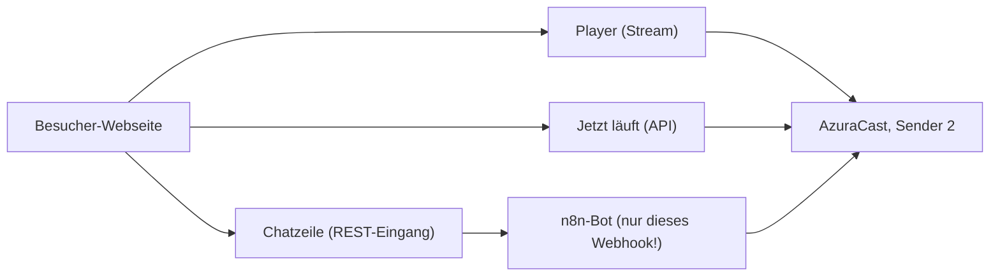

# Axis Church Radio — in die eigene Webseite einpflegen (Integration)

> **Betreiber-Anleitung (Deutsch).** Die Edition selbst ist englisch dokumentiert
> (`README.md`, `NACHBAU/README.md`); diese Datei beschreibt nur die Einbettung
> in die eigene Webseite: **Player**, **„Jetzt läuft"** und eine **Chatzeile**,
> die Besucher benutzen können — dazu die nötige Veröffentlichung über einen
> Reverse Proxy.

Stand: 2026-09-25 · Adressen = Referenzinstallation (durch eigene ersetzen).

---

## 1. Was eingebunden wird



| Baustein | Quelle (Referenz) | Öffentlich nötig? |
| --- | --- | --- |
| Player | `http://192.168.178.33/listen/ddd_webseite/radio.mp3` (LAN) | ja (über Proxy, HTTPS) |
| „Jetzt läuft" | `GET /api/nowplaying/2` auf AzuraCast — **ohne Schlüssel** | ja (über Proxy) |
| Chatzeile | `POST /webhook/ddd-webseite-rest` auf n8n (192.168.178.53:5678) | ja, **nur dieser Pfad** |
| Alles andere (n8n-Oberfläche, AzuraCast-Verwaltung) | — | **nein, privat lassen** |

---

## 2. Öffentlich erreichbar machen (Reverse Proxy)

Zwei Namen anlegen (DNS), beide auf HTTPS mit gültigem Zertifikat:

* `radio.<deine-domain>` → `http://192.168.178.33:80` (AzuraCast-Web: `/listen/…` und `/api/…`)
* `bot.<deine-domain>` → `http://192.168.178.53:5678` — **nur** der Webhook-Pfad

Beispiel nginx (Rate-Limit gegen Chat-Spam; im `http`-Block einmalig
`limit_req_zone $binary_remote_addr zone=chat:10m rate=6r/m;`):

```nginx
server {
    listen 443 ssl;
    server_name radio.example.org;
    # ssl_certificate … (certbot/Proxy-Manager)

    location /listen/ { proxy_pass http://192.168.178.33:80; }
    location /api/nowplaying/ { proxy_pass http://192.168.178.33:80; }
}

server {
    listen 443 ssl;
    server_name bot.example.org;
    # ssl_certificate …

    # NUR der Besucher-Chat; alles andere 404 (n8n-Oberfläche bleibt privat!)
    location = /webhook/ddd-webseite-rest {
        limit_except POST { deny all; }
        limit_req zone=chat burst=3 nodelay;
        proxy_pass http://192.168.178.53:5678;
        proxy_read_timeout 600s;   # Antworten koennen bis zu einer Minute dauern
    }
    location / { return 404; }
}
```

Hinweise:

* **HTTPS ist Pflicht** — sonst blockiert der Browser den Player und den
  Chat-Aufruf (Mixed Content).
* Der Stream läuft auch direkt über den Stationsport `:8010`, aber nur im LAN —
  für Besucher immer über den Proxy.
* Es gibt **keinen** fertigen Proxy-Eintrag (Stand oben): Dieser Schritt fehlt
  in der Referenzinstallation noch.

---

## 3. Player einbinden (ein paar Zeilen HTML)

```html
<audio id="axis-player" controls preload="none"
       src="https://radio.example.org/listen/ddd_webseite/radio.mp3"></audio>
```

* `preload="none"` = der Stream startet erst auf Klick (spart Bandbreite).
* AirPlay/Chromecast nutzen den Stream direkt; die Adresse funktioniert auch in
  VLC & Co.
* Während Ansagen zeigt der Player den Streamer **„Aqua"** (Anzeigename des
  Bot-Kontos) — Hörer erkennen so, dass gerade moderiert wird.

---

## 4. „Jetzt läuft" anzeigen (öffentliche API, ohne Schlüssel)

```html
<p id="axis-jetzt">Lade Programm …</p>
<script>
async function axisJetzt() {
  try {
    const r = await fetch('https://radio.example.org/api/nowplaying/2');
    const d = await r.json();
    const s = d.now_playing.song;
    document.getElementById('axis-jetzt').textContent =
      'Jetzt läuft: ' + (s.text || ((s.artist ? s.artist + ' - ' : '') + (s.title || '')));
  } catch (e) { /* Netzfehler ignorieren, naechster Versuch */ }
}
axisJetzt();
setInterval(axisJetzt, 15000);   // alle 15 Sekunden aktualisieren
</script>
```

* Das Feld `song.text` ist die fertige Zeile („Künstler - Titel").
* Alles unter **einer** Domain ausliefern (oder die API mit durch den Proxy
  leiten): dann gibt es keine CORS-Probleme.

---

## 5. Chatzeile für Besucher

### 5.1 Der Aufruf

```bash
curl -s -X POST "https://bot.example.org/webhook/ddd-webseite-rest?schluessel=<TEST-SCHLUESSEL>" \
  -H 'Content-Type: application/json' \
  -d '{"text": "was läuft gerade"}'
# {"ok":true,"antwort":"Jetzt laeuft: …","tastatur":null,"sprache":"de"}
```

* Schlüssel: aus `zugangsdaten/test-schluessel.txt` — er darf in **keiner**
  Dokumentation abgedruckt werden (hier absichtlich `&lt;TEST-SCHLUESSEL&gt;`).
* Der Schlüssel **wird mit der Webseite öffentlich** — das ist für die Demo so
  gedacht. Falscher Schlüssel → Antwort „Kein Zugang".
* Antwortfelder: `antwort` (Text), `tastatur` (optional Knöpfe/Auswahlliste),
  `sprache` (`de`/`en`). Nummerierte Listen einfach als Zahl zurückgeben
  („2" = zweiter Vorschlag).

### 5.2 Variante A — fertiges Chat-Fenster als iframe (schnellster Weg)

1. `chat-fenster.html` auf den Webspace kopieren.
2. Oben im Skript die zwei Werte fest eintragen (statt der Eingabefelder):
   `adresse.value = 'https://bot.example.org/webhook/ddd-webseite-rest';` und
   `schluessel.value = '<TEST-SCHLUESSEL>';` — dazu die beiden `<label>`-Felder
   ausblenden (`#einstellungen { display: none; }`).
3. Einbetten:

```html
<iframe src="/chat-fenster.html" title="Axis Church Radio Chat"
        style="width:100%; height:520px; border:0; border-radius:12px"></iframe>
```

### 5.3 Variante B — eigene Zeile (minimales JavaScript)

```html
<form id="axis-form"><input id="axis-text" placeholder="Wunsch oder Frage …">
  <button>Senden</button></form>
<pre id="axis-log" style="white-space:pre-wrap"></pre>
<script>
document.getElementById('axis-form').addEventListener('submit', async (e) => {
  e.preventDefault();
  const feld = document.getElementById('axis-text');
  const log = document.getElementById('axis-log');
  log.textContent += '\ndu: ' + feld.value;
  const text = feld.value; feld.value = '';
  try {
    const r = await fetch(
      'https://bot.example.org/webhook/ddd-webseite-rest?schluessel=<TEST-SCHLUESSEL>',
      { method: 'POST', headers: { 'Content-Type': 'application/json' },
        body: JSON.stringify({ text }), signal: AbortSignal.timeout(600000) });
    const d = await r.json();
    log.textContent += '\nRadio: ' + (d.antwort || '(keine Antwort)');
  } catch (err) {
    log.textContent += '\nRadio: Verbindung fehlgeschlagen (spaeter erneut).';
  }
  log.scrollTop = log.scrollHeight;
});
</script>
```

**Wichtig:** Antworten immer als **Text** einsetzen (`textContent`), nie als
HTML — sonst können Antworten Markup in die Seite schmuggeln.

### 5.4 Was Besucher dürfen — und was der Bot selbst verhindert

| Erlaubt | Grenze (im Bot eingebaut) |
| --- | --- |
| Musikwünsche | **nur** aus der Playlist „GEMA-frei"; alles andere: „Diesen Titel gibt es nicht in der Demo-Playlist." |
| „weiter"/„next" | einzige Steuerung (kein Pause/Lautstärke/Neustart) |
| Fragen (was läuft, Postfach, Wetter, Nachrichten, Überblick) | wie im Chat üblich, Antwort 1–60 s |
| Freie Ansage („sag durch: …") | höchstens **240 Zeichen**, gleicher Text **90 s gesperrt**, **einmal** je Befehl |
| Alles Administrative | wird freundlich abgelehnt (keine Rechte) |

Zusätzlich schützt das nginx-Ratenlimit aus §2 (z. B. 6 Anfragen/Minute je IP)
vor Reihen-Spam. Wenn Besucher **gar keine freien Ansagen** sprechen können
sollen: in `zugangsdaten`/`bauen.sh` `DEMO_ANSAGE_MAX=0` setzen, neu bauen und
einspielen — Sprachnachrichten von Wetter/Nachrichten (Recherche) bleiben
erlaubt, „sag durch: …" wird dann höflich abgelehnt.

---

## 6. Prüfliste nach dem Einbau

1. Player läuft über `https://radio.…` (auch auf dem Handy).
2. „Jetzt läuft" aktualisiert sich alle 15 s, auch während Ansagen.
3. Chat: „was läuft gerade" → Antwort in Sekunden; „spiele Mozart" → „… ist als
   Wunsch eingeplant"; falscher Schlüssel → „⛔ Kein Zugang".
4. Chat von zwei Geräten gleichzeitig → beide bekommen Antworten.
5. Ansage: „sag durch: Hallo von der Webseite." → **einmal** gesprochen;
   sofortige Wiederholung wird unterdrückt („… gerade eben schon").
6. Ratenlimit: mehr als 6 Anfragen pro Minute → `503` vom Proxy.
7. Nach einem n8n-Neustart: Webhook einmal antesten (registriert sich neu).

---

## 7. Sicherheit und Recht (kurz)

* Nur `/webhook/ddd-webseite-rest` veröffentlichen — **nie** die n8n-Oberfläche
  oder die AzuraCast-Verwaltung.
* Der Demo-Schlüssel ist öffentlich: Er öffnet nur das, was §5.4 erlaubt. Der
  Missbrauchsschutz sind Ratenlimit + Ansage-Grenzen.
* Musik kommt ausschließlich aus der GEMA-freien Playlist; Wetter/Nachrichten
  holt der Dienst aus seinen Quellen. Die Verantwortung fürs Programm bleibt
  beim Betreiber.

## 8. Noch offen (Referenzinstallation)

* DNS + Reverse-Proxy-Einträge für `radio.…` und `bot.…` fehlen noch
  (siehe `README.md` §7).
* Telegram-Bot ist optional zusätzlich möglich (`README.md` §5).
