# Handbuch — Fähigkeiten, Architektur, Schnittstellen

## Fähigkeiten

Stand 2026-09-21 (Fassung 11); Stimmen-Abschnitt ergänzt 2026-09-23 (Fassung 19).
Alle Angaben sind **gemessen**, nicht geschätzt; die
Zahlen stehen in Klammern. Beispielsätze sind so formuliert, wie der Bot sie
tatsächlich versteht — er muss keine Schlüsselwörter sehen.

---

### 1. Musik und Programm

| Fähigkeit | Beispiel | Verhalten |
| --- | --- | --- |
| Titelwunsch | „spiele Benzin von Rammstein" | sucht, spielt **sofort** (unterbricht den laufenden Titel) |
| Titelwunsch einreihen | „danach was von Nirvana", „spiele X später" | hängt hinter das Laufende |
| Wunsch per Nummer | „2" nach einer Auswahlliste | spielt den zweiten Vorschlag |
| Mehrere Treffer | „spiele Thriller" | zeigt die Kandidaten als **anklickbare Knöpfe**, fragt kurz nach |
| Interpretwunsch | „was von Scooter" | sucht im Archiv (48.729 Titel) und im Katalog |
| Stimmungswunsch | „mach mal was Peppiges", „etwas Ruhiges", „was Rockiges" | übersetzt die Stimmung ohne Sprachmodell in eine Richtung und spielt den ersten passenden Titel |
| Richtung nach Genre/Jahrzehnt | „was aus Rock", „90er" | sucht im Katalogdienst nach Genre/Jahrzehnt |
| Programmauskunft | „was läuft", „was kommt danach", „wie viele hören zu" | Zustand im Klartext (1,4 s) |
| Steuerung | „nächster Titel", „skip", „pause", „sender neu starten", „sender starten/stoppen" | feste Adressen des Senders, ohne Sprachmodell |
| Warteschlange/Verlauf | „was ist eingereiht" | Liste aus der Senderschnittstelle |
| **Sammelbefehl** | „spiele Benzin und danach Hyper Hyper, mach was Peppiges, was läuft" | bis zu **10 Aufgaben** in einer Nachricht; der **erste** Titel läuft sofort, **weitere Titel automatisch eingereiht** (gemessen: „Benzin" sofort, „Hyper Hyper" danach) |

**Grenzen:** Titel, die im Archiv nicht liegen, kann der Bot nicht spielen — er sagt
es und zeigt, was stattdessen passt. Bruchstücke unter 45 s und der Moderationsordner
werden nie vorgeschlagen; `_Archiv/` (Live/Bootlegs) bleibt außen vor (48.729 von
56.635 Titeln sind durchsuchbar).

---

### 2. Moderation: Sprechen im laufenden Programm

Der Bot spricht **selbst** — seit 2026-09-23 mit der **eigenen Stimme `deine-stimme`**
(Wandlungsstimme; Dienst `sprechdienst` auf der GPU-Maschine, Entstehung: `STIMME.md`),
in den laufenden Sendebetrieb gesprochen. Ist der Stimmendienst nicht erreichbar,
spricht er ersatzweise mit Piper (`de_thorsten`); Piper-Stimmen bleiben über
`voice`/`stimme` wählbar. Der AutoDJ verstummt für die Ansage und läuft danach weiter.

| Fähigkeit | Beispiel | Messwert |
| --- | --- | --- |
| Freie Ansage | „sag durch: die Sendung beginnt in fünf Minuten" | Text → Stimme → Sendung |
| Wetter ansagen | „suche nach dem Wetter für Marbach am Neckar" | 49,9 s inkl. Recherche; Sprechzeit 27,6 s |
| Nachrichten ansagen | „lies die Nachrichten vor" | 58,7 s |
| RSS-Feed ansagen | „lies den Feed tagesschau vor" | Feed wird gelesen |
| Kurzinfo | „wer ist …" (über den Recherche-Auftrag) | Wikipedia-Einleitung |
| Ansage aus dem Postfach | Knopf ▶️ an einer Meldungskarte | Ansage + Bestätigung |
| Ansage ohne Vorlesen | „…, aber lies es nicht vor" | nur Postfach füllen (15,1 s) |
| **Quellen-Überblick** | „überblick ki, raumfahrt" · „themen: ki, raumfahrt" · „überblick aus heise und golem" | zu jedem **Thema**: Schlagzeilen aus der Presse (Google News), Hintergrund aus Wikipedia, eine **gelesene Netzseite** über die **eigene Suchmaschine** (SearXNG in LXC 108) und passende Meldungen aus den **21 Feeds**; Länge ergibt sich aus dem Material — gemessen 0,4 Min (1 Thema, 2 Schlagzeilen), 1,5 Min (2 Themen), 2,4 Min (3 Themen); live am 2026-09-21: „themen: raumfahrt" → 1,3 Min mit 3 Schlagzeilen, Hintergrund und **1 Netzseite** |
| Überblick **ohne** Ansage | „gib mir einen überblick zu ki, aber lies ihn nicht vor" | Beitrag wird nur als Meldung abgelegt (22,9 s, **keine** Unterbrechung des Programms) |

**Aufbereitung des Sprechtextes:** Links und Markdown fliegen raus, Emojis werden
entfernt, Abkürzungen ausgeschrieben (z. B. → zum Beispiel), Einheiten gesprochen
(°C → Grad, % → Prozent, km/h → Kilometer pro Stunde), Ticker-Zeichen der Feeds
(++++++) entfernt, Kürzung an der Satzgrenze (Standard **9000 Zeichen ≈ 8,5 Minuten**,
vorher 700), je Meldungsart ein Vor- und Nachspann („Und nun der Blick aufs
Wetter." … „Das war das Wetter."; beim Überblick „Das war der Überblick. Und weiter
geht es mit Musik.").

**Lautstärke (Fassung 8):** Piper liefert volle Spitzen, aber leise im Mittel
(−16,6 LUFS) gegenüber dem Musikprogramm (−9,8 LUFS). Der Dienst hebt die Stimme mit
Hochpass, Verdichtung (3:1) und einem Begrenzer mit Vorausschau auf Sendelautstärke:
**−13,1 LUFS** in der Datei, **−11,8 LUFS** auf Sendung, Spitze −1,0 dBFS — rund 4 dB
lauter, ohne Übersteuern. Die eigene Stimme `deine-stimme` läuft durch **dieselbe Kette**;
im Betrieb ist sie seit dem 23.09. sanfter eingestellt (Hochpass 50 Hz, Verdichtung
2:1 ab −18 dB, Ziel −12,5 dBFS — siehe `BETRIEB.md`). Beim Sprechen meldet sich die
Stimme im Sender als Streamer **„DEINE-STIMME“**.

---

### 3. Postfach und Freigabe (Schnittstelle für andere Bots)

Der Bot hat ein **Postfach**. Ein fremder Bot („Suchbot") kann dort Meldungen
ablegen; der Bot legt sie mir in Telegram als **Karte mit Knöpfen** vor
(▶️ Vorlesen / 🗑️ Verwerfen) und spricht sie erst nach Freigabe.

| Fähigkeit | Verhalten |
| --- | --- |
| Meldung annehmen | `POST /meldungen/neu` (mit Schlüssel) — Art, Titel, Text, wichtig, Quelle, URL |
| Automatisches Vorlegen | alle **5 Minuten** prüft ein Zeitplan neue Meldungen; `angeboten_am` verhindert ein zweites Angebot |
| Vorlesen | Knopf ▶️ → Live-Ansage in den Sender, danach Bestätigung mit Dauer |
| Verwerfen | Knopf 🗑️ → Meldung als verworfen markiert |
| Postfach abfragen | „was gibt es für Meldungen" → Liste **ohne** Ansage (0,3–1,4 s, ohne Sprachmodell) |
| Aufräumen | alte/erledigte Meldungen entfernen (`POST /meldungen/aufraeumen`) |

Meldungsarten mit eigenem Vor-/Nachspann: `wetter`, `nachrichten`, `rss`, `verkehr`,
`hinweis`, `musik`, `sonstiges`.

---

### 4. Recherche auf Zuruf

Der Bot holt Inhalte **selbst** aus dem Netz — ohne fremden Bot, ohne Schlüssel:

| Art | Quelle | Beispiel |
| --- | --- | --- |
| `wetter` | Open-Meteo (Ortssuche + Vorhersage) | „suche nach dem Wetter für Marbach am Neckar" → „24 Grad, bedeckt, 35 Prozent, 19 km/h" |
| `nachrichten` | RSS von tagesschau, heise, Spiegel, Deutschlandfunk, Sportschau | „lies die Nachrichten vor" |
| `rss` | beliebige Feed-Adresse oder Kurzname | „lies den Feed heise vor" |
| `wikipedia` | Wikipedia-Kurzinfo (REST) | „wer ist …" |
| `ueberblick` | **Themen** werden in mehreren Quellen gesucht: Presse (Google News), Wikipedia, **eigene Suchmaschine** (SearXNG, die gefundene Seite wird geöffnet) und die **21 Feeds** | „überblick ki, raumfahrt" · „themen: photovoltaik" · „überblick elektromobilität aus heise golem" → Beitrag; je Thema bis zu 6 Stücke (Presse 3, Wikipedia, Netzseite, Feed), Länge nach Material (Sicherheitsgrenze 6000 Zeichen ≈ 5,7 Min) |

Unbekannter Ort → klare Meldung (HTTP 404), unbekannte Art → 422. Jedes Ergebnis wird
als Meldung abgelegt (also auch später noch vorlesbar) und auf Wunsch sofort gesagt.

---

### 5. Wiedergabelisten

Über einen eigenen Dienstweg (ohne Sprachmodell, dadurch schnell: 0,2–0,7 s je Schritt):

| Fähigkeit | Beispiel |
| --- | --- |
| Anlegen und füllen | „lege eine Wiedergabeliste Sommer mit Rock an" |
| Anlegen **und sofort starten** | „baue eine Playlist aus Scooter und spiele sie" (ohne Rückfrage) |
| Anzeigen | „zeige die Wiedergabelisten", „was ist in Sommer" |
| Umbenennen | „nenne Sommer in Sommerhit um" |
| Leeren / Löschen | „leere die Playlist Sommer" / „lösche die Playlist Sommer" (mit Ja/Nein-Knöpfen) |
| Titel tauschen | „ersetze Titel 3 in Sommer durch …" |
| Vorschlag | „schlage etwas für eine Party-Playlist vor" |

**Grenze (ehrlich):** einzelne Titel aus einer Liste *entfernen* kann der Bot noch
nicht — er sagt das. Eine offene Auswahl überlebt keinen Neustart des Dienstes.

---

### 6. Verwaltung des Senders

Der Agent hat Werkzeuge, mit denen er die **AzuraCast-Schnittstelle** benutzt:
`azura_endpunkte` (Adresse nachschlagen), `azura_aufruf` (aufrufen), `azura_ueberblick`
(Anlagen, Sendeteil, Ausgabe, Wiedergabelisten). Damit sind alle 263 Endpunkte der
Sender-API möglich — unter anderem:

* Anlagen (Mounts), Streamer, Fernverbindungen, Webhooks
* Medien: suchen, verschieben (über die API, damit Zuordnungen erhalten bleiben)
* Nutzer, Rollen, Einstellungen, Berichte
* Sicherungen (Backups)
* Neustart von Sendeteil und Ausgabe

**Sicherheitsregel:** Verändernde Aufrufe (POST/PUT/DELETE) macht der Bot nur, wenn ich
ausdrücklich zugestimmt habe; sonst zeigt er einen **Trockenlauf** und fragt
in einfachen Worten um Erlaubnis („Soll ich das anlegen?"). Fachbegriffe nennt er
nicht.

---

### 7. Verstehen: Text, Sprache, Knöpfe

| Eingabe | Verhalten |
| --- | --- |
| Textnachricht (deutsch oder englisch) | Analyse in Stufen (siehe `HANDBUCH.md`); die Sprache der Nachricht reist als Feld `sprache` mit und bestimmt die Sprache aller Antworten |
| **Sprachnachricht** | Datei holen → whisper.cpp large-v3 auf der MI50 (Hinweis `de`, erkennt englische Nachrichten ebenfalls) → Text; der Bot zeigt zur Kontrolle, was er verstanden hat; ein Fachhinweis mit den häufigsten Interpreten verbessert Namenstreffer |
| Knopfdruck | wirkt wie die getippte Nummer; Menüs werden **bearbeitet** statt neu gesendet (kein Nachrichten-Spam) |
| Mehrere Aufgaben | „spiele X und suche nach dem Wetter für Y" → zwei Befehle, in der genannten Reihenfolge abgearbeitet |
| Verwaltungsaufträge | „lege … an", „lösche …", „zeige …" — über den Agenten mit Werkzeugen |
| Kein Auftrag erkennbar | der Bot sagt es, statt zu raten |

**Deutsch und Englisch in einem Chat (seit 2026-09-25):** Der Bot erkennt die Sprache
jeder Nachricht und antwortet darin — Kurzbefehle, Auswahllisten, Modellantworten und
Ansagen („what is playing right now" → „Now playing: …"). Sprachnachrichten und
Knopfdrücke behalten die Sprache des Chats. **Bewusst deutsch** bleiben die Inhalte
(Nachrichten, Wetter) und die Verwaltungswege des Dienstes.

**Nur der Betreiber** kommt durch (Liste `erlaubte` in den statischen Daten des
Ablaufs). Der Testeingang verlangt zusätzlich einen geheimen Schlüssel.

---

### 8. Betrieb, Sicherheit, Qualität

| Fähigkeit | Zustand |
| --- | --- |
| Selbstkontrolle je Auftrag | Stufe 3 prüft jeden Befehl gegen den echten Senderzustand; fehlgeschlagene Befehle bekommen **einen** zweiten Versuch |
| Rückfrage statt Fehlschlag | erkennt der Bot, dass er den Nutzer etwas fragen muss, zeigt er die Frage mit Auswahlknöpfen (kein „nicht erledigt") |
| Zweiter Sendeversuch | schlägt das Bearbeiten einer Nachricht fehl, sendet der Bot sie neu |
| Prüfkatalog | 45 Proben (Dienst) + 20 (Antwortwege) + 19 (Kurzbefehle) + 37 (Weichen) + 6 (Bot Ende-zu-Ende) — alle grün |
| Zeichenfläche | 0 Befunde: jeder Knoten in genau einem Rahmen, keine Überlappung, jeder Knoten mit Beschriftung |
| Fassungen | v1–v21 gesichert, jede mit Beschreibung (siehe `BAU.md`) |
| Ausfälle | Modellfehler brechen den Lauf nicht ab (Wiederholung + Ersatzwege ohne Sprachmodell) |

---

### 9. Was der Bot **nicht** kann (bewusst)

* Musik von Streaming-Diensten (nur das eigene Archiv)
* Titel aus einer Wiedergabeliste einzeln entfernen (sagt er offen)
* Mehr als **eine** Ansage gleichzeitig (der Sender hat einen Hafen)
* Erfinden: unbekannte Titel/Orte meldet er als „nicht gefunden" statt zu raten
* Ohne Freigabe etwas verändern

## Architektur

Stand 2026-09-21 (Fassung 11). Diese Datei beschreibt **wie** der Bot arbeitet und
**warum** er so gebaut ist.

---

### 10. Aufbau in Schichten

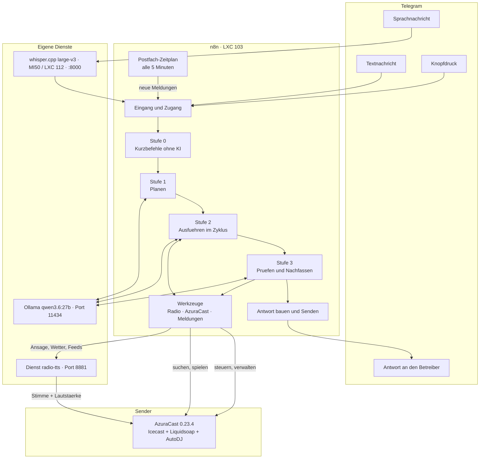

---

### 11. Der Weg einer Nachricht (Stufen)

Der Bot arbeitet in **vier Stufen**. Jede Stufe ist im Ablauf ein eigener Bereich mit
Rahmen (siehe `ANHANG/ANORDNUNG.md`).

| Stufe | Was passiert | Technik |
| --- | --- | --- |
| **0 — Kurzbefehl** | feste Regeln erkennen einfache Befehle (Liedwunsch, Richtung, skip, Status, Postfachfrage, **Themen-Überblick**) und schicken sie **direkt** in die Ausführung | Code-Knoten, kein Sprachmodell → 0,3–1,7 s |
| **1 — Planen** | freier Text wird in **Befehle** zerlegt: `{"befehle":[{"art":…}]}` — **bis zu zehn Aufgaben**, höchstens 3 Anläufe, danach Ersatzweg ohne Modell | `qwen3.6:27b`, blanker HTTP-Aufruf, 3000 Token, `reasoning_effort: none` |
| **2 — Ausführen** | **je Befehl ein Durchlauf** der Schleife: ohne Modell (Radio-Werkzeug), über feste Senderadressen (Steuerung) oder mit dem Agenten und seinen Werkzeugen; **mehrere Titel** werden automatisch eingereiht (erster sofort) | Agent mit 8 Werkzeugen, 3000 Token; Überblick holt und spricht der Dienst |
| **3 — Prüfen** | Urteil je Befehl **gegen den echten Senderzustand** (was läuft, was ist eingereiht); fehlgeschlagene Befehle bekommen **einen** zweiten Versuch; danach Antwort bauen und senden | `qwen3.6:27b`, 4000 Token; bei klaren Fällen Regelurteil ohne Modell |

Befehlarten der Analyse: `spielen`, `richtung`, `programm`, `recherche`, `verwalten`.

---

### 12. Warum es so gebaut ist (Entscheidungen)

**Die Werkzeuge spielen selbst.** Das Modell bekommt **Dateipfade nie zu sehen** — es
wählt aus, das Werkzeug trägt ein. Grund (gemessen): kleinere Modelle erfinden Pfade
und kündigen Titel nur an, statt sie zu spielen.

**Kurzbefehle ohne Modell.** Ein einfacher Wunsch dauerte über den Modellweg 163 s
(früher: sechs Modellaufrufe, hunderte Denk-Token). Mit Stufe 0, `reasoning_effort:
"none"` und einem Regelurteil statt Modell sind es 1,7 s. Was die Stufe nicht sicher
erkennt, geht **unverändert** an die Analyse.

**Antworten sind belegt, nicht behauptet.** Der Bot prüft nach jedem Auftrag den
echten Senderzustand. Läuft der Titel nicht und steht er nicht in der Warteschlange,
gilt der Auftrag als nicht erledigt — auch wenn das Modell „läuft" geschrieben hat.

**Rückfrage ist kein Fehlschlag.** Muss der Bot etwas fragen (mehrere Titel passen),
zeigt er die Liste **wortgetreu** mit Knöpfen und fasst sie **nicht** nach. Vorher
überschrieb der zweite Versuch die Liste mit „(keine Ausgabe)" — der Nutzer sah die
Auswahl nie.

**Alles Modulare liegt im Dienst, nicht im Ablauf.** Textaufbereitung, Ansage,
Katalogsuche, Wiedergabelisten und Recherche sind Python-Module im Dienst `radio-tts`.
Der n8n-Ablauf **leitet nur weiter** (Weiche → HTTP → senden). Neue Sätze brauchen
deshalb meist nur eine Änderung im Modul, keinen Umbau des Ablaufs.

**Der Ablauf wird nicht von Hand gebaut.** Der Generator
`werkzeuge/agent-wf-bauen.py` erzeugt alle vier Abläufe; Positionen, Bereiche,
Rahmen und Beschriftungen stehen als Tabellen darin. Änderungen gehen chirurgisch
über `agent-patchen.sh` in den laufenden Ablauf (nie komplett neu bauen — ein Neubau
würde die Werkzeugnamen gegenüber dem Modell ändern).

---

### 13. Komponenten im Einzelnen

#### 4.1 n8n-Abläufe (vier)

| Ablauf | Kennung | Knoten | Zweck |
| --- | --- | --- | --- |
| Radio – Telegram-Agent | `RadioAgentBot` | 81 | der Bot selbst: Eingang, Stufen, Antwort |
| Werkzeug – Radio | `RadioWerkzeug` | 16 | Titel/Richtung suchen, spielen, einreihen, Zustand |
| Werkzeug – AzuraCast | `AzuraWerkzeug` | 16 | Sender-Adressen nachschlagen, aufrufen, Überblick |
| Werkzeug – Meldungen | `MeldungenWerkzeug` | 13 | Postfach, Ansagen, Recherche |

(Im Projekt liegt zusätzlich der ältere Ablauf `bjFSfXGqpLg7AAXw` als Archiv.)

#### 4.2 Dienst `radio-tts` (LXC 103, Port 8881)

Ein FastAPI-Dienst mit sechs Modulen; Aufbau und Adressen in `HANDBUCH.md`.

| Modul | Aufgabe |
| --- | --- |
| `main.py` | Sprachausgabe (**eigene Stimme `deine-stimme`** als Vorgabe, Piper wählbar; OpenAI-kompatibel), **Live-Ansage** inkl. Lautstärke-Kette |
| `katalog.py` | Suchindex des Archivs (48.729 Titel), unscharf und tippfehlertolerant, Genre/Jahrzehnt |
| `playlist.py` | Wiedergabelisten bauen, verwalten, starten (Zustand je Chat) |
| `meldungen.py` | Postfach, Moderations- und Sprechtexte, Freigabe |
| `suche.py` | Recherche: Wetter, Nachrichten-Feeds, RSS, Wikipedia — und der **Themen-Überblick** (Presse, Netz, Feeds) |
| `whisper_server.py` | Spracherkennung des Bots läuft **nicht hier**, sondern als `whisper-amd` in LXC 112 (MI50, Port 8000, seit 2026-09-23); LXC 105 (Port 18790) ist der abgeschaltete Ersatzweg |

#### 4.3 Sender AzuraCast

* Station *Deadline Beats* (Kennung `deadline_beats`), Icecast-Frontend (Hörer) +
  Liquidsoap (AutoDJ), **DJ-Hafen Port 8005** (hier spricht der Bot hinein)
* 56.635 Titel (15-TB-Platte), davon 48.729 im Wunsch-/Suchbestand
* Rotation: Wiedergabeliste „List A" (72 Titel) — der Rest ist Wunschpool
* Wunschwege des Bots: `PUT /files/batch` mit `do=immediate` (sofort, unterbricht)
  und `do=queue` (einreihen); vor einem Sofortwunsch wird die unterbrechende
  Warteschlange geleert, damit der neueste Wunsch gewinnt

#### 4.4 Sprachmodelle auf der GPU

* **Ollama** (`qwen3.6:27b`, 17,7 GB) für Planen, Ausführen (mit Werkzeugen), Prüfen.
  Warm 2,5–4 s; das Modell bleibt mit `OLLAMA_KEEP_ALIVE=30m` geladen (ein Neuladen
  kostet 43,7 s).
* **whisper.cpp large-v3** (Vulkan auf der **MI50**, LXC 112, `:8000`) für die
  Sprachnachrichten des Bots, Sprache fest `de`, mit Fachhinweis (häufigste
  Interpreten) für bessere Namen; in LXC 105 läuft der Whisper der
  Home-Assistant-Sprachdienste — der frühere Radio-Dienst (`:18790`) ist abgeschaltet.
* **Stimmendienst `sprechdienst`** (CT 111, Port 10205) für die **eigene Moderationsstimme
  `deine-stimme`** der Ansagen: edge-tts → RVC-Modell `<dein-modell>`. Ist er nicht erreichbar, spricht
  `radio-tts` ersatzweise mit Piper (`EIGENE_STIMME_ERSATZ`). Entstehung und Nachbau:
  `STIMME.md`, `NACHBAU/eigene-stimme/`.

---

### 14. Datenfluss einer Ansage (Beispiel)

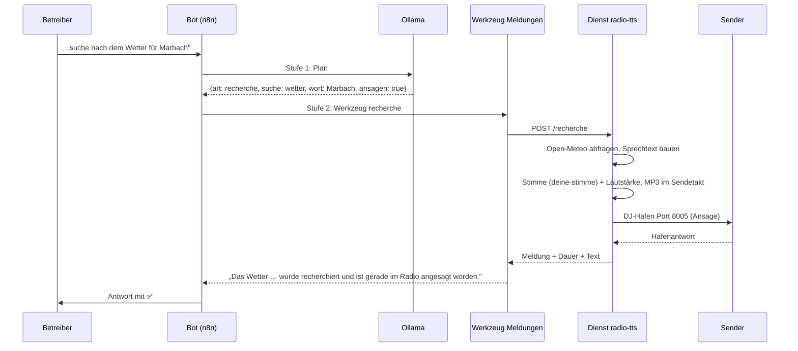

---

### 15. Zustand und Gedächtnis

| Zustand | Wo | Lebensdauer |
| --- | --- | --- |
| Laufender Auftrag (Befehle, Ausgaben, Urteile) | statische Daten im n8n-Ablauf (`d.lauf`) | bis zum Ende des Laufs |
| Letzte Antwort (für „ja, mach das") | statische Daten (`d.letzteAntwort`) | bis zur nächsten Nachricht |
| Gemerkte Auswahlliste (Titel + Pfade) | statische Daten im **Werkzeug**-Ablauf (`d.listen`) | bis zur Auflösung |
| Offene Wiedergabelisten-Auswahl | Arbeitsspeicher des Dienstes (je Chat) | bis Dienstneustart |
| Postfach (Meldungen) | Datei `/daten/meldungen.json` im Dienst | dauerhaft |
| Suchindex des Archivs | `/daten/katalog.json` (44 MB) | bis zur nächsten Aktualisierung (~47 s) |

---

### 16. Betriebsgrenzen (bekannt)

* Ein Sprachmodell-Aufruf dauert 2–4 s warm; ein Agentenweg mit mehreren Werkzeugen
  20–60 s. Kurzbefehle umgehen das.
* Der DJ-Hafen verträgt nur **eine** Ansage gleichzeitig; die zweite wartet.
* Ein **Überblick** belegt den DJ-Hafen so lange wie der Beitrag (Minuten): In dieser
  Zeit läuft keine Musik und keine zweite Ansage. Davor sammelt und erzeugt der Dienst
  den Text (10–90 s, je nach Zahl der Themen und Quellen) — deshalb 15 Minuten Zeitablauf.
* Liquidsoap puffert am Hafen ~10 s — deshalb sendet der Dienst die Ansage **im
  Sendetakt** (sonst verwirft Liquidsoap den Rest).
* `/api/nowplaying` ist 15 s gecacht (Antworten können kurz nachhinken).

## Diagramme

**Stand 2026-09-24.** Diese Sammlung zeigt in **Mermaid-Bildern** alles, was man zum
Erklären des Bots und der Stimme braucht: vom Gesamtbild der Maschinen über den Weg
einer Nachricht bis zur Entstehung der Moderationsstimme „DEINE-STIMME". Die Zahlen und Namen
stammen aus `README.md`, `HANDBUCH.md`, `STIMME.md`.

> **Ansehen:** In VS Code die Markdown-Vorschau öffnen (**Strg+Umschalt+V**). Auf GitHub
> rendern die Bilder automatisch. UML-artig sind die Sequenzbilder (A3–A6), das
> Zustandsbild (B4) und die Klassensicht (B3); dazu kommen Flussbilder
> (A1, A2, A7, B1, B2, C1, C2).

| Teil | Bilder |
| --- | --- |
| **A — Der Bot** | A1 Gesamtbild · A2 Abläufe · A3 Nachrichtenweg · A4 Musikwunsch · A5 Sprachnachricht · A6 Ansage mit Freigabe · A7 Themen-Überblick |
| **B — Die Stimme** | B1 Entstehung (Klon-Pipeline) · B2 Sprechkette im Betrieb · B3 Dienste (Klassensicht) · B4 Zustände und Ersatz |
| **C — Querschnitt** | C1 GPU-Landkarte · C2 Ersatzwege · Adress- und Prüftabellen |

---

### Teil A — Der Bot

#### A1 · Das Gesamtbild

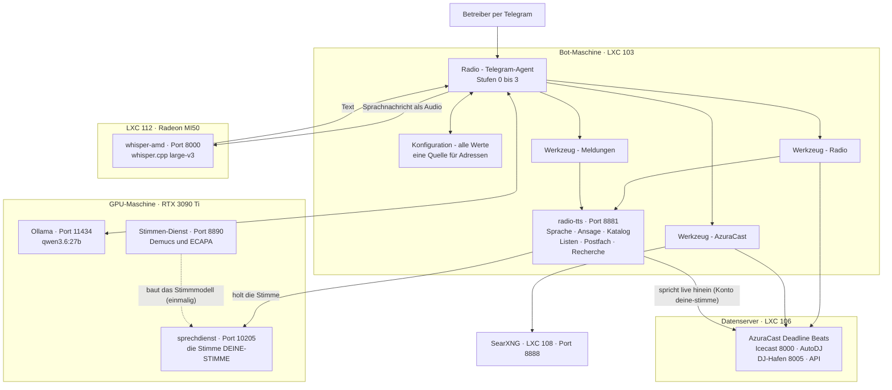

* Die **3090 Ti teilen sich Ollama und DEINE-STIMME** — die Belegung zeigt Bild C1.
* Die **Sprachnachricht** läuft über n8n zur Erkennung auf der MI50 (Bild A5).
* `radio-tts` ist der **einzige Dienst, der in den Sender spricht**; die Werkzeuge steuern nur.

---

#### A2 · Die Abläufe in n8n

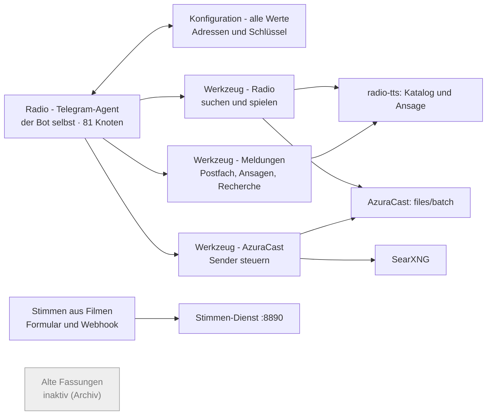

* Vier **Werkzeug-Abläufe** tragen die Arbeit; der Agent plant und prüft (Bild A3).
* Der Agent hat **8 Werkzeuge**, u. a. `azura_endpunkte`, `azura_aufruf`,
  `azura_ueberblick` (Adressen nachschlagen statt raten).
* In n8n liegen zusätzlich die **alten Wunschbot-Fassungen** — grau heißt: nicht aktiv.

---

#### A3 · Der Nachrichtenweg (Stufen 0 bis 3)

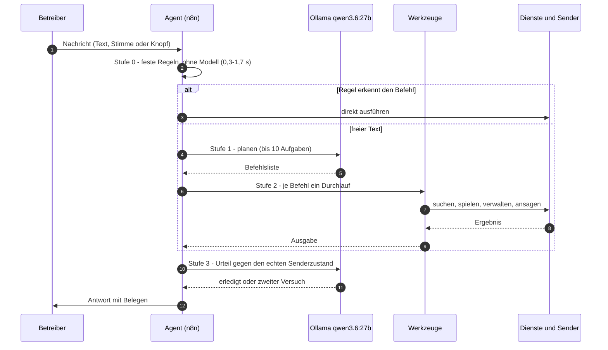

* **Stufe 0** fängt die häufigen Wünsche ohne KI ab (schnell, deterministisch).
* **Stufe 1** zerlegt freien Text in Befehle; **Stufe 3** prüft gegen den echten
  Senderzustand — „belegt, nicht behauptet".
* Was die Regeln nicht sicher erkennen, geht **unverändert** an die Analyse.

---

#### A4 · Beispiel: Musikwunsch sofort

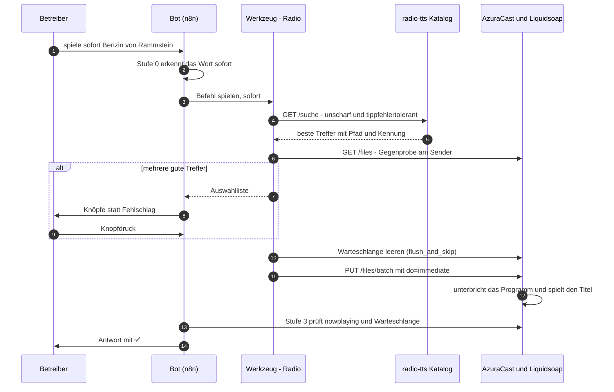

* Der **neueste Wunsch gewinnt**: Vor dem Start wird die unterbrechende Warteschlange
  geleert (`interrupting_requests.flush_and_skip`).
* `do=immediate` = **sofort** (schneidet ab), `do=queue` = **einreihen** — ohne jede
  Vorprüfung, deshalb prüft Stufe 3 hinterher den echten Zustand.

---

#### A5 · Beispiel: Sprachnachricht

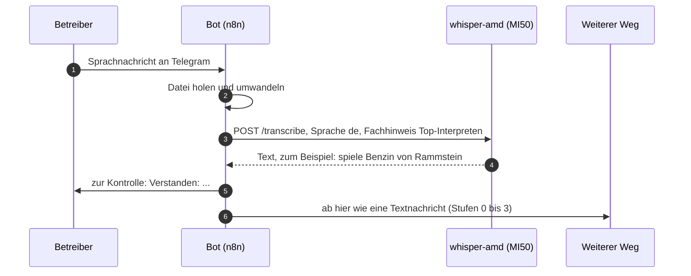

* Die Erkennung läuft auf der **MI50 (whisper.cpp, Vulkan)**; der **Fachhinweis** mit
  den häufigsten Interpreten verbessert Namenstreffer deutlich.
* Die erkannte Nachricht wird **wortgleich wie getippter Text** behandelt.

---

#### A6 · Beispiel: Ansage mit Freigabe

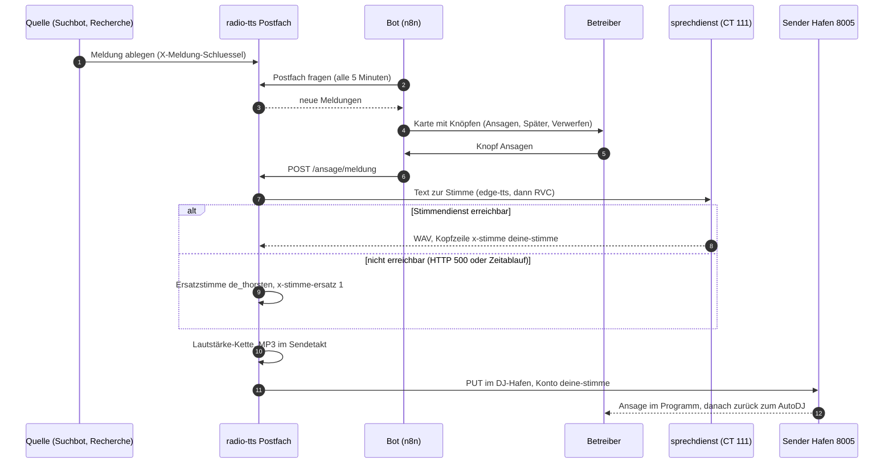

* **Nichts geht automatisch auf den Sender** — jede Ansage wird freigegeben.
* Im Sender erscheint als aktiver Streamer **„DEINE-STIMME"** (eigenes Bot-Konto).
* Eine Ansage belegt den Hafen; die nächste wartet (Bild C2).

---

#### A7 · Der Themen-Überblick

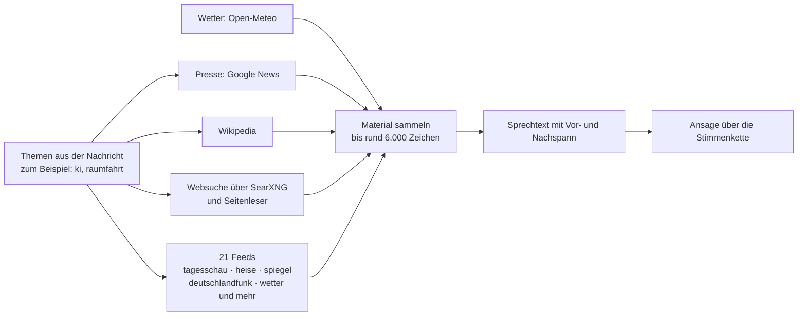

* Je Thema kommen **Schlagzeilen, Hintergrund, eine gelesene Netzseite und Feed-Treffer**
  zusammen; die Länge ergibt sich aus dem Material.
* Während des Beitrags ist der Hafen belegt — **keine Musik, keine zweite Ansage**.

---

### Teil B — Die Stimme

#### B1 · Die Entstehung (Klon-Pipeline)

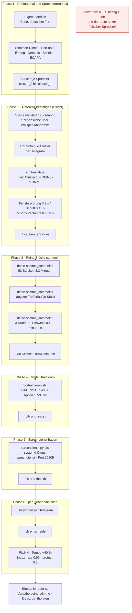

* **Die wichtigste Regel:** Erst wenn ich die Referenz bestätigt habe, darf
  gesammelt werden — ein falscher Anker kostet ein ganzes Modell.
* Jede Stellschraube (Pitch, Tempo, `index_rate`) wurde **per Hörprobe** entschieden.
* Vor-/Abspann-Lieder werden aussortiert; sie überleben die Vokaltrennung und würden
  das Modell verfälschen.

---

#### B2 · Die Sprechkette im Betrieb

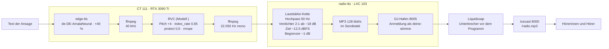

* Die **Datei-Erzeugung** dauert 1,4–3,8 s (der erste Aufruf nach einem Dienststart ~9 s);
  **gesendet wird in Echtzeit** (Sendetakt — der Hafen puffert nur ~10 s).
* Die **Lautstärke-Kette** (meine Wahl vom 23.09., „Variante 3") macht die Stimme
  weniger hell; Zielpegel −12,5 dBFS.

---

#### B3 · Die Dienste (UML-Klassensicht)

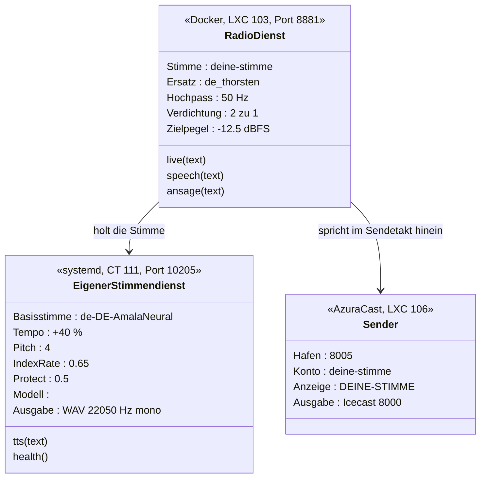

* Der **RadioDienst kennt zwei Stimmenwege**: die eigene Stimme (auf Wunsch) und `de_thorsten`
  (Ersatz) — Piper-Stimmen bleiben über den Parameter `voice` wählbar.
* Das **Konto `deine-stimme`** am Hafen ist der Grund, warum im Sender „DEINE-STIMME" steht.

---

#### B4 · Zustände einer Ansage (mit Ersatzweg)

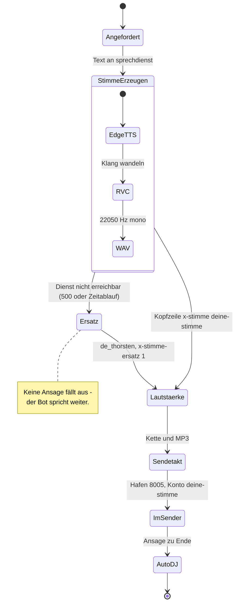

* Der **Ersatzweg greift automatisch** (auch bei GPU-Speicherfehlern des Stimmendienstes);
  er wird im Protokoll und in einer Kopfzeile kenntlich gemacht.
* Nach jeder Ansage schaltet Liquidsoap **selbstständig zum AutoDJ zurück**.

---

### Teil C — Querschnitt

#### C1 · Die GPU-Landkarte

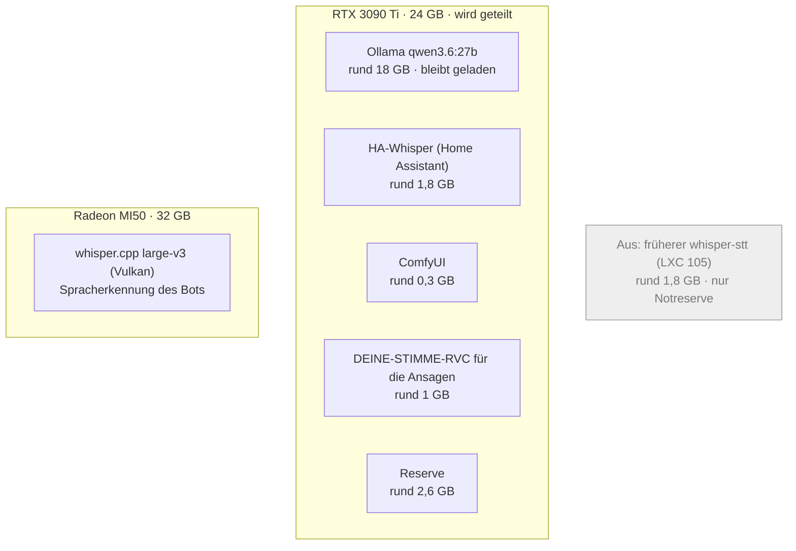

* **Lehre aus dem GPU-Vorfall:** Die Ansagen laden Ollama; war die Karte voll, brach die
  Stimme ab. Deshalb wanderte die **Spracherkennung auf die MI50** und der alte Dienst
  wurde stillgelegt.
* Die Belegung vor jeder Änderung prüfen: `nvidia-smi` (3090 Ti), MI50 siehe Bild C2.

---

#### C2 · Ersatzwege auf einen Blick

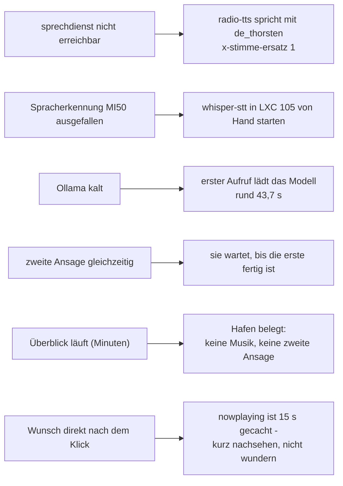

---

### Tabellen

#### Adressen

| Dienst | Adresse | Zweck |
| --- | --- | --- |
| n8n | `http://192.168.178.53:5678` | die Abläufe (Web: `DEIN-N8N-HOST`) |
| radio-tts | `http://192.168.178.53:8881` | Sprache, Ansage, Katalog, Listen, Postfach, Recherche |
| sprechdienst | `http://192.168.178.116:10205` | die Stimme DEINE-STIMME (`/tts`, `/health`) |
| whisper-amd (MI50) | `http://192.168.178.188:8000` | Spracherkennung (`/transcribe`) |
| Ollama | `http://192.168.178.187:11434` | Sprachmodell `qwen3.6:27b` |
| AzuraCast | `http://192.168.178.33` | Sender: API, Web; Icecast `:8000`, DJ-Hafen `:8005` |
| SearXNG | `http://192.168.178.26:8888` | Websuche für den Überblick |

#### Prüfen (je Bild ein Befehl)

| Bild | Befehl |
| --- | --- |
| A1/A2 | `ssh -F …/proxmox-ssh/config ai-server "pct exec 103 -- docker exec n8n n8n list:workflow"` |
| A3–A6 | `BETRIEB.md` §2 (Ende-zu-Ende über den Testeingang) |
| A5 | `curl -s http://192.168.178.188:8000/health` |
| A6/B2–B4 | `curl -s http://192.168.178.53:8881/health` und `curl -s http://192.168.178.116:10205/health` |
| B2 | `ssh … "pct exec 103 -- docker exec radio-tts env \| grep -E 'TTS_\|LIVE_'"` |
| C1 | `ssh … "pct exec 105 -- nvidia-smi"` (Belegung der 3090 Ti) |
| C2 | `ssh … "pct exec 103 -- docker logs --since 1h radio-tts \| grep -i eigene Stimme"` |

---

### Wo die Geschichten dahinter stehen

| Thema | Datei |
| --- | --- |
| Aufbau und Entscheidungen | `HANDBUCH.md` |
| Bau-Chronik (v1 bis v19) | `BAU.md` |
| Die Stimme DEINE-STIMME (Werte, Hörproben, verworfene Wege) | `STIMME.md` |
| Eine Stimme aus einer Serie klonen (Anleitung) | `STIMME.md` |
| Alle Schnittstellen | `HANDBUCH.md` |
| Prüfläufe | `BETRIEB.md` |
| Störungen und Ersatzwege | `BETRIEB.md` |

## Schnittstellen

Alle Adressen, die der Bot benutzt oder anbietet. Stand 2026-09-21 (Fassung 11).

**Grundregel:** Alles, was verändert, braucht die Kopfzeile `X-Meldung-Schluessel`
(Wert in `<dokuordner>/NACHBAU/zugangsdaten/meldung-schluessel.txt`). Nur die
Statusadressen und die öffentlichen Senderadressen kommen ohne Schlüssel aus.

---

### 17. Dienst `radio-tts` — `http://192.168.178.53:8881`

#### 1.1 Sprache und Ansage

| Adresse | Eingabe | Wirkung |
| --- | --- | --- |
| `POST /v1/audio/speech` | `{input\|text, voice, response_format: mp3\|wav, speed}` | OpenAI-kompatibel: erzeugt Sprache (ohne `voice` = Vorgabe `deine-stimme`, sonst Piper-Stimme) mit Lautstärke-Anpassung |
| `POST /live` | `{input\|text, voice, speed, host, port, mount, user, password, name, schweigen, schweigen_ende}` | **spricht live in den Sender** (DJ-Hafen Port 8005), im Sendetakt, mit Vor-/Nachlaufstille |
| `GET /v1/audio/voices` | — | verfügbare Stimmen |
| `GET /v1/models`, `GET /health` | — | Kontrolle |

Standardstimme ist seit 2026-09-23 die **eigene Moderationsstimme `deine-stimme`** (externe
Wandlungsstimme auf der GPU-Maschine, `http://192.168.178.116:10205/tts`; Entstehung:
`STIMME.md`). Ist sie nicht erreichbar, spricht der Dienst ersatzweise mit
`de_thorsten` (`EIGENE_STIMME_ERSATZ`; dann meldet `/v1/audio/speech` die Kopfzeile
`X-Stimme-Ersatz: 1`). Weitere deutsche Piper-Stimmen bleiben wählbar (Kurznamen in
`dienst/main.py`); `GET /v1/audio/voices` listet `deine-stimme` als externen Eintrag mit.

**Länge:** Eine Ansage darf bis **9000 Zeichen** lang sein — das sind rund **8,5 Minuten**
Sprechzeit (gemessen: rund 1050 Zeichen je Minute mit der aktuellen +40-%-Fassung). Der Dienst sendet im **Sendetakt**, ein
`/live`- oder `/ansage/…`-Aufruf dauert also **so lange wie die Ansage**; Aufrufer
brauchen einen Zeitablauf von mindestens 15 Minuten (im Bot so eingestellt). Ein
**Überblick** wird auf `RECHERCHE_UEBERBLICK_MAX_ZEICHEN` (Vorgabe 6000 ≈ 5,7 Min)
begrenzt.

#### 1.2 Postfach (Meldungen)

| Adresse | Eingabe | Wirkung |
| --- | --- | --- |
| `POST /meldungen/neu` | `{meldungen:[{quelle, art, titel, text, url, wichtig, von, bis}]}` | Meldung(en) ablegen; `art`: `wetter`, `nachrichten`, `rss`, `verkehr`, `hinweis`, `musik`, `sonstiges` |
| `GET /meldungen/offen` | `?anzahl=&art=&nur_neue=` | offene Meldungen (Radio-Bot holt hier ab) |
| `GET /meldungen/alle`, `GET /meldungen/status` | — | Bestand und Zähler |
| `GET /meldungen/text/{kennung}` | — | **Vorschau des Sprechtextes** (was der Moderator sagen würde) |
| `POST /meldungen/angeboten` | `{ids:[…]}` | als vorgelegt merken (kein zweites Angebot) |
| `POST /meldungen/erledigt` | `{ids:[…], grund: gesagt\|verworfen\|abgelaufen]` | abschließen; Antwort enthält Telegram-Text und Tastatur |
| `POST /meldungen/aufraeumen` | — | alte Meldungen entfernen |
| `POST /ansage/meldung` | `{id, trocken, stimme, speed}` | Meldung live sprechen (`trocken: true` = nur erzeugen) |
| `POST /ansage/text` | `{text, trocken, stimme, speed}` | freien Text live sprechen |
| `GET /ansage/status` | — | letzte Ansagen |

#### 1.3 Recherche (Wetter, Nachrichten, Feeds, Kurzinfos)

| Adresse | Eingabe | Wirkung |
| --- | --- | --- |
| `POST /recherche` | `{art: wetter\|nachrichten\|rss\|wikipedia\|ueberblick, wort, themen, quellen, ansagen, wichtig, trocken, quelle}` | holt die Information, legt sie als Meldung ab und spricht sie bei `ansagen: true` sofort |
| `POST /recherche` mit `art=ueberblick` | `{art: "ueberblick", themen: "ki, raumfahrt", quellen: "heise golem", ansagen: true}` | sucht zu **jedem Thema** Schlagzeilen (Google News), Hintergrund (Wikipedia), Treffer der **Websuche** (Seite wird geöffnet) und passende Meldungen der **21 Feeds**; Länge nach Material, Sicherheitsgrenze `RECHERCHE_UEBERBLICK_MAX_ZEICHEN` (Vorgabe 6000). Ohne `themen` kommen die neuesten Meldungen der Quellen |
| `GET /recherche/feeds` | — | alle Quellen, Arten und die Überblick-Einstellungen (`quellen`, `quellen_mit_themen`, `themen`, `thema_presse/web/wiki/feed`, `websuche`, `searx_url`, `webseiten`, `wetter_ort`) |

Antwort: `ok, id, art, titel, text, sprechtext, gesagt, dauer_sekunden, antwort`.
Unbekannter Ort → **404**, unbekannte Art → **422** (mit klarer Meldung).

Quellen (ohne Schlüssel, ohne fremde Bibliotheken):
Wetter = `geocoding-api.open-meteo.com` + `api.open-meteo.com`;
Presse/Fachfeeds = **21 Adressen** (tagesschau, tagesschau-wirtschaft, heise, heise-security,
spiegel, deutschlandfunk, n-tv, faz, welt, tagesspiegel, taz, mdr, swr, golem, netzpolitik,
t3n, computerbase, scinexx, ingenieur, sportschau, wetter);
Themen-Presse = Google News (`news.google.com/rss/search?q=…`, findet auch Seiten ohne Feed);
Kurzinfo = Wikipedia REST **und** Wikipedia-Suche (`action=query&list=search`, findet den genauen
Artikeltitel — die Einleitungs-Schnittstelle braucht ihn exakt);
Websuche = **eigene SearXNG-Instanz** (`RECHERCHE_SEARX_URL`, hier LXC 108 auf
`http://192.168.178.26:8888`, Einrichtung: `NACHBAU/searxng-einrichten.md`), sonst
DuckDuckGo lite, sonst Bing
(die gefundene Seite wird gelesen: Titel, Beschreibung, Absätze — per `html.parser`;
Bedienhilfen wie `visually-hidden`/`aria-hidden` und Symboltitel in `<svg><title>` werden
aussortiert).
Eigene Seiten ohne Feed können als `RECHERCHE_WEBSEITEN` (kommagetrennt) hinterlegt werden;
sie werden in jeden Überblick mit aufgenommen.

Der **Überblick** arbeitet je **Thema**: Presse-Schlagzeilen, Wikipedia-Hintergrund,
Websuche samt **gelesener Seite** und passende Feed-Meldungen. Je Thema sind
`RECHERCHE_THEMA_MELDUNGEN` Plätze vorgesehen (Vorgabe **6**); die Presse bekommt davon
höchstens `RECHERCHE_THEMA_PRESSE` (Vorgabe 3) — und nur so viele, dass für Wikipedia
(`RECHERCHE_THEMA_WIKI`), Netz (`RECHERCHE_THEMA_WEB`) und Feeds (`RECHERCHE_THEMA_FEED`)
je **ein** Platz reserviert bleibt. Sonst verdrängen die Schlagzeilen (die keinen
Fliesstext tragen) den Inhalt. Ein Thema ohne Fund wird nicht angekündigt. Eine
Zeitvorgabe gibt es nicht: die Länge ergibt sich aus dem Material. Fällt eine Quelle aus,
wird sie unter `ausgefallen` genannt und übersprungen („Quelle hatte nichts zum Thema"
ist dagegen kein Ausfall). Für **Wetter** wird Open-Meteo genutzt (Ort aus
`RECHERCHE_WETTER_ORT`), weil die öffentlichen Wetter-Feeds 404 liefern.
Gemessen am 2026-09-21 (`themen: künstliche intelligenz`): Presse 3, Wiki 1, Web 1
(Seite gelesen), 1341 Zeichen, 79 s Sprechzeit; live über den Bot
(`themen: raumfahrt`): „Überblick gesagt (1.3 Min, 3 aus der Presse, mit Hintergrund,
1 aus dem Netz)".

#### 1.4 Katalogdienst (Suche im Archiv)

| Adresse | Eingabe | Wirkung |
| --- | --- | --- |
| `GET /suche` | `?q=&anzahl=&min_punkte=` | unscharfe, tippfehlertolerante Suche (48.729 Titel) |
| `GET /genre` | `?wort=&anzahl=&mischen=` | Richtung/Stimmung/Jahrzehnt |
| `GET /genre/liste` | — | gültige Richtungsworte |
| `GET /katalog/kuenstler` | — | häufigste Interpreten (für die Spracherkennung) |
| `GET /katalog/status` | — | Zustand des Index |
| `POST /katalog/aktualisieren` | — | Index neu aufbauen (~47 s) |

#### 1.5 Wiedergabelisten

| Adresse | Eingabe | Wirkung |
| --- | --- | --- |
| `POST /playlist/befehl` | `{text}` | Listenauftrag in Worten (anlegen, füllen, zeigen, umbenennen, leeren, löschen, starten) |
| `POST /playlist/knopf` | `{daten, text}` | Knopfdruck (`callback_data`) |
| `POST /playlist/vorschlag` | `{text}` | Vorschlag für eine Liste |
| `GET /playlist/status` | — | offene Auswahlen je Chat |

---

### 18. Sender AzuraCast — `http://192.168.178.33/api`

Der Bot benutzt die offizielle REST-Schnittstelle (OpenAPI 3, **263 Endpunkte**).
Die vollständige Spezifikation: `GET /api/openapi.yml`, Bedienoberfläche `/api/docs`.
Schlüssel im Kopf `X-API-Key: <identifier>:<verifier>`.

Für den Bot wichtige Adressen:

| Adresse | Zweck |
| --- | --- |
| `GET /api/nowplaying/1` | was läuft, was danach, Hörer, `is_live` (15 s gecacht) |
| `GET /api/station/1/files?searchPhrase=…&rowCount=…` | Titel im Archiv suchen (**Wörter werden mit UND verknüpft**) |
| `PUT /api/station/1/files/batch` | `{"do":"immediate"\|"queue"\|"playlist"\|"move", …}` — spielen, einreihen, Wiedergabeliste füllen, verschieben |
| `POST /api/station/1/playlist/{id}/import`, `DELETE …/playlist/{id}/empty`, `DELETE …/playlist/{id}` | Listen füllen/leeren/löschen |
| `GET/POST/PUT /api/station/1/playlist(s)`, `/streamers`, `/mounts`, `/remotes`, `/webhooks`, `/reports`, `/queue`, `/history`, `/requests` | Senderverwaltung |
| `POST /api/admin/debug/sync/{NowPlaying,QueueInterruptingTracks,…}` | interne Synchronisation |
| `PUT /api/admin/debug/station/1/telnet` | Liquidsoap-Befehl (z. B. `interrupting_requests.flush_and_skip`) |
| `GET /api/admin/{stations,users,roles,settings,backups,relays,storage-locations,auditlog}` | Verwaltung |

**Live-Moderation** läuft nicht über die API, sondern über den **DJ-Hafen**
Port **8005**, Mount `/` — dort spricht der Dienst `radio-tts` hinein, und zwar mit
einem **eigenen Streamer-Konto `deine-stimme`** (Anzeigename **„DEINE-STIMME“**; Zugang in
`geheim.env`). Der Sender zeigt beim Sprechen den Anzeigenamen des Kontos, also
**„DEINE-STIMME“** statt meines Namens. Icecast-Frontend für Hörer: Port **8000**.

---

### 19. Spracherkennung — `http://192.168.178.188:8000`

| Adresse | Eingabe | Wirkung |
| --- | --- | --- |
| `POST /transcribe` | multipart: `file`, `language` (Standard **de**), `prompt` | Text der Sprachnachricht (**whisper.cpp large-v3 auf der MI50**, LXC 112 — seit 2026-09-23) |
| `GET /health` | — | Zustand |

Der `prompt` ist ein Fachhinweis (häufigste Interpreten aus dem Katalog) — damit
werden Namen wie „Nirvana" oder „die Ärzte" zuverlässig erkannt. Der frühere Dienst
(faster-whisper large-v3, LXC 105, Port **18790**) ist seit dem Umzug **abgeschaltet**
und liegt als Ersatzweg bereit (`pct exec 105 -- systemctl start whisper-stt`).

---

### 20. Sprachmodell — `http://192.168.178.187:11434/v1`

| Adresse | Eingabe | Wirkung |
| --- | --- | --- |
| `POST /v1/chat/completions` | `{model, messages, temperature, max_tokens, reasoning_effort: "none", tools?}` | Planen, Ausführen, Prüfen |

Modell `qwen3.6:27b` (17,7 GB, RTX 3090 Ti). Weitere Modelle im Container:
`qwen2.5:14b`, `qwen3-coder:30b`, `gemma4:26b`, `phi4:14b`, `llama3.1:8b`,
`qwen3-embedding:8b`.

Wichtig: `reasoning_effort: "none"` und ein Token-Budget (3000/4000) — sonst
verbraucht das Modell das Budget mit Denk-Token und antwortet leer.

---

### 21. Testeingang des Bots (nur zum Prüfen)

```
POST http://192.168.178.53:5678/webhook/DEIN-WEBHOOK-PFAD?schluessel=<Schlüssel>
Body: eine Telegram-Nachricht als JSON, z. B.
{"message":{"message_id":1,"chat":{"id":<chatId>,"type":"private"},
            "from":{"id":<chatId>,"first_name":"Test"},"text":"was läuft"}}
oder ein Knopfdruck:
{"callback_query":{"id":"1","data":"w1","from":{"id":<chatId>},
                   "message":{"message_id":9,"chat":{"id":<chatId>,"type":"private"}}}}
```

Damit lassen sich alle Wege ohne echtes Telegram prüfen (siehe `BETRIEB.md`).
