# Handbook — Capabilities, Architecture, Interfaces

## Capabilities

As of 2026-09-21 (Version 11); Voice segment added 2026-09-23 (Version 19).
All figures are **measured**, not estimated; the
numbers are in parentheses. Example sentences are formulated as the bot actually understands them — it does not need to see key words.

---

### 1. Music and Program

| Capability | Example | Behavior |
| --- | --- | --- |
| Title Request | "play Benzin by Rammstein" | searches, plays **immediately** (interrupts the current track) |
| Queue Title Request | "play something by Nirvana after that", "play X later" | queues behind the current track |
| Request by Number | "2" after a selection list | plays the second suggestion |
| Multiple Hits | "play Thriller" | shows candidates as **clickable buttons**, asks briefly |
| Artist Request | "play something by Scooter" | searches the archive (48,729 tracks) and the catalog |
| Mood Request | "play something peppy", "something calm", "something rock" | translates the mood without a speech model into a direction and plays the first matching track |
| Direction after Genre/Jahrzehnt | "play something from rock", "90s" | searches the catalog service for Genre/Jahrzehnt |
| Program Information | "what's playing", "what's next", "how many are listening" | State in plain text (1.4 s) |
| Control | "next track", "skip", "pause", "restart the station", "station starten/stoppen" | fixed addresses of the station, without speech model |
| Warteschlange/Verlauf | "what's queued" | List from the station interface |
| **Batch Command** | "play Benzin and then Hyper Hyper, play something peppy, what's playing" | up to **10 tasks** in one message; the **first** track plays immediately, **subsequent tracks automatically queued** (measured: "Benzin" immediately, "Hyper Hyper" next) |

**Limits:** Titles not in the archive cannot be played by the bot — it says
so and shows what fits instead. Fragments under 45 s and the moderation folder
are never suggested; `_Archiv/` (Live/Bootlegs) remains outside (48,729 of
56,635 tracks are searchable).

---

### 2. Moderation: Speaking in the Live Program

The bot speaks **on its own** — since 2026-09-23 with its **own voice `deine-stimme`**
(style voice; service `sprechdienst` on the GPU machine, creation: `STIMME.md`),
spoken into the live broadcast. If the voice service is not available,
it speaks instead with Piper (`de_thorsten`); Piper voices remain selectable via
`voice`/`stimme`.

The AutoDJ mutes for the announcement and resumes afterward.

| Capability | Example | Measurement |
| --- | --- | --- |
| Free Announcement | "announce: the show starts in five minutes" | Text → Voice → Broadcast |
| Weather Announcement | "search for the weather in Marbach am Neckar" | 49.9 s including research; speaking time 27.6 s |
| News Announcement | "read the news" | 58.7 s |
| RSS Feed Announcement | "read the feed from tagesschau" | Feed is read |
| Quick Info | "who is..." (via the research request) | Wikipedia introduction |
| Announcement from the Inbox | Button ▶️ on a notification card | Announcement + Confirmation |
| Announcement without Reading | "..., but don't read it" | only inbox fills (15.1 s) |
| **Source Overview** | "overview ki, space" · "topics: ki, space" · "overview from heise and golem" | for each **topic**: Headlines from the press (Google News), Background from Wikipedia, a **read web page** from the **own search engine** (SearXNG in LXC 108) and relevant **21 feeds**; Length depends on the material — measured 0.4 min (1 topic, 2 headlines), 1.5 min (2 topics), 2.4 min (3 topics); live on 2026-09-21: "topics: space" → 1.3 min with 3 headlines, background and **1 web page** |
| Overview **without** Announcement | "give me an overview of ki, but don't read it" | Contribution is only filed as a notification (22.9 s, **no** interruption of the program) |

**Preparation of the Speech Text:** Links and Markdown are removed, emojis are
deleted, abbreviations are spelled out (e.g., → for example), units are spoken
(°C → degrees, % → percent, km/h → kilometers per hour), ticker symbols from feeds
(++++++) are removed, sentence truncation at the end (standard **9000 characters ≈ 8.5 minutes**, previously 700), a prelude and postlude for each message type ("Now the weather overview." … "That was the weather."; for the overview "That was the overview. And now it's time for music.").

**Volume (Version 8):** Piper delivers full peaks but is quieter on average
(−16.6 LUFS) compared to the music program (−9.8 LUFS). The service boosts the voice with
high-pass filtering, compression (3:1), and a lookahead limiter to broadcast volume:
**−13.1 LUFS** in the file, **−11.8 LUFS** on air, peak −1.0 dBFS — about 4 dB
louder, without oversteering. The own voice `deine-stimme` runs through **the same chain**;
in operation, it has been set softer since 23.09. (high-pass 50 Hz, compression 2:1 from −18 dB, target −12.5 dBFS — see `BETRIEB.md`). When speaking, the voice is heard in the studio as a streamer **"YOUR-VOICE"**.

---

### 3. Mailbox and Release (Interface for Other Bots)

The bot has a **mailbox**. A foreign bot ("Searchbot") can leave messages there;
the bot presents them to me in Telegram as **a card with buttons** (▶️ Read / 🗑️ Discard) and only reads them after approval.

| Capability | Behavior |
| --- | --- |
| Accept message | `POST /meldungen/neu` (with key) — type, title, text, important, source, URL |
| Automatic presentation | a **5-minute** schedule checks for new messages; `angeboten_am` prevents a second offer |
| Read aloud | Button ▶️ → live announcement to the studio, followed by confirmation with duration |
| Discard | Button 🗑️ → marks the message as discarded |
| Query mailbox | "what are there for messages" → list **without** announcement (0.3–1.4 s, without speech model) |
| Clean up | alte/erledigte messages removed (`POST /meldungen/aufraeumen`) |

Message types with their own Vor-/Nachspann: `wetter`, `nachrichten`, `rss`, `verkehr`,
`hinweis`, `musik`, `sonstiges`.

---

### 4. On-Demand Research

The bot retrieves content **on its own** from the internet — without a foreign bot, without a key:

| Type | Source | Example |
| --- | --- | --- |
| `wetter` | Open-Meteo (location search + forecast) | "search for the weather in Marbach am Neckar" → "24 degrees, cloudy, 35 percent, 19 km/h" |
| `nachrichten` | RSS from tagesschau, heise, Spiegel, Deutschlandfunk, Sportschau | "read the news aloud" |
| `rss` | any feed address or short name | "read the heise feed aloud" |
| `wikipedia` | Wikipedia short info (REST) | "who is …" |
| `ueberblick` | **Topics** are searched in multiple sources: press (Google News), Wikipedia, **own search engine** (SearXNG, the found page is opened) and the **21 feeds** | "overview ki, space travel" · "topics: photovoltaic" · "overview electromobility from heise golem" → article; up to 6 pieces per topic (press 3, Wikipedia, web page, feed), length according to material (safety limit 6000 characters ≈ 5.7 min) |

Unknown location → clear message (HTTP 404), unknown type → 422. Each result is
stored as a message (thus also readable later) and can be read aloud on request.

---

### 5. Playlists

Via a dedicated service path (without language model, therefore fast: 0.2–0.7 s per step):

| Capability | Example |
| --- | --- |
| Create and fill | "create a playlist Summer with rock" |
| Create and start immediately | "build a playlist from Scooter and play it" (without confirmation) |
| Display | "show playlists", "what is in Summer" |
| Rename | "rename Summer to Summerhit" |
| Empty / Delete | "empty the playlist Summer" / "delete the playlist Summer" (with yes/no buttons) |
| Swap titles | "replace title 3 in Summer with …" |
| Suggestion | "suggest something for a party playlist" |

**Limit (honest):** The bot cannot yet remove individual tracks from a playlist — it says so. An open selection does not survive a service restart.

---

### 6. Station Management

The agent has tools to use the **AzuraCast interface**:
`azura_endpunkte` (look up address), `azura_aufruf` (call up), `azura_ueberblick`
(mounts, streamer, output, playlists). This allows all 263 endpoints of the
station API — including:

* Mounts (Mounts), streamers, remote connections, webhooks
* Media: search, move (via the API, to preserve associations)
* Users, roles, settings, reports
* Backups
* Restart streamer and output

**Security rule:** The bot only makes modifying calls (POST/PUT/DELETE) if the
I explicitly agree; otherwise, it shows a **dry run** and asks for
permission in simple terms ("Should I create this?"). It does not use technical terms.

---

### 7. Understanding: Text, Speech, Buttons

| Input | Behavior |
| --- | --- |
| Text message (German or English) | Analyzed in stages (see `HANDBUCH.md`); the language of the message travels along as the field `sprache` and determines the language of all replies |
| **Voice message** | Retrieve file → whisper.cpp large-v3 on the MI50 (hint `de`; English messages are recognized as well) → text; the bot shows what it understood for verification; a technical note with the most common interpreters improves name recognition |
| Button press | acts like the typed number; menus are **edited** instead of resent (no message spam) |
| Multiple tasks | "play X and check the weather for Y" → two commands, processed in the specified order |
| Management tasks | "create …", "delete …", "show …" — via the agent with tools |
| No task recognized | the bot says so, instead of guessing |

**German and English in one chat (as of 2026-09-25):** the bot detects the language
of every message and answers in it — shortcuts, selection lists, model replies and
announcements ("what is playing right now" → "Now playing: …"). Voice messages and
button presses keep the language of the chat. **Deliberately German** remain the
content (news, weather) and the admin paths of the service.

**Only the operator** can access (list `erlaubte` in the static data of the
flow). The test entry additionally requires a secret key.

---

### 8. Operation, Security, Quality

| Capability | Status |
| --- | --- |
| Self-check per task | Level 3 checks each command against the actual station state; failed commands get **one** retry |
| Confirmation instead of failure | If the bot recognizes that it needs to ask the user something, it shows the question with selection buttons (no "not completed") |
| Second transmission attempt | If editing a message fails, the bot sends it again |
| Test catalog | 45 samples (service) + 20 (response paths) + 19 (short commands) + 37 (switches) + 6 (bot end-to-end) — all green |
| Canvas | 0 findings: each node in exactly one frame, no overlap, each node with labeling |
| Versions | v1–v21 secured, each with description (see `BAU.md`) |
| Failures | Model errors do not abort the run (retries + language model-free fallback paths) |

---

### 9. What the Bot **cannot** do (intentionally)

* Play music from streaming services (only own archive)
* Remove individual tracks from a playlist (it says so openly)
* Make more than **one** announcement at the same time (the station has a harbor)
* Invent: for unknown Titel/Orte it reports "not found" instead of guessing
* Change anything without permission

## Architecture

As of 2026-09-21 (Version 11). This file describes **how** the bot operates and
**why** it is built this way.

---

### 10. Layered Structure

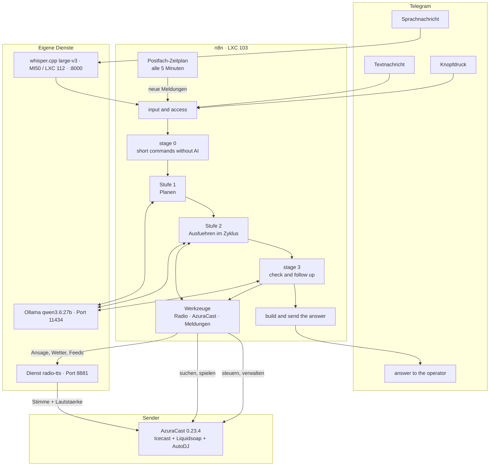

---

### 11. The Path of a Message (Stages)

The bot operates in **four stages**. Each stage is a distinct process in the workflow (see `ANHANG/ANORDNUNG.md`).

| Stage | What Happens | Technology |
| --- | --- | --- |
| **0 — Short Command** | Recognizes fixed rules for simple commands (song request, direction, skip, status, mailbox query, **topic overview**) and sends them **directly** for execution | Code nodes, no language model → 0.3–1.7 s |
| **1 — Planning** | Free text is broken down into **commands**: `{"befehle":[{"art":…}]}` — **up to ten tasks**, at most three attempts, then fallback path without model | `qwen3.6:27b`, plain HTTP call, 3000 tokens, `reasoning_effort: none` |
| **2 — Execution** | **Each command a loop**: without model (radio tool), over fixed sender addresses (control) or with the agent and its tools; **multiple titles** are automatically queued (first one immediately) | Agent with 8 tools, 3000 tokens; Overview fetches and speaks the service |
| **3 — Verification** | Judgment per command **against the actual sender state** (what is running, what is queued); failed commands get **one** second attempt; then build and send response | `qwen3.6:27b`, 4000 tokens; in clear cases rule judgment without model |

Command types for analysis: `spielen`, `richtung`, `programm`, `recherche`, `verwalten`.

---

### 12. Why It Is Built This Way (Decisions)

**The tools play themselves.** The model never sees **file paths** — it
chooses, the tool provides. Reason (measured): smaller models invent paths
and announce titles only, instead of playing them.

**Short commands without model.** A simple request took over the model path 163 s
(earlier: six model calls, hundreds of thought tokens). With stage 0, `reasoning_effort:
"none"` and a rule judgment instead of model, it is 1.7 s. What the stage does not
recognize securely goes **unchanged** to analysis.

**Responses are documented, not claimed.** The bot checks after each task the
actual sender state. If the title does not run and is not in the queue, the task is
considered unfulfilled — even if the model wrote "running".

**Query is not a failure.** If the bot needs to ask something (multiple titles fit),
it shows the list **verbatim** with buttons and does not **summarize**. Previously,
the second attempt overwrote the list with "(no output)" — the user never saw the
choices.

**All modular lies in the service, not in the workflow.** Text preparation, announcement,
catalog search, playlist management, and research are Python modules in the service `radio-tts`.
The n8n workflow **only forwards** (switch → HTTP → send). New sentences usually
require only a change in the module, not a rebuild of the workflow.

**The workflow is not built by hand.** The generator
`werkzeuge/agent-wf-bauen.py` creates all four workflows; positions, areas,
frames, and labels are tables within. Changes go surgically
over `agent-patchen.sh` into the running workflow (never rebuild completely — a full rebuild
would change the tool names relative to the model).

---

### 13. Individual Components

#### 4.1 n8n Flows (four)

| Flow | ID | Nodes | Purpose |
| --- | --- | --- | --- |
| Radio – Telegram Agent | `RadioAgentBot` | 81 | the bot itself: input, stages, response |
| Tool – Radio | `RadioWerkzeug` | 16 | Titel/Richtung search, play, queue, state |
| Tool – AzuraCast | `AzuraWerkzeug` | 16 | lookup, call, overview of station addresses |
| Tool – Messages | `MeldungenWerkzeug` | 13 | mailbox, announcements, research |

(An additional older flow `bjFSfXGqpLg7AAXw` is archived in the project.)

#### 4.2 Service `radio-tts` (LXC 103, Port 8881)

A FastAPI service with six modules; structure and addresses in `HANDBUCH.md`.

| Module | Task |
| --- | --- |
| `main.py` | Speech output (own voice `deine-stimme` as prompt, Piper selectable; OpenAI compatible), **live announcement** including volume chain |
| `katalog.py` | Search index of the archive (48,729 titles), fuzzy and typo-tolerant, Genre/Jahrzehnt |
| `playlist.py` | Build, manage, start playlists (state per chat) |
| `meldungen.py` | Mailbox, moderation, and speech texts, release |
| `suche.py` | Research: weather, news feeds, RSS, Wikipedia — and the **topic overview** (press, web, feeds) |
| `whisper_server.py` | Speech recognition of the bot runs **not here**, but as `whisper-amd` in LXC 112 (MI50, Port 8000, since 2026-09-23); LXC 105 (Port 18790) is the deactivated fallback route |

#### 4.3 AzuraCast Station

* Station *Deadline Beats* (ID `deadline_beats`), Icecast frontend (listeners) +
  Liquidsoap (AutoDJ), **DJ port 8005** (here the bot speaks in)
* 56,635 titles (15-TB drive), of which 48,729 in request-/Suchbestand
* Rotation: Playlist "List A" (72 titles) — the rest is wish pool
* Bot's wish paths: `PUT /files/batch` with `do=immediate` (immediate, interrupts)
  and `do=queue` (queue); before an immediate wish, the interrupting queue is cleared to ensure the latest wish wins

#### 4.4 Speech Models on the GPU

* **Ollama** (`qwen3.6:27b`, 17.7 GB) for planning, execution (with tools), and evaluation.
  Warm-up 2.5–4 s; the model stays loaded with `OLLAMA_KEEP_ALIVE=30m` (a reload takes 43.7 s).
* **whisper.cpp large-v3** (Vulkan on the **MI50**, LXC 112, `:8000`) for the bot's speech messages, language fixed `de`, with expert hint (most frequent interpreters) for better names; in LXC 105 runs the Whisper of the Home-Assistant speech service — the former radio service (`:18790`) is deactivated.
* **Voice service `sprechdienst`** (CT 111, Port 10205) for the **own moderation voice `deine-stimme`** of announcements: edge-tts → RVC model `<your-model>`. If it is not reachable, `radio-tts` speaks as a fallback with Piper (`EIGENE_STIMME_ERSATZ`). Creation and replication:
  `STIMME.md`, `NACHBAU/eigene-stimme/`.

---

### 14. Data Flow of an Announcement (Example)

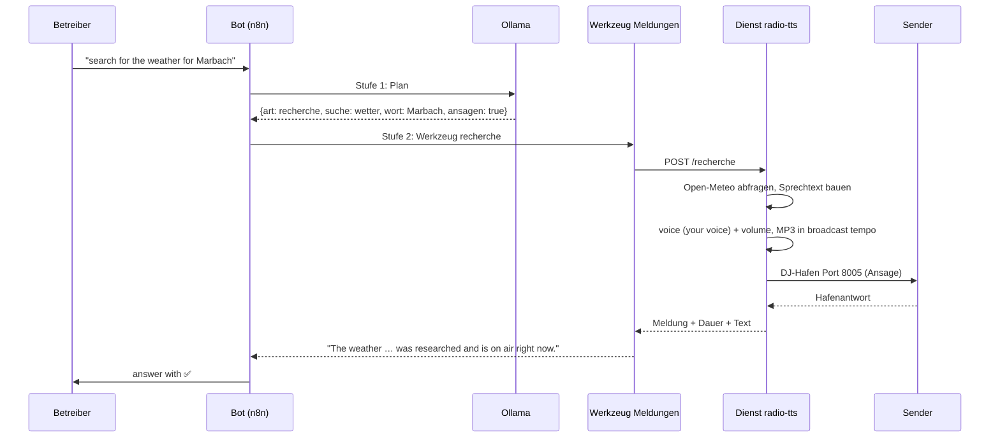

---

### 15. State and Memory

| State | Where | Lifespan |
| --- | --- | --- |
| Running Task (Commands, Outputs, Judgments) | static data in the n8n flow (`d.lauf`) | until the end of the run |
| Last Response (for "yes, do that") | static data (`d.letzteAntwort`) | until the next message |
| Marked Selection List (Titles + Paths) | static data in the **Tool** flow (`d.listen`) | until resolution |
| Open Playlist Selection | service memory (per chat) | until service restart |
| Mailbox (Messages) | file `/daten/meldungen.json` in the service | permanently |
| Search index of the archive | `/daten/katalog.json` (44 MB) | until the next update (~47 s) |

---

### 16. Operating Limits (Known)

* A language model call takes 2–4 s warm; an agent path with multiple tools takes
  20–60 s. Short commands bypass this.
* The DJ port can handle only **one** announcement at a time; the second one waits.
* An **Overview** locks the DJ port for as long as the contribution (minutes): During
  this time, no music plays and no second announcement can be made. Before this, the
  service collects and generates the text (10–90 s, depending on the number of topics
  and sources) — hence a 15-minute time window.
* Liquidsoap buffers at the port ~10 s — therefore, the service sends the announcement
  **in the broadcast rhythm** (otherwise Liquidsoap discards the rest).
* `/api/nowplaying` is cached for 15 s (responses can lag slightly).

## Diagrams

**As of 2026-09-24.** This collection shows in **Mermaid diagrams** everything needed to
explain the Bot and the voice: from the overall machine picture to the message path and
the creation of the moderation voice "YOUR-VOICE." The numbers and names come from `README.md`, `HANDBUCH.md`,
`STIMME.md`, and `STIMME.md`.

> **View:** Open the Markdown preview in VS Code (**Ctrl+Shift+V**). On GitHub, the images
> render automatically. The sequence diagrams (A3–A6), state diagram (B4), and class view
> (B3) are UML-like; flow diagrams (A1, A2, A7, B1, B2, C1, C2) are also included.

| Part | Diagrams |

| --- | --- |

| **A — The Bot** | A1 Overview · A2 Processes · A3 Message Path · A4 Music Request · A5 Speech Message · A6 Announcement with Approval · A7 Topic Overview |

| **B — The Voice** | B1 Creation (Clone Pipeline) · B2 Speaking Chain in Operation · B3 Services (Class View) · B4 States and Substitutions |

| **C — Cross-Section** | C1 GPU Map · C2 Substitution Paths · Address and Check Tables |

---

### Part A — The Bot

#### A1 · The Overview

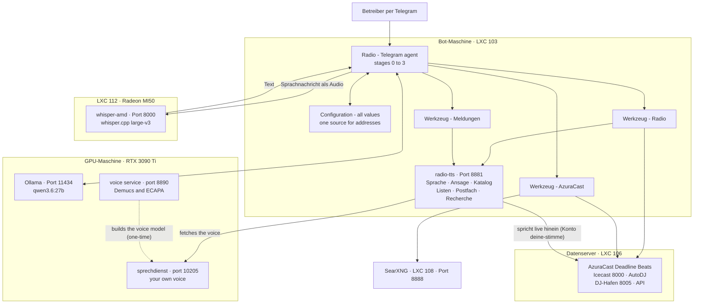

* The **3090 Ti is shared by Ollama and YOUR-VOICE** — the allocation is shown in diagram C1.
* The **speech message** runs through n8n for recognition on the MI50 (diagram A5).
* `radio-tts` is the **only service that speaks to the sender**; the tools only control.

---

#### A2 · The Processes in n8n

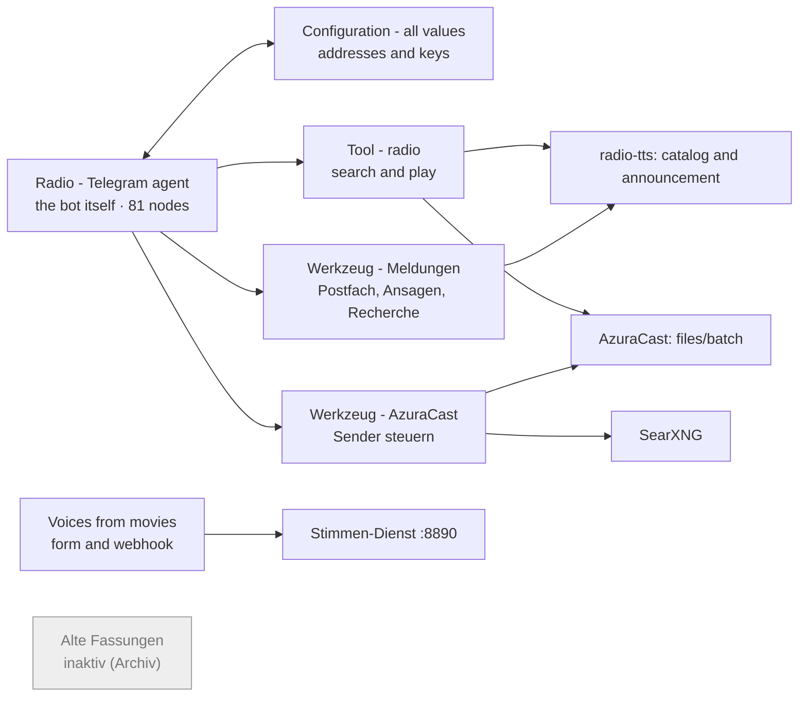

* Four **tool processes** carry out the work; the agent plans and checks (diagram A3).
* The agent has **8 tools**, including `azura_endpunkte`, `azura_aufruf`,
  `azura_ueberblick` (look up addresses instead of guessing).
* In n8n, there are also the **old Wunschbot versions** — gray means: not active.

---

#### A3 · The Message Path (Stages 0 to 3)

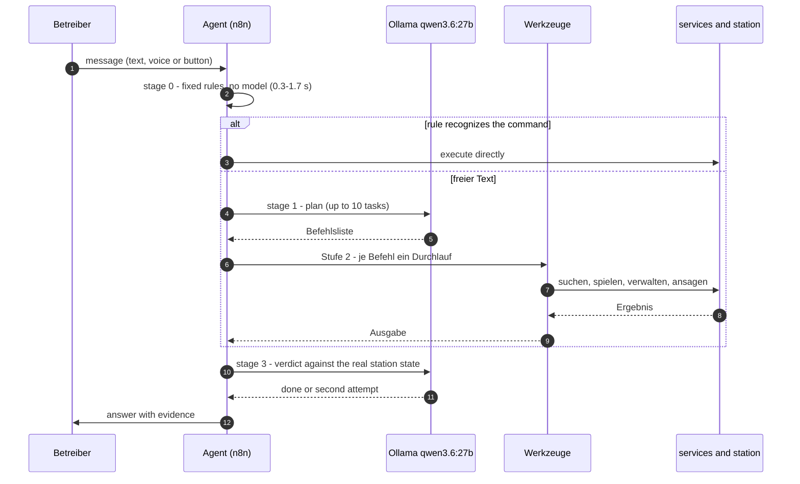

* **Stage 0** catches frequent requests without AI (fast, deterministic).
* **Stage 1** breaks down free text into commands; **Stage 3** checks against the actual
  sender state — "occupied, not claimed."
* What the rules cannot recognize with certainty goes **unchanged** to the analysis.

---

#### A4 · Example: Immediate Music Request

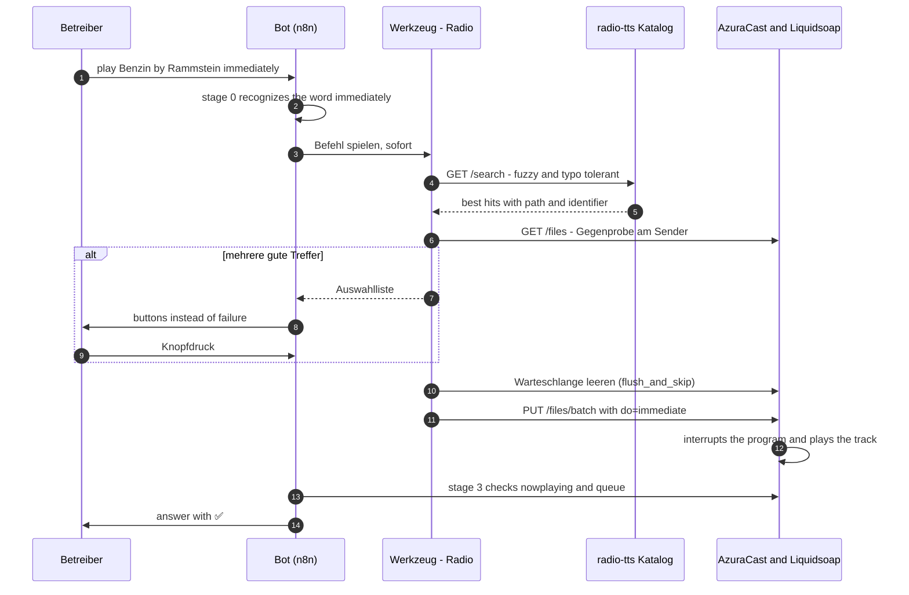

* The **latest request wins**: Before starting, the interrupting queue is cleared (`interrupting_requests.flush_and_skip`).
* `do=immediate` = **immediate** (cuts in), `do=queue` = **queue** — without any
  pre-check, so Stage 3 checks the actual state afterward.

---

#### A5 · Example: Speech Message

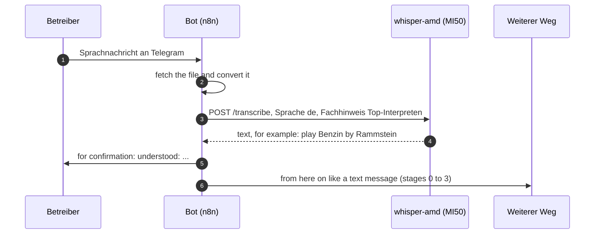

* The recognition runs on the **MI50 (whisper.cpp, Vulkan)**; the **special hint** with
  the most common interpreters improves name matches significantly.
* The recognized message is treated **word-for-word as typed text**.

---

#### A6 · Example: Announcement with Approval

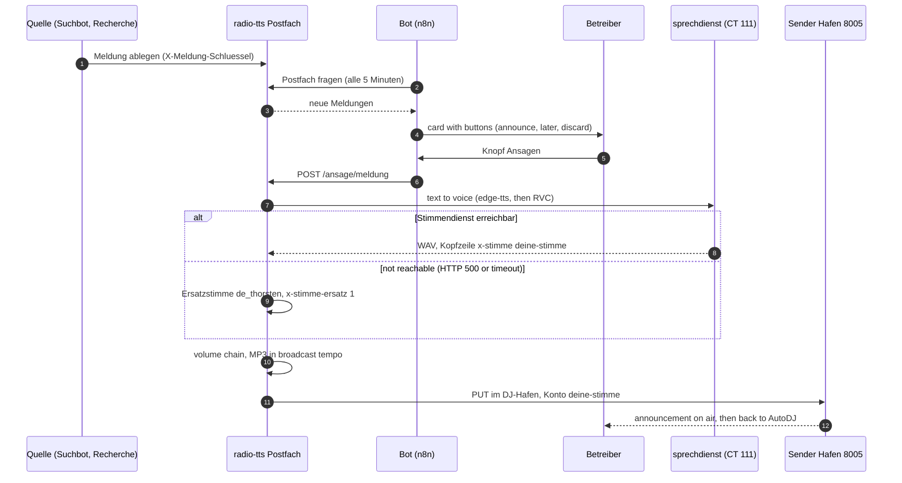

* **Nothing goes automatically to the sender** — every announcement is approved.
* In the sender, the active streamer appears as **"YOUR-VOICE"** (its own bot account).
* An announcement occupies the harbor; the next one waits (diagram C2).

---

#### A7 · The Topic Overview

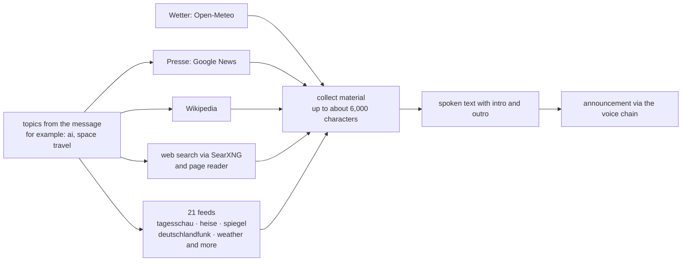

* Each topic brings together **headlines, background, a read web page, and feed hits**;
  the length depends on the material.
* During the contribution, the harbor is occupied — **no music, no second announcement**.

---

### Part B — The Voice

#### B1 · The Creation (Clone Pipeline)

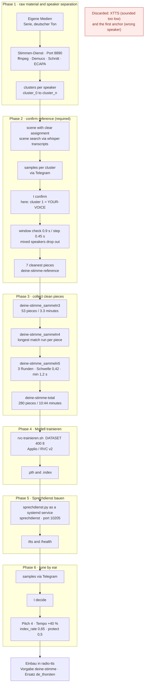

* **The most important rule:** Collection can only begin once I have confirmed the reference — a false anchor can cost an entire model.
* Each tuning knob (Pitch, Tempo, `index_rate`) was **decided by listening test**.
* Vor-/Abspann-Lieder are weeded out; they survive the vowel segmentation and would
  distort the model.

---

#### B2 · The Speech Chain in Operation

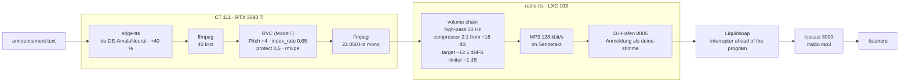

* **File creation** takes 1.4–3.8 s (the first call after a service start is ~9 s);
  **sent in real-time** (send interval — the harbor buffers only ~10 s).
* The **Volume Chain** (my choice from 09/23, "Variant 3") makes the voice
  less bright; target level −12.5 dBFS.

---

#### B3 · The Services (UML Class View)

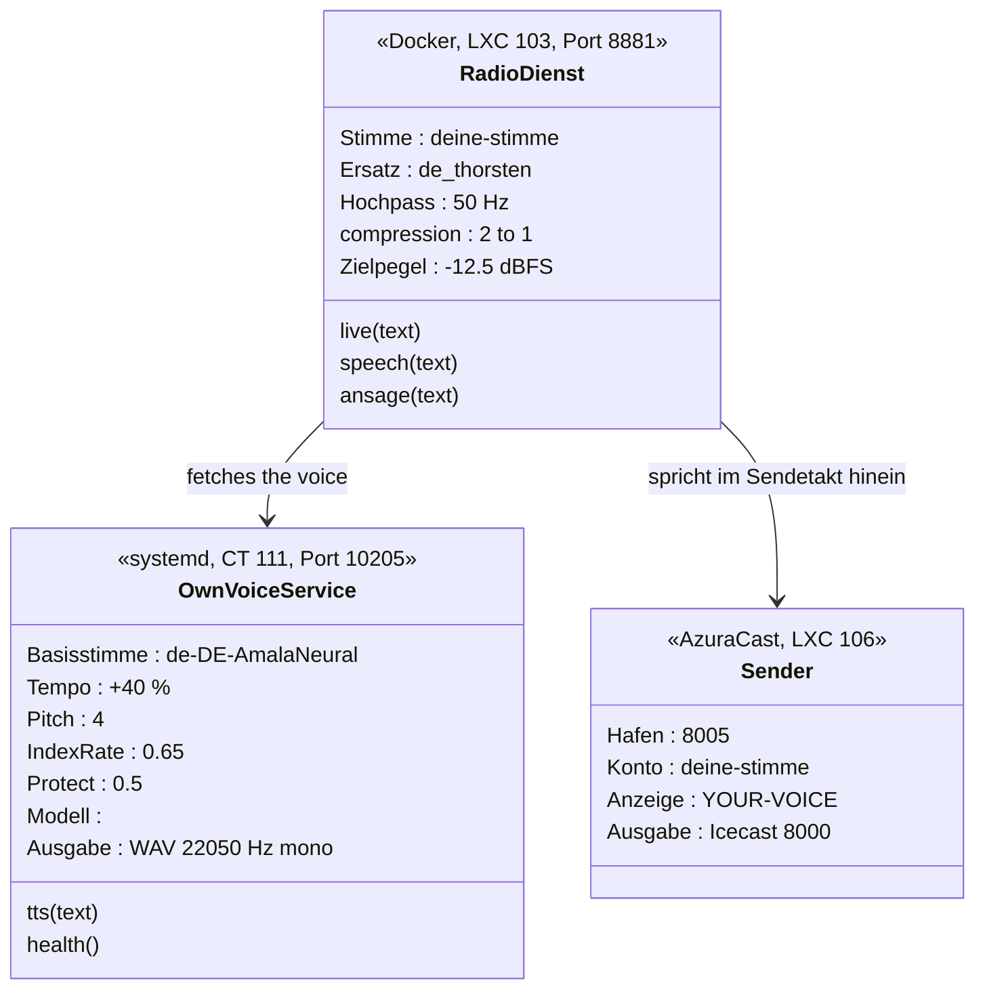

* The **Radio Service knows two voice paths**: your own voice and `de_thorsten`
  (backup) — Piper voices remain selectable via the `voice` parameter.
* The **account `deine-stimme`** at the harbor is the reason why "YOUR-VOICE" is displayed in the transmitter.

---

#### B4 · States of an Announcement (with Backup Path)

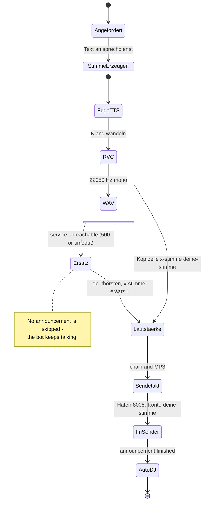

* **The backup path is activated automatically** (even in case of GPU memory faults of the voice service);
  it is marked in the log and in a header line.
* After each announcement, Liquidsoap **switches back to AutoDJ independently**.

---

### Part C — Cross-section

#### C1 · The GPU Map

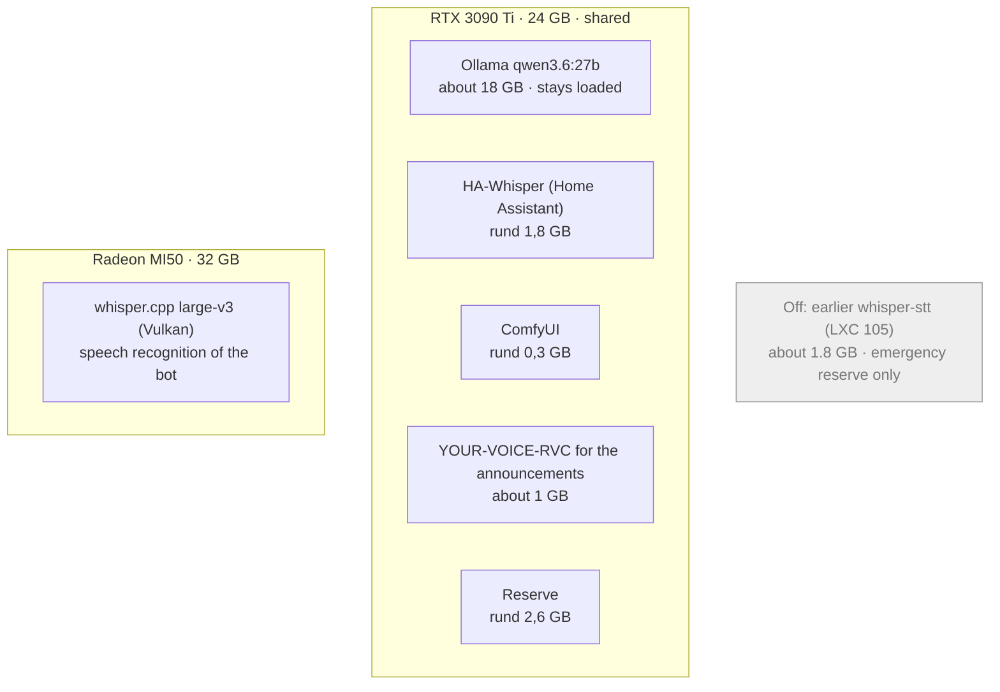

* **Lesson from the GPU incident:** Announcements load Ollama; if the map was full, the
  voice would cut off. Therefore, the **speech recognition moved to the MI50** and the old service
  was shut down.
* Check the occupancy before each change: `nvidia-smi` (3090 Ti), MI50 see image C2.

---

#### C2 · Backup Paths at a Glance

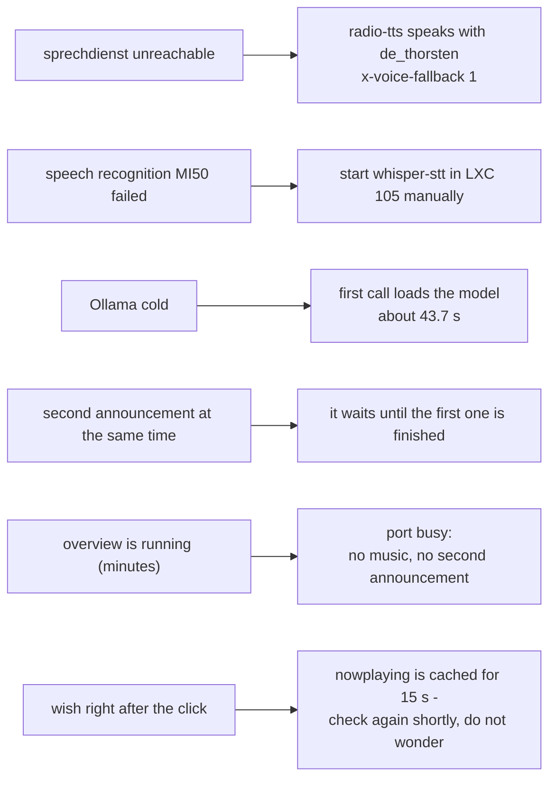

---

### Tables

#### Addresses

| Service | Address | Purpose |

| --- | --- | --- |

| n8n | `http://192.168.178.53:5678` | the workflows (web: `YOUR-N8N-HOST`) |

| radio-tts | `http://192.168.178.53:8881` | speech, announcement, catalog, lists, mailbox, search |

| sprechdienst | `http://192.168.178.116:10205` | the voice YOUR-VOICE (`/tts`, `/health`) |

| whisper-amd (MI50) | `http://192.168.178.188:8000` | speech recognition (`/transcribe`) |

| Ollama | `http://192.168.178.187:11434` | speech model `qwen3.6:27b` |

| AzuraCast | `http://192.168.178.33` | station: API, web; Icecast `:8000`, DJ harbor `:8005` |

| SearXNG | `http://192.168.178.26:8888` | web search for overview |

#### Check (one command per image)

| Image | Command |

| --- | --- |

| A1/A2 | `ssh -F …/proxmox-ssh/config ai-server "pct exec 103 -- docker exec n8n n8n list:workflow"` |

| A3–A6 | `BETRIEB.md` §2 (end-to-end via the test input) |

| A5 | `curl -s http://192.168.178.188:8000/health` |

| A6/B2–B4 | `curl -s http://192.168.178.53:8881/health` and `curl -s http://192.168.178.116:10205/health` |

| B2 | `ssh … "pct exec 103 -- docker exec radio-tts env \| grep -E 'TTS_\|LIVE_'"` |

| C1 | `ssh … "pct exec 105 -- nvidia-smi"` (occupancy of 3090 Ti) |

| C2 | `ssh … "pct exec 103 -- docker logs --since 1h radio-tts \| grep -i own voice"` |

---

### Where the Stories Behind Them Are

| Topic | File |

| --- | --- |

| Structure and Decisions | `HANDBUCH.md` |

| Build Chronicle (v1 to v19) | `BAU.md` |

| The Voice YOUR-VOICE (values, listening tests, discarded paths) | `STIMME.md` |

| Cloning a Voice from a Series (Guide) | `STIMME.md` |

| All Interfaces | `HANDBUCH.md` |

| Test Runs | `BETRIEB.md` |

| Disturbances and Backup Paths | `BETRIEB.md` |

## Interfaces

All addresses used or offered by the bot. As of 2026-09-21 (version 11).

**Basic Rule:** Everything that changes needs the header `X-Meldung-Schluessel` (value in `<dokuordner>/NACHBAU/zugangsdaten/meldung-schluessel.txt`). Only
status addresses and public sender addresses come without a key.

---

### 17. Service `radio-tts` — `http://192.168.178.53:8881`

#### 1.1 Language and Announcements

| Address | Input | Effect |
| --- | --- | --- |
| `POST /v1/audio/speech` | `{input\|text, voice, response_format: mp3\|wav, speed}` | OpenAI-compatible: generates speech (without `voice` = default `deine-stimme`, otherwise Piper voice) with volume adjustment |
| `POST /live` | `{input\|text, voice, speed, host, port, mount, user, password, name, schweigen, schweigen_ende}` | **speaks live into the sender** (DJ Harbor Port 8005), in broadcast rhythm, with Vor-/Nachlaufstille |
| `GET /v1/audio/voices` | — | available voices |
| `GET /v1/models`, `GET /health` | — | control |

The default voice is since 2026-09-23 the **own moderation voice `deine-stimme`** (external
conversion voice on the GPU machine, `http://192.168.178.116:10205/tts`; creation:
`STIMME.md`). If it is not reachable, the service speaks instead with
`de_thorsten` (`EIGENE_STIMME_ERSATZ`; then `/v1/audio/speech` reports the header
`X-Stimme-Ersatz: 1`). Further German Piper voices remain selectable (short names in
`dienst/main.py`); `GET /v1/audio/voices` lists `deine-stimme` as an external entry.

**Length:** An announcement may be up to **9000 characters** long — that is about **8.5 minutes**
of speaking time (measured: about 1050 characters per minute with the current +40% version). The service broadcasts in **broadcast rhythm**, a
`/live`- or `/ansage/…`-call therefore takes **as long as the announcement**; callers
need a time span of at least 15 minutes (set up in the bot). An
**overview** is limited to `RECHERCHE_UEBERBLICK_MAX_ZEICHEN` (default 6000 ≈ 5.7 min).

#### 1.2 Mailbox (Messages)

| Address | Input | Effect |
| --- | --- | --- |
| `POST /news/new` | `{news:[{source, type, title, text, url, important, from, to}]}` | deposit message(s); `type`: `weather`, `news`, `rss`, `traffic`, `hinteis`, `musik`, `sonstiges` |
| `GET /meldungen/offen` | `?anzahl=&art=&nur_neue=` | open messages (Radio-Bot picks them up here) |
| `GET /meldungen/alle`, `GET /meldungen/status` | — | stock and counters |
| `GET /meldungen/text/{kennung}` | — | **preview of the speech text** (what the moderator would say) |
| `POST /meldungen/angeboten` | `{ids:[…]}` | mark as presented (no second offer) |
| `POST /meldungen/erledigt` | `{ids:[…], grund: gesagt\|verworfen\|abgelaufen]` | conclude; response contains Telegram text and keyboard |
| `POST /meldungen/aufraeumen` | — | remove old messages |
| `POST /ansage/meldung` | `{id, trocken, stimme, speed}` | speak message live (`trocken: true` = only generate) |
| `POST /ansage/text` | `{text, trocken, stimme, speed}` | speak free text live |
| `GET /ansage/status` | — | last announcements |

#### 1.3 Research (Weather, News, Feeds, Short Info)

| Address | Input | Effect |
| --- | --- | --- |
| `POST /research` | `{art: wetter\|nachrichten\|rss\|wikipedia\|ueberblick, wort, themen, quellen, ansagen, wichtig, trocken, quelle}` | fetches the information, deposits it as a message, and speaks it immediately at `ansagen: true` |
| `POST /research` with `art=ueberblick` | `{art: "ueberblick", themen: "ki, raumfahrt", quellen: "heise golem", ansagen: true}` | searches for **each topic** headlines (Google News), background (Wikipedia), web search **hits** (page is opened) and matching messages from **21 feeds**; length depends on material, safety limit `RECHERCHE_UEBERBLICK_MAX_ZEICHEN` (default 6000). Without `themen` the latest messages from the sources are provided |
| `GET /recherche/feeds` | — | all sources, types, and overview settings (`quellen`, `quellen_mit_themen`, `themen`, `thema_presse/web/wiki/feed`, `websuche`, `searx_url`, `webseiten`, `wetter_ort`) |

Response: `ok, id, art, titel, text, sprechtext, gesagt, dauer_sekunden, antwort`.
Unknown location → **404**, unknown type → **422** (with clear message).

Sources (without key, without foreign libraries):
Weather = `geocoding-api.open-meteo.com` + `api.open-meteo.com`;
Presse/Fachfeeds = **21 addresses** (tagesschau, tagesschau-wirtschaft, heise, heise-security,
spiegel, deutschlandfunk, n-tv, faz, welt, tagesspiegel, taz, mdr, swr, golem, netzpolitik,
t3n, computerbase, scinexx, ingenieur, sportschau, wetter);
Topic Press = Google News (`news.google.com/rss/search?q=…`, also finds pages without feed);
Short Info = Wikipedia REST **and** Wikipedia Search (`action=query&list=search`, finds the exact
article title — the introduction interface needs it exactly);
Web Search = **own SearXNG instance** (`RECHERCHE_SEARX_URL`, here LXC 108 on
`http://192.168.178.26:8888`, setup: `NACHBAU/searxng-einrichten.md`), otherwise
DuckDuckGo lite, otherwise Bing
(the found page is read: title, description, paragraphs — via `html.parser`;
interface help like `visually-hidden`/`aria-hidden` and title symbols in `<svg><title>` are
filtered out).
Own pages without feed can be listed as `RECHERCHE_WEBSEITEN` (comma-separated);
they are included in every overview.

The **Overview** works per **topic**: Headlines, Wikipedia background,
web search including **read page** and relevant feed entries. Each topic has
`RECHERCHE_THEMA_MELDUNGEN` slots reserved (default **6**); the news gets up to `RECHERCHE_THEMA_PRESSE` (default 3) — but only
as many as leave one slot each for Wikipedia (`RECHERCHE_THEMA_WIKI`), web (`RECHERCHE_THEMA_WEB`), and feeds (`RECHERCHE_THEMA_FEED`).
Otherwise, the headlines (which do not carry full text) would displace the content.
A topic without content is not announced. There is no time limit: the length is
determined by the material. If a source is unavailable, it is mentioned under `ausgefallen`
and skipped ("Source had nothing on the topic" is not an outage). For **weather**,
Open-Meteo is used (location from `RECHERCHE_WETTER_ORT`), because public weather feeds return 404.
Measured on 2026-09-21 (`topics: artificial intelligence`): news 3, wiki 1, web 1
(page read), 1341 characters, 79 s speaking time; live via the bot
(`themen: raumfahrt`): "Overview read (1.3 min, 3 from the news, with background, 1 from the web)".

#### 1.4 Catalog Service (Search in Archive)

| Address | Input | Effect |
| --- | --- | --- |
| `GET /suche` | `?q=&anzahl=&min_punkte=` | fuzzy, typo-tolerant search (48,729 titles) |
| `GET /genre` | `?wort=&anzahl=&mischen=` | Richtung/Stimmung/Jahrzehnt |
| `GET /genre/liste` | — | valid direction words |
| `GET /katalog/kuenstler` | — | most frequent interpreters (for speech recognition) |
| `GET /katalog/status` | — | index status |
| `POST /katalog/aktualisieren` | — | rebuild index (~47 s) |

#### 1.5 Playlists

| Address | Input | Effect |
| --- | --- | --- |
| `POST /playlist/befehl` | `{text}` | Playlist command in words (create, fill, show, rename, clear, delete, start) |
| `POST /playlist/knopf` | `{daten, text}` | Button press (`callback_data`) |
| `POST /playlist/vorschlag` | `{text}` | Suggestion for a playlist |
| `GET /playlist/status` | — | open choices per chat |

---

### 18. AzuraCast Station — `http://192.168.178.33/api`

The bot uses the official REST interface (OpenAPI 3, **263 endpoints**).
Complete specification: `GET /api/openapi.yml`, user interface `/api/docs`.
Key in the head `X-API-Key: <identifier>:<verifier>`.

Important addresses for the bot:

| Address | Purpose |
| --- | --- |
| `GET /api/nowplaying/1` | what's playing, what's next, listeners, `is_live` (15 s cached) |
| `GET /api/station/1/files?searchPhrase=…&rowCount=…` | search titles in the archive (**words are linked with AND**) |
| `PUT /api/station/1/files/batch` | `{"do":"immediate"\|"queue"\|"playlist"\|"move", …}` — play, queue, fill playlist, move |
| `POST /api/station/1/playlist/{id}/import`, `DELETE …/playlist/{id}/empty`, `DELETE …/playlist/{id}` | fill/clear/delete playlists |
| `GET/POST/PUT /api/station/1/playlist(s)`, `/streamers`, `/mounts`, `/remotes`, `/webhooks`, `/reports`, `/queue`, `/history`, `/requests` | station management |
| `POST /api/admin/debug/sync/{NowPlaying,QueueInterruptingTracks,…}` | internal synchronization |
| `PUT /api/admin/debug/station/1/telnet` | Liquidsoap command (e.g., `interrupting_requests.flush_and_skip`) |
| `GET /api/admin/{stations,users,roles,settings,backups,relays,storage-locations,auditlog}` | management |

**Live moderation** does not run via the API but through the **DJ Harbor**
port **8005**, mount `/` — there the service `radio-tts` speaks into it, using
a **dedicated streamer account `deine-stimme`** (display name **"YOUR-VOICE"**; access in
`geheim.env`). The station displays the display name of the account when speaking,
so **"YOUR-VOICE"** instead of my name. Icecast frontend for listeners: port **8000**.

---

### 19. Speech Recognition — `http://192.168.178.188:8000`

| Address | Input | Effect |
| --- | --- | --- |
| `POST /transcribe` | multipart: `file`, `language` (default **de**), `prompt` | text of the speech message (**whisper.cpp large-v3 on the MI50**, LXC 112 — since 2026-09-23) |
| `GET /health` | — | status |

The `prompt` is a hint field (most frequent artists from the catalog) — this ensures that names like "Nirvana" or "Die Ärzte" are reliably recognized. The previous service (faster-whisper large-v3, LXC 105, Port **18790**) has been switched off since the move and is available as a fallback option (`pct exec 105 -- systemctl start whisper-stt`).

---

### 20. Language Model — `http://192.168.178.187:11434/v1`

| Address | Input | Effect |
| --- | --- | --- |
| `POST /v1/chat/completions` | `{model, messages, temperature, max_tokens, reasoning_effort: "none", tools?}` | Plan, Execute, Check |

Model `qwen3.6:27b` (17.7 GB, RTX 3090 Ti). Other models in the container:
`qwen2.5:14b`, `qwen3-coder:30b`, `gemma4:26b`, `phi4:14b`, `llama3.1:8b`,
`qwen3-embedding:8b`.

Important: `reasoning_effort: "none"` and a token budget (3000/4000) — otherwise the model will consume the budget with thought tokens and respond with an empty answer.

---

### 21. Bot Test Input (for verification only)

```
POST http://192.168.178.53:5678/webhook/YOUR-WEBHOOK-PATH?key=<key>
Body: a Telegram message as JSON, e.g.
{"message":{"message_id":1,"chat":{"id":<chatId>,"type":"private"},
            "from":{"id":<chatId>,"first_name":"Test"},"text":"what is playing"}}
or a button press:
{"callback_query":{"id":"1","data":"w1","from":{"id":<chatId>},
                   "message":{"message_id":9,"chat":{"id":<chatId>,"type":"private"}}}}
```

This allows all paths to be tested without real Telegram (see `BETRIEB.md`).
