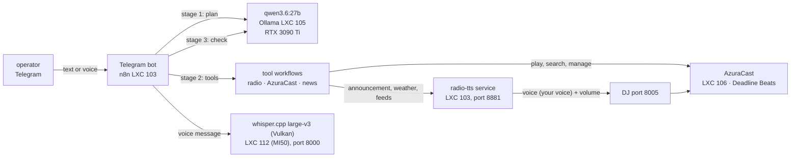

# AI Radio Moderator Bot — "Deadline Beats"

Complete documentation of the bot that controls the internet radio station **Deadline Beats** via Telegram, moderates the ongoing program, and can fetch content from the internet.

**Bilingual:** the bot understands **German and English** messages in one chat and answers in the language of the request — shortcuts, tool lists, model replies and announcements. Content (news, weather) remains German.

> **Date:** 2026-09-25 · The station and bot are running continuously.
> **Everything lives in this folder** — documentation, service sources
> (`service/`), tools (`tools/`) and the rebuild guide (`REBUILD/`).
>
> **Edition for sharing:** all credentials are placeholders (German and English,
> **without any third-party voice or voice data**).
>
> **Website:** <https://www.deadlinedriven.dev/>
>
> **Project repository:** <https://github.com/Nr44suessauer/deadline-beats-radio-bot>
>
> **English edition:** this folder is the English version of the documentation. The
> German original lives in the parent folder, and the German workflows are the ones in
> operation.
>
> **License:** MIT — anyone may use, modify and redistribute this bot and its
> documentation (see `../../LICENSE`). The training material of the own voice is excluded
> (see `DOCS/VOICE.md`, section 14). The English copies of the seven n8n workflows (display texts translated,
> provided for reading and as a template) are in `REBUILD/running-workflows/`;
> the illustrated guide with English screenshots is `APPENDIX/n8n-interface.html`.

---

## Structure & Rebuild in Brief

This project is organised so that for the rebuild you only need to follow **one folder**:

| Folder / file | What it contains |
| --- | --- |
| **`README.md`** (this file) | Entry point, usage, system overview — and this guide |
| **`REBUILD/`** | **the rebuild guide** (`REBUILD/README.md`) with all setup documents, templates and the credentials overview |
| **`DOCS/`** | the four volumes: `DOCS/MANUAL.md` (all technical details), `DOCS/OPERATIONS.md` (daily operation, troubleshooting, tests), `DOCS/BUILD.md` (build history, versions), `DOCS/VOICE.md` (the “YOUR-VOICE” voice and cloning) |
| **`APPENDIX/`** | appendix: n8n interface (HTML booklet), canvas layout, images, development documents (`APPENDIX/entwicklung/`) |
| **`service/`** | the speech service `radio-tts`: all modules, Dockerfile, Compose, `whisper/` and `whisper-amd/` |
| **`tools/`** | the bot's workshop: build and import workflows, checks, images and documentation (`tools/docs/`), plus `playlist/`, `news/`, `tempo/`, `aufraeumen/` |
| **`EN/`** | this English edition (same structure) |

**Rebuild in 8 steps** (each step detailed in `REBUILD/README.md`):

1. **Set up the `radio-tts` service** — announcements, catalogue, lists, inbox (`service/`)
2. **Speech models on the GPU machine** — Ollama + Whisper (`REBUILD/voices-and-models.md`)
3. **Start n8n** — two ways (LXC or Docker)
4. **Import the workflows** — builder creates bot + 3 tools (`tools/`)
5. **Set up the station** — AzuraCast, DJ harbour (`REBUILD/station-setup.md`)
6. **Import the music archive** — pull tracks into the station
7. **Run the checks** — test runs (`DOCS/OPERATIONS.md` and `REBUILD/README.md` §4)
8. **Own announcer voice (optional)** — `REBUILD/own-voice/`

Prerequisites, order, all commands: **`REBUILD/README.md`**.

---

## 1. What the Bot Is

A Telegram bot that **handles everything** at the station:

* **Music** — song requests, mood requests, queue, skip, pause, restart
* **Moderation** — announcements in **live speech** directly into the ongoing broadcast (reading weather, news, feeds, short updates)
* **Research** — weather, news feeds, RSS sources, Wikipedia on demand
* **Playlists** — search, build, fill, rename, start, delete
* **Station Management** — over 260 addresses of the AzuraCast interface (stations, users, roles, settings, reports, streamers, backups …)
* **Voice Messages** — I speak, the bot system understands

Everything runs on dedicated hardware, without cloud services (the speech models run on the local GPU, the internet search is handled by a **custom SearXNG instance** in LXC 108).

---

## 2. How to Use It

I write to the bot in Telegram — in normal sentences, spoken or typed, one or more tasks per message:

| What to Write | What Happens |
| --- | --- |
| "play Benzin by Rammstein" | Plays immediately (the radio stops briefly and switches) |
| "then something by Nirvana" | Queues behind the current track |
| "overview ai, space travel" · "topics: ai, space travel" · "overview from heise and golem" | **Topic Overview**: For each mentioned topic, the bot searches for headlines (press), reads background information (Wikipedia) **and a page from the web** (via the **custom search engine** in LXC 108) and relevant feed updates — **as long as there is material** (no time limit) |
| "play something lively" | Mood request — the bot selects the first matching track |
| "what is playing" | Status: current track, next track, listener count |
| "next title" / "pause" / "restart the station" | Fixed control, without speech model |
| "create a playlist Summer with rock and play it" | Create, fill, start — with confirmation |
| "search for the weather for Marbach am Neckar" | Research **and** announcement in the program |
| "read the news aloud" | Fetch current news and read them on the radio |
| "what news is there" | List inbox (without announcement) |
| "play Hyper Hyper and search for the weather for Marbach" | **Two** tasks in one message: play track immediately, weather after it is ready |
| "play Benzin and then Hyper Hyper, play something lively, what is playing" | **Batch Command**: up to **10 tasks** in one message, in order; the **first** track plays immediately, **subsequent tracks automatically queued** |
| Voice message "play me something by Michael Jackson" | Understood, searched, selection with buttons |
| "what can the radio do" / Management questions | The bot accesses the station interface and responds |

**Response Times** (measured): Short commands **0.3–1.7 s**, agent paths (administration, research with announcement) **20–60 s**. A title request starts immediately, the announcement follows once it is ready. An overview first collects (press, web, feeds) and then speaks **as long as the found content takes**: measured 0.4 min for a topic with two headlines, 1.5 min for two topics, 2.4 min for three topics — during this time, no music plays.

Before the bot makes any **changes** (playlists, users, settings), it presents them for confirmation — only after "yes" does it proceed. Announcements in the program only occur if explicitly stated.

---

## 3. System Overview

| Component | Location | Task |
| --- | --- | --- |
| **n8n** v2.34.6 | LXC 103, `192.168.178.53:5678` | the bot itself: Telegram input, step logic, tools, send |
| **Service `radio-tts`** | LXC 103, Port **8881** | speech output (own voice `deine-stimme`, Piper selectable), live announcements, catalog search, playlists, mailbox, research |
| **AzuraCast** 0.23.4 | LXC 106 on `192.168.178.163`, Web `http://192.168.178.33` | the station: Icecast + Liquidsoap + AutoDJ |
| **Ollama** | LXC 105 on `192.168.178.187:11434` | speech model `qwen3.6:27b` for planning, execution, verification |
| **whisper.cpp** large-v3 (Vulkan) | LXC 112 on `ai-server`, `192.168.178.188:8000` | speech-to-text (GPU, MI50) |

**Own announcer's voice:** There is an own moderation voice (transformation voice "YOUR-VOICE", service **`sprechdienst`** on the GPU machine, CT 111, Port **10205**). By default, the bot speaks with the stable Piper voice (`TTS_DEFAULT_VOICE=de_thorsten`); **your own voice** is used only on explicit request ("… with your own voice"). If the voice service is unreachable, the bot continues with the default voice — no announcement falls out. **In the station, it appears as the streamer "YOUR-VOICE"** (own bot account `deine-stimme`, so the operator's name is not displayed). Origin, values, and replication: `DOCS/VOICE.md` + `REBUILD/own-voice/`; the general guide for each series: `DOCS/VOICE.md`.

**Station:** *Deadline Beats*, station identifier `deadline_beats`, stream `http://192.168.178.33/listen/deadline_beats`, rotation = playlist "List A" (72 titles), wish pool = the entire archive.

---

## 4. Documentation — where to find what

| File | Content |
| --- | --- |
| **`README.md`** (this file) | Introduction, capabilities in brief, system overview |
| **`DOCS/MANUAL.md`** | **Capabilities, architecture, diagrams, interfaces** — complete catalogue (example phrases, timings, limits), stages 0–3, 13 diagrams, all HTTP interfaces |
| **`DOCS/OPERATIONS.md`** | **Operations, troubleshooting, testing** — deploy, back up, monitor; known pitfalls; every test run with invocation and expectation |
| **`DOCS/BUILD.md`** | **Build & versions** — how the bot was built (chronicle, method, tools, decisions) and what the individual versions added |
| **`DOCS/VOICE.md`** | **Voice** — how the “YOUR-VOICE” host voice was created (values, checks, discarded paths) and how to clone any voice (scripts in `REBUILD/own-voice/`) |
| `APPENDIX/LAYOUT.md` | generated overview of the workspace (each node with purpose) |
| `APPENDIX/ablauf-bot-*.png` | flow diagrams (overview, input, execution) |
| `APPENDIX/` | appendix: n8n booklet, canvas, images and the development documents (`APPENDIX/entwicklung/`) |
| **`REBUILD/`** | the **rebuild guide** with setup documents and the credentials overview |
| `service/` · `tools/` | service sources and workshop (see above) |

---

## 5. Can the Bot be rebuilt from this folder?

**Yes** — except for the music archive, the model and voice files, and the station database,
which cannot be sensibly placed in a folder. The access credentials are now included
(`REBUILD/credentials/`, Section 6).
Everything needed is in `REBUILD/`:

| Required for rebuilding | Located in | Notes |
| --- | --- | --- |
| Flows (Bot 83 nodes + 3 tools) | **ready**: `REBUILD/running-workflows/` · **to rebuild**: `tools/agent-wf-build.py` | ready exports for exact restoration; the creator builds them alternatively (test: 0 findings) |
| Service `radio-tts` (6 modules, Dockerfile, Compose) | `service/` | Compose template with `docker compose config` verified |
| Operation, build, and test tools (over 100 files) | `tools/` | including all test runs |
| Voices (Piper) | `REBUILD/fetch-voices.sh` | loads the 4 voices; **checksums identical** with the running system |
| Personal voice (RVC) | **`REBUILD/own-voice/`** | Instructions + **all scripts**; dataset and model are generated from personal media collection (not in folder, Section 6) |
| Language model (Ollama) + Speech recognition (Whisper) | `REBUILD/voices-and-models.md` + `service/whisper/` | Models are loaded by their tools (17.7 GB / 3 GB) |
| Setting up stations | `REBUILD/station-setup.md` | Station, Mount, Streamer, Wishes, Rotation |
| Infrastructure (containers, ports, systemd) | `REBUILD/environment.md` | Roles, ports, unit files |
| Credentials | `REBUILD/credentials/` (values) + `credentials.md` (instructions) | **now in the folder** — be careful when sharing |
| Step-by-step instructions | `REBUILD/README.md` | from "empty machine" to "test" |

**What cannot be in the folder:**

1. **The music archive** — the content itself. The bot adapts
   to any personal archive (new catalog index).
2. **The model and voice binary files** (200 MB voices, 17.7 GB language model,
   3 GB Whisper) — too large; sources and download commands are described.
3. **The station database** (playlists, users, history) — rebuild via `station-setup.md` or import
   from an AzuraCast backup.

**Files with identifiers** (e.g. `tools/moderator-import.json`,
`agent-fassung-2026-09-19.json`) stay outside git for security reasons and live only
on the disk (permissions 600) — for an exact copy of the **running** state, take them
from there.

---

## 6. Where the credentials are located

**They are in this folder:** `REBUILD/credentials/` (directory 700,
files 600) with `OVERVIEW.md`, which file contains which value and where it belongs during
rebuilding.

> **Note:** This folder contains secrets. Do not copy it to a public
> repository, cloud, or chat. For sharing without secrets, omit `REBUILD/credentials/` — the instructions
> for regenerating them are then in `REBUILD/credentials.md`.

| Access | File in folder |
| --- | --- |
| Telegram bot token | `credentials/telegram-bot-token.txt` |
| Operator chat IDs | `credentials/telegram-chat-ids.txt` |
| inbox key (`X-News-Key`) | `credentials/meldung-schluessel.txt` (+ `…-container.txt`) |
| Key of test input | `credentials/bot-test-schluessel.txt` |
| AzuraCast: web login, stream, DJ access, API key | `credentials/azuracast-zugang.txt` (+ `api_key.txt`, `dj_passwort.txt`, `bot_streamer_passwort.txt`) |
| Service configuration (DJ port, volume) | `credentials/secret.env` |
| n8n interface, project ID | `credentials/n8n-zugang.txt` |
| SSH management access (Datenserver/Container) | `credentials/ssh/` |

In addition, `REBUILD/running-workflows/` contains the **exports of the running
processes** — these include Telegram tokens and sender keys (therefore 600). They
are the basis for the **exact** restoration; alternatively, `tools/agent-wf-build.py` reconstructs the processes
with new access values.

Not reconstructible (only hash stored): the password for the n8n interface and the
AzuraCast web account — both can be reset, the commands are in
`credentials/n8n-zugang.txt` and `credentials/OVERVIEW.md`.

---

## 7. In a sentence

The bot listens (Telegram, also spoken), understands (its own language model), acts
(via the sender interface and its own speech service), **speaks itself** during the running
program (real voice, adjusted to send volume) and reports what it has done — with
follow-up questions if something is ambiguous or changing.
