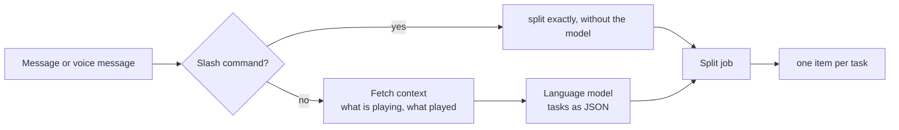

# Language model in the radio bot (Ollama on the 3090 Ti)

As of: 2026-09-19

The bot understands free text and voice messages with a **language model**. This is what
makes several jobs in one sentence, quantities ("three songs") and references to what is
playing ("two more of those") possible — things a word list cannot do.

## Service

| | |
| --- | --- |
| Location | LXC **105** "ollama.nvidia" on the ai-server (**192.168.178.187**), port **11434** |
| Graphics | RTX 3090 Ti (24 GB) |
| Model | **`qwen2.5:14b`** (~9 GB), response time 0.5–0.7 s in operation |
| Call | `POST /api/chat` with `format: "json"`, `temperature: 0.1`, `keep_alive: "30m"` |

More models in the container: `qwen3-coder:30b`, `gemma4:26b`, `phi4:14b`, `llama3.1:8b`,
`qwen3-embedding:8b` and others. The Whisper server **`whisper-stt`** (`POST /transcribe`, port
18790) and ComfyUI (8188) also run on the same card.

### Speech recognition in the same container

> **Since 2026-09-23** the bot's speech recognition runs via the **MI50** (LXC 112 "whisper-amd",
> `http://192.168.178.188:8000/transcribe`, whisper.cpp `large-v3` with Vulkan, same interface)
> — setup and test tools: `service/whisper-amd/`. Switching = the address `sprache.adresse` in the
> n8n workflow "Configuration". The service below remains as the **fallback path**.

| | |
| --- | --- |
| Service | `whisper-stt.service` → `/usr/bin/python3 /root/whisper-stt/whisper_server.py --port 18790 --model large-v3` |
| Model | **`large-v3`** (faster-whisper, `int8_float16` on CUDA, ~2.9 GB on disk) |
| Interface | `POST /transcribe` (multipart) with `file`, `language` (default `de`), `prompt`; response `{text, language}` |
| Check | `curl -s http://192.168.178.187:18790/health` → `{"status":"ok","model":true,"device":"cuda"}` |

The `prompt` is a domain hint for proper names; both services (here and on the MI50)
support it — the bot currently sends none. `language` was once set to auto detection and
is now fixed to `de`; short German sentences were otherwise occasionally recognised as English.

Changes to the service (script and unit live **in the container**, not in the repo):

```bash
ssh -F $CFG ai-server "pct exec 105 -- bash -lc '
  cp /root/whisper-stt/whisper_server.py /root/whisper-stt/whisper_server.py.bak
  cat > /root/whisper-stt/whisper_server.py'" < service/whisper/whisper_server.py
# Load the model file beforehand (one-off, ~3 GB):
#   python3 -c "from huggingface_hub import snapshot_download; snapshot_download('Systran/faster-whisper-large-v3')"
ssh -F $CFG ai-server "pct exec 105 -- bash -lc 'systemctl restart whisper-stt'"
```

The copy in the repo is at `service/whisper/whisper_server.py`.

## How the bot uses it



* The **system hint** is built when the workflow is generated and contains: the allowed
  commands (`play`, `wish`, `genre`, `search`, `now`, `last`, `help`), the field description
  with `anzahl`, the **45 most frequent artists** of the archive (`/catalog/artists`) and the
  direction words (`/genre/list`). This way there is only one source for both lists.
* The **request** contains the context: "now playing: … (direction: …)" and the last
  title beginnings. This is how the model resolves "of those", "the same artist", "again".
* The answer is always JSON: `{"aufgaben":[{"befehl":"wunsch","interpret":"…","anzahl":3}]}`.
  Unusable answers, timeouts and an unreachable service lead to the
  **fallback path**: free text counts as a music request, direction words are recognised — the bot
  still carries it out.
* The tasks become **individual items**; each of them then passes through search, rating,
  wish list or immediate list, and answer.

## Keeping it warm

Ollama unloads the model after 30 minutes without a call. The next message then waits ~25 s
(model loading). The schedule (every 10 minutes) therefore sends a tiny call
(`Wake model`, `num_predict: 1`, `keep_alive: "30m"`). This permanently occupies around **10 GB of graphics memory**.
If you need it for something else: remove the node — the first message after a
pause will then be slow.

## Checking

```bash
# Models and service
curl -s http://192.168.178.187:11434/api/version
curl -s http://192.168.178.187:11434/api/ps        # what is loaded right now?

# Behaviour of the bot (several tasks, quantities, context)
cat tools/context2-test.sh | ssh -F $CFG ai-server "pct exec 103 -- bash -s -- $SCHLUESSEL"
cat tools/speech2-test.sh | ssh -F $CFG ai-server "pct exec 103 -- bash -s -- $SCHLUESSEL"

# what a single run did in detail
docker exec -u node n8n node /tmp/zaehlen.js <execution>
docker exec -u node n8n node /tmp/feld.js <execution> "Split job" anzahl
```

## Pitfalls from the build

* **`format: "json"` is not enough.** The model can still write text around it; the
  node `Split job` therefore cuts out the JSON part and checks the fields.
* **The quantity is often missing.** "several" yields 3, "a few" 2, "many" 6 — as a number or as a word.
  The bot recalculates this (`alsZahl`) and limits it to 1…10.
* **Misheard names** (`Ure mehrere Ärzten`, `Ben Zim Rammstein`) are mapped by the model via the
  artist list; the catalog service's fuzzy search checks afterwards.
* **A model is no substitute for checks.** All statements from the answer are checked against the
  allowed commands and fields before anything is played.
