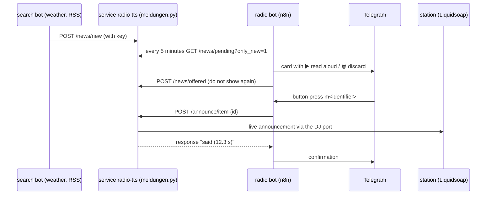

# News inbox (messages for the radio bot)

Tools, test runs and the deploy path for the **news inbox** of the radio bot:
the search bot delivers messages (weather, news, RSS, traffic, notes), the bot
offers them in Telegram, speaks them on air on release — and can research new
items on request.

The logic itself lives in **`../../dienst/meldungen.py`** and runs in the
service `radio-tts` (LXC 103, port 8881). The radio bot only uses these
addresses; the search bot needs to know nothing else.

## Looking is not reading aloud

Questions about the inbox ("what news is there", "what is in the inbox") are
answered by the bot **without a language model** in the pre-stage `Short?`: it
fetches `GET /news/pending` and answers with the list — explicitly **without**
an announcement. Reason: when the question went to the model, it took
"news" for news and let a message speak on the radio unasked (measured 45 s
instead of 0.4 s, 2026-09-20). To speak, one has to say so ("read the news
aloud", "read *title* aloud") — then it goes via `POST /research` or
`POST /announce/item`. Test run: `bash ../kurz-test.sh` (19 cases).

## The path of a message



## Research on request (weather, news, feeds, short info)

The operator does not have to wait for a foreign bot: they can have something
searched directly in Telegram — the bot fetches it, files it as a message and
speaks it on the radio.

```
POST /research
{"type": "weather", "word": "Marbach am Neckar", "announce": true, "dry": false}
```

| Field | Meaning |
| --- | --- |
| `type` | `weather`, `news`, `rss` or `wikipedia` |
| `word` | place (weather), keyword (wikipedia), feed URL or short name (rss) |
| `announce` | `true` = speak on air right away (default), `false` = only file it |
| `dry` | `true` = only create the spoken text, send nothing |
| `important` | message is kept at the front of the list |

Sources: **Open-Meteo** (weather, with place search), **RSS feeds** of German
news sites (short names: `tagesschau`, `heise`, `spiegel`, `deutschlandfunk`,
`sport`, `wetter` — or any feed URL) and the **Wikipedia introduction** for
short info. All free and without a key.

In the bot the agent uses the tool **`research`** for this (job type `research`
in the analysis). Examples it knows:

| Sentence | Result |
| --- | --- |
| "search for the weather for Marbach am Neckar" | fetch weather **and announce it** |
| "read the news aloud" | announce the top news item |
| "search for the weather for X, but do not read it aloud" | only file it (`announce=false`) |
| "play Hyper Hyper by Scooter and search for the weather for Marbach am Neckar" | song plays immediately, then the weather announcement |

Check:

```bash
python3 19-meldungen-test.py     # contains the research samples (dry)
```

## Depositing a message

```
POST http://192.168.178.53:8881/news/new
Header: X-News-Key: <key from /daten/meldung-schluessel.txt>
Content-Type: application/json
```

```json
{
  "source": "wetterdienst",
  "type": "weather",
  "title": "Weather Berlin",
  "text": "Today 18°C, later rain at 70 % probability.",
  "url": "https://example.org/weather",
  "important": false,
  "from_": "suchbot",
  "to": ""
}
```

| Field | Meaning |
| --- | --- |
| `type` | `weather`, `news`, `rss`, `traffic`, `hint`, `music`, `misc` — determines the intro ("And now a look at the weather.") |
| `title` | short, only read aloud if it is not already in the text |
| `text` | **required**. Is prepared for speech (see below) |
| `important` | important messages stay at the front of the list (and are marked in the card) |
| `source`, `from_`, `url` | information only, the `url` is **not** read aloud |
| `to` | free for a validity (currently not evaluated) |

Several messages at once also work:

```json
{"news": [ { "type": "weather", "text": "…" }, { "type": "rss", "text": "…" } ]}
```

Response: `{"ok": true, "recorded": [{"id": "m260920-0018", …}], "open": 3}`

## All addresses

| Address | Purpose |
| --- | --- |
| `POST /news/new` | deposit message(s) (search bot) |
| `GET /news/pending?count=5&only_new=1&type=` | open messages (radio bot) |
| `GET /news/all?count=&status=` | all messages (control) |
| `GET /news/text/<identifier>` | preview: **what the moderator would speak** |
| `POST /news/offered` | `{"ids": ["m…"]}` — remember as offered |
| `POST /news/done` | `{"ids": ["m…"], "reason": "said\|discarded\|expired"}` |
| `POST /news/cleanup?days=7` | throw away done messages |
| `POST /announce/item` | `{"id": "m…", "dry": false}` — speak live |
| `POST /announce/text` | `{"text": "…", "dry": false}` — speak free text |
| `GET /news/status` | counters, open list, live access (**without key**) |
| `GET /announce/status` | the latest announcements (**without key**) |

Everything except `/news/status` and `/announce/status` requires the header
`X-News-Key`. Without it the answer is HTTP 403.

`dry: true` only creates the audio and states length and text — **nothing goes
on air**.

## What belongs in the text?

The service prepares the text for speech:

- **Links, markdown and emojis are dropped** (`https://…`, `**bold**`, `🌧️`).
- **Abbreviations are written out** (e.g. → for example, vs. → versus,
  approx. → approximately, no. → number).
- **Units are spoken** (°C → degrees, % → percent, km/h → kilometers per hour).
- **Overly long texts are cut at the last sentence boundary** (default 700 characters).

Therefore for the search bot: send text as detailed as you like — the
announcement still sounds like a moderator, not like a reader. `GET /news/text/<identifier>`
shows beforehand exactly what would be spoken.

## Example (Python, no dependencies)

`22-suchbot-beispiel.py` in this folder is a runnable example: it deposits a
weather and a feed message and shows the preview of the spoken text.

```bash
python3 22-suchbot-beispiel.py --dry      # only file it, speak nothing
```

For a bot in n8n an **HTTP request node** is enough: `POST`, JSON body, and the
header `X-News-Key`. An example for a weather fetch:

```
1. HTTP request: https://api.open-meteo.com/v1/forecast?latitude=…&longitude=…&current=temperature_2m
2. Code node: build { "type": "weather", "title": "Weather <place>", "text": "…18 degrees…" } from it
3. HTTP request: POST http://192.168.178.53:8881/news/new  →  done
```

The radio bot takes care of everything else (offer in Telegram, announcement
after release, confirmation).

## Checking and deploying

```bash
cd ../../werkzeuge/meldungen
python3 19-meldungen-test.py            # service: text preparation and all paths
python3 19-meldungen-test.py --live     # additionally a real announcement on air
python3 21-bot-meldungen-test.py        # bot: buttons, tool, release
python3 21-bot-meldungen-test.py --live --warten   # with announcement and waiting for the schedule
python3 23-lautstaerke-test.py          # volume of the voice (calculates + asks the service)
python3 24-live-pegel.py                # test announcement + recording: measure voice against music
bash 18-live-zugang-setzen.sh           # enter the announcement account (YOUR-VOICE) into the service configuration
```

Deploying the service module (from `werkzeuge/`):

```bash
bash dienst-einspielen.sh      # copies main.py, katalog.py, playlist.py, meldungen.py + Dockerfile
```

## Pitfalls

- **Addresses in the tool description**: the agent only learns the addresses from
  its tool description — if you change routes, adjust the description too.
- **403 instead of 404**: a wrong key reports HTTP 403; a wrong route reports
  404. That helps when searching for mistakes.
- **`dry` in production**: the schedule calls `POST /research` with
  `dry: false` — for tests use `true`, otherwise something goes on air
  immediately.
- **Cleanup**: `POST /news/cleanup` only removes done messages (default: older
  than 7 days). Open messages stay.
- **Cache**: `/api/nowplaying` on the station is cached for 15 s — shortly
  after an announcement it may still show the old state. Not an error.
