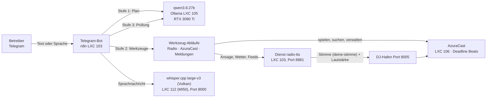

# KI-Radio-Moderator-Bot — „Deadline Beats“

Vollständige Dokumentation des Bots, der den Internetradiosender **Deadline Beats**
per Telegram steuert, im laufenden Programm moderiert und sich Inhalte aus dem Netz
holen kann.

> **Stand:** 2026-09-25 · Sender und Bot laufen im Dauerbetrieb.
> **Alles liegt in diesem Ordner** — Dokumentation, Dienstquellen (`dienst/`),
> Werkzeuge (`werkzeuge/`) und die Nachbau-Anleitung (`NACHBAU/`).
>
> **Fassung zum Weitergeben:** alle Zugangswerte sind Platzhalter (deutsch und
> englisch, **ohne fremde Stimme und ohne Stimmdaten**).
>
> **Zweisprachig:** der Bot versteht **deutsche und englische** Nachrichten in
> einem Chat und antworten in der Sprache der Frage.
>
> **Webseite:** <https://www.deadlinedriven.dev/>
>
> **Projekt-Repository:** <https://github.com/Nr44suessauer/deadline-beats-radio-bot>
>
> **Englische Fassung:** dieselbe Doku gibt es in `EN/` — Anleitung, Bilder und
> englische Ablauf-Kopien (die deutschen Abläufe bleiben die im Betrieb).
>
> **Lizenz:** MIT — jeder darf diesen Bot und diese Dokumentation nutzen, ändern und
> weitergeben (siehe `../LICENSE`). Ausgenommen bleibt das Trainingsmaterial der eigenen
> Stimme (siehe `DOKU/STIMME.md`, Abschnitt 14).

---

## Aufbau & Nachbau in Kürze

Dieses Projekt ist so sortiert, dass du für den Nachbau **nur einem Ordner** folgen musst:

| Ordner / Datei | Was darin steht |
| --- | --- |
| **`README.md`** (diese Datei) | Einstieg, Bedienung, Systemüberblick — und dieser Wegweiser |
| **`NACHBAU/`** | **die Anleitung zum Nachbauen** (`NACHBAU/README.md`) mit allen Einrichtungs-Dokumenten, Vorlagen und der Zugangsdaten-Übersicht |
| **`dienst/`** | der Sprachdienst `radio-tts`: alle Module, Dockerfile, Compose, `whisper/` und `whisper-amd/` |
| **`werkzeuge/`** | die Werkstatt des Bots: Abläufe bauen und einspielen, prüfen, Bilder und Doku erzeugen (`werkzeuge/doku/`), dazu `playlist/`, `meldungen/`, `tempo/`, `aufraeumen/` |
| **`DOKU/`** | die vier Bände: `DOKU/HANDBUCH.md` (alles Technische), `DOKU/BETRIEB.md` (Alltag, Störungen, Tests), `DOKU/BAU.md` (Baugeschichte, Fassungen), `DOKU/STIMME.md` (Stimme „DEINE-STIMME“ und Klonen) |
| **`ANHANG/`** | Beilagen: n8n-Oberfläche als HTML-Heft, Zeichenflächen-Anordnung, Bilder, Entwicklungsdokumente (`ANHANG/entwicklung/`) |
| **`EN/`** | dieselbe Sammlung auf Englisch (gleicher Aufbau) |

**Nachbau in 8 Schritten** (jeder Schritt ausführlich in `NACHBAU/README.md`):

1. **Dienst `radio-tts` aufsetzen** — Ansagen, Katalog, Listen, Postfach (`dienst/`)
2. **Sprachmodelle auf der GPU-Maschine** — Ollama + Whisper (`NACHBAU/stimmen-und-modelle.md`)
3. **n8n starten** — zwei Wege (LXC oder Docker)
4. **Abläufe einspielen** — Erzeuger bauen Bot + 3 Werkzeuge (`werkzeuge/`)
5. **Sender einrichten** — AzuraCast, DJ-Hafen (`NACHBAU/sender-einrichten.md`)
6. **Musikarchiv einlesen** — Titel in den Sender holen
7. **Alles prüfen** — Prüfläufe (`DOKU/BETRIEB.md` und `NACHBAU/README.md` §4)
8. **Eigene Sprecherstimme (optional)** — `NACHBAU/eigene-stimme/`

Voraussetzungen, Reihenfolge, alle Befehle: **`NACHBAU/README.md`**.

---

## 1. Was der Bot ist

Ein Telegram-Bot, der **alles** am Sender übernimmt:

* **Musik** — Titelwünsche, Stimmungswünsche, Warteschlange, skip, Pause, Neustart
* **Moderation** — Ansagen in **echter Sprache** live in den laufenden Sendebetrieb
  (Vorlesen von Wetter, Nachrichten, Feeds, Kurzinfos)
* **Recherche** — Wetter, Nachrichten-Feeds, RSS-Quellen, Wikipedia auf Zuruf
* **Wiedergabelisten** — suchen, bauen, füllen, umbenennen, starten, löschen
* **Senderverwaltung** — über 260 Adressen der AzuraCast-Schnittstelle (Anlagen,
  Nutzer, Rollen, Einstellungen, Berichte, Streamer, Sicherungen …)
* **Sprachnachrichten** — ich spreche, das Bot-System versteht

Alles läuft auf eigener Hardware, ohne Cloud-Dienste (die Sprachmodelle laufen auf
der eigenen GPU, die Suche im Netz übernimmt eine **eigene SearXNG-Instanz** in LXC 108).

---

## 2. Wie man ihn bedient

Ich schreibe dem Bot in Telegram — in normalen Sätzen, gesprochen oder
getippt, eine oder mehrere Aufgaben pro Nachricht — **deutsch oder englisch**,
der Bot antwortet in der Sprache der Frage:

| Was man schreibt | Was passiert |
| --- | --- |
| „spiele Benzin von Rammstein" | läuft sofort (Radio verstummt kurz und wechselt) |
| „danach was von Nirvana" | wird hinter das Laufende eingereiht |
| „überblick ki, raumfahrt" · „themen: ki, raumfahrt" · „überblick aus heise und golem" | **Themen-Überblick**: zu jedem genannten Thema sucht der Bot Schlagzeilen (Presse), liest Hintergrund (Wikipedia) **und eine Seite aus dem Netz** (über die **eigene Suchmaschine** in LXC 108) und dazu passende Meldungen der eigenen Feeds — **so lang, wie es Material gibt** (keine Zeitangabe) |
| „mach mal was Peppiges" | Stimmungswunsch — der Bot wählt den ersten passenden Titel |
| „was läuft gerade" | Zustand: laufender Titel, danach, Hörerzahl |
| „nächster Titel" / „pause" / „sender neu starten" | feste Steuerung, ohne Sprachmodell |
| „lege eine Wiedergabeliste Sommer mit Rock an und spiele sie" | anlegen, füllen, starten — mit Rückfrage |
| „suche nach dem Wetter für Marbach am Neckar" | Recherche **und** Ansage im Programm |
| „lies die Nachrichten vor" | aktuelle Nachricht holen und im Radio vorlesen |
| „was gibt es für Meldungen" | Postfach auflisten (ohne Ansage) |
| „spiele Hyper Hyper und suche nach dem Wetter für Marbach" | **zwei** Aufgaben in einer Nachricht: Titel sofort, Wetter, sobald es fertig ist |
| „spiele Benzin und danach Hyper Hyper, mach was Peppiges, was läuft" | **Sammelbefehl**: bis zu **10 Aufgaben** in einer Nachricht, der Reihe nach; der **erste** Titel läuft sofort, **weitere Titel automatisch danach** |
| Sprachnachricht „spiele mir was von Michael Jackson" | verstanden, gesucht, Auswahl mit Knöpfen |
| „was kann das Radio überhaupt" / Verwaltungsfragen | der Bot ruft die Sender-Schnittstelle auf und antwortet |

**Antwortzeiten** (gemessen): Kurzbefehle **0,3–1,7 s**, Agentenwege (Verwaltung,
Recherche mit Ansage) **20–60 s**. Ein Titelwunsch läuft sofort los, die Ansage folgt,
sobald sie fertig ist. Ein Überblick sammelt erst (Presse, Netz, Feeds) und spricht dann
**so lange, wie das Gefundene hergibt**: gemessen 0,4 Min für ein Thema mit zwei
Schlagzeilen, 1,5 Min für zwei Themen, 2,4 Min für drei Themen — in dieser Zeit läuft
keine Musik.

Bevor der Bot etwas **verändert** (Wiedergabelisten, Nutzer, Einstellungen), legt er
es zur Bestätigung vor — erst nach „ja" führt er es aus. Ansagen im Programm passieren
nur, wenn man es ausdrücklich sagt.

---

## 3. Systemüberblick

| Baustein | Wo | Aufgabe |
| --- | --- | --- |
| **n8n** v2.34.6 | LXC 103, `192.168.178.53:5678` | der Bot selbst: Telegram-Eingang, Stufenlogik, Werkzeuge, Sende |
| **Dienst `radio-tts`** | LXC 103, Port **8881** | Sprachausgabe (eigene Stimme `deine-stimme`, Piper wählbar), Live-Ansage, Katalogsuche, Wiedergabelisten, Postfach, Recherche |
| **AzuraCast** 0.23.4 | LXC 106 auf `192.168.178.163`, Web `http://192.168.178.33` | der Sender: Icecast + Liquidsoap + AutoDJ |
| **Ollama** | LXC 105 auf `192.168.178.187:11434` | Sprachmodell `qwen3.6:27b` für Planen, Ausführen, Prüfen |
| **whisper.cpp** large-v3 (Vulkan) | LXC 112 auf `ai-server`, `192.168.178.188:8000` | Sprachnachrichten in Text (GPU, MI50) |

**Eigene Sprecherstimme:** Es gibt eine eigene
Moderationsstimme (Wandlungsstimme „DEINE-STIMME", Dienst **`sprechdienst`** auf der GPU-Maschine,
CT 111, Port **10205**). Standardmäßig spricht der Bot mit der
stabilen Piper-Stimme (`TTS_DEFAULT_VOICE=de_thorsten`); die **eigene Stimme** wird nur
auf ausdrücklichen Wunsch verwendet („… mit eigener Stimme"). Ist der Stimmendienst
nicht erreichbar, spricht der Bot mit der Standardstimme weiter — eine Ansage fällt
nicht aus. **Im Sender erscheint sie beim Sprechen als Streamer „DEINE-STIMME“** (eigenes
Bot-Konto `deine-stimme`, damit nicht der Betreibername angezeigt wird). Entstehung, Werte und
Nachbau: `DOKU/STIMME.md` + `NACHBAU/eigene-stimme/`; die allgemeine Anleitung für jede
Serie: `DOKU/STIMME.md`.

**Sender:** *Deadline Beats*, Senderkennung `deadline_beats`, Stream
`http://192.168.178.33/listen/deadline_beats`, Rotation = Wiedergabeliste „List A"
(72 Titel), Wunschpool = das gesamte Archiv.

---

## 4. Dokumentation — wohin für was

| Datei | Inhalt |
| --- | --- |
| **`README.md`** (diese Datei) | Einstieg, Fähigkeiten in Kurzform, Systemüberblick |
| **`DOKU/HANDBUCH.md`** | **Fähigkeiten, Architektur, Diagramme, Schnittstellen** — vollständiger Katalog (Beispielsätze, Zeiten, Grenzen), Stufen 0–3, 13 Bilder, alle HTTP-Schnittstellen |
| **`DOKU/BETRIEB.md`** | **Betrieb, Störungen, Testen** — einspielen, sichern, überwachen; bekannte Fallstricke; alle Prüfläufe mit Aufruf und Erwartung |
| **`DOKU/BAU.md`** | **Bau & Fassungen** — wie der Bot gebaut wurde (Chronologie, Bauweise, Werkzeuge, Entscheidungen) und was die einzelnen Fassungen brachten |
| **`DOKU/STIMME.md`** | **Stimme** — wie die eigene Moderationsstimme „DEINE-STIMME“ entstand (Werte, Prüfungen, verworfene Wege) und wie man jede Stimme klont (Skripte in `NACHBAU/eigene-stimme/`) |
| `ANHANG/ANORDNUNG.md` | erzeugte Übersicht der Zeichenfläche (jeder Knoten mit Zweck) |
| `ANHANG/ablauf-bot-*.png` | Bilder des Ablaufs (Übersicht, Eingang, Ausführung) |
| `ANHANG/` | Beilagen: n8n-Heft, Zeichenfläche, Bilder und die Entwicklungsdokumente (`ANHANG/entwicklung/`) |
| **`NACHBAU/`** | die **Anleitung zum Nachbauen** samt Einrichtungs-Dokumenten und Zugangsdaten-Übersicht |
| `dienst/` · `werkzeuge/` | Dienstquellen und Werkstatt (siehe oben) |

---

## 5. Kann man den Bot aus diesem Ordner nachbauen?

**Ja** — bis auf das Musikarchiv, die Modell-/Stimmendateien und die Senderdatenbank,
die man nicht sinnvoll in einen Ordner legen kann. Die Zugangsdaten liegen inzwischen mit
drin (`NACHBAU/zugangsdaten/`, Abschnitt 6).
Alles Nötige steht in `NACHBAU/`:

| Für den Nachbau nötig | Liegt in | Anmerkung |
| --- | --- | --- |
| Abläufe (Bot 83 Knoten + 3 Werkzeuge) | **fertig**: `NACHBAU/ablaeufe-laufend/` · **zum Neubauen**: `werkzeuge/agent-wf-bauen.py` | fertige Exporte für die exakte Wiederherstellung; der Erzeuger baut sie alternativ neu (Probe: 0 Befunde) |
| Dienst `radio-tts` (6 Module, Dockerfile, Compose) | `dienst/` | Compose-Vorlage mit `docker compose config` geprüft |
| Betriebs-, Bau- und Prüfwerkzeuge (über 100 Dateien) | `werkzeuge/` | inkl. aller Prüfläufe |
| Stimmen (Piper) | `NACHBAU/stimmen-holen.sh` | lädt die 4 Stimmen; **Prüfsummen identisch** mit dem laufenden System |
| Eigene Sprecherstimme (RVC) | **`NACHBAU/eigene-stimme/`** | Anleitung + **alle Skripte**; Datensatz und Modell entstehen aus dem eigenen Medienbestand (nicht im Ordner, Abschnitt 6) |
| Sprachmodell (Ollama) + Spracherkennung (Whisper) | `NACHBAU/stimmen-und-modelle.md` + `dienst/whisper/` | Modelle werden von ihren Werkzeugen geladen (17,7 GB / 3 GB) |
| Sender einrichten | `NACHBAU/sender-einrichten.md` | Station, Mount, Streamer, Wünsche, Rotation |
| Infrastruktur (Container, Ports, systemd) | `NACHBAU/umgebung.md` | Rollen, Ports, Unit-Dateien |
| Zugangsdaten | `NACHBAU/zugangsdaten/` (Werte) + `zugangsdaten.md` (Anleitung) | **liegen jetzt im Ordner** — Vorsicht beim Weitergeben |
| Schritt-für-Schritt-Anleitung | `NACHBAU/README.md` | von „leere Maschine" bis „prüfen" |

**Was nicht im Ordner sein kann:**

1. **Das Musikarchiv** — der Inhalt selbst. Der Bot passt sich
   jedem eigenen Archiv an (Katalogindex neu bauen).
2. **Die Modell- und Stimmen-Binärdateien** (200 MB Stimmen, 17,7 GB Sprachmodell,
   3 GB Whisper) — zu groß; Quellen und Ladebefehle sind beschrieben.
3. **Die Senderdatenbank** (Wiedergabelisten, Nutzer, Verlauf) — über
   `sender-einrichten.md` neu aufbauen oder aus einer AzuraCast-Sicherung einspielen.

**Dateien mit Kennungen** (z. B. `werkzeuge/moderator-import.json`,
`agent-fassung-2026-09-19.json`) bleiben aus Sicherheitsgründen außerhalb des Git und
liegen nur auf der Platte (Rechte 600) — wer den **laufenden** Zustand exakt kopieren
will, nimmt sie von dort.

---

## 6. Wo die Zugangsdaten liegen

**Sie liegen in diesem Ordner:** `NACHBAU/zugangsdaten/` (Verzeichnis 700,
Dateien 600) mit `UEBERSICHT.md`, welche Datei welchen Wert enthält und wohin er beim
Nachbau gehört.

> **Achtung:** damit enthält dieser Ordner Geheimnisse. Nicht in ein öffentliches
> Repository, eine Cloud oder einen Chat kopieren. Für eine Weitergabe ohne
> Geheimnisse `NACHBAU/zugangsdaten/` weglassen — die Anleitung zum Neuerzeugen
> steht dann in `NACHBAU/zugangsdaten.md`.

| Zugang | Datei im Ordner |
| --- | --- |
| Telegram-Bot-Token | `zugangsdaten/telegram-bot-token.txt` |
| Betreiber-Chat-IDs | `zugangsdaten/telegram-chat-ids.txt` |
| Postfach-Schlüssel (`X-Meldung-Schluessel`) | `zugangsdaten/meldung-schluessel.txt` (+ `…-container.txt`) |
| Schlüssel des Testeingangs | `zugangsdaten/bot-test-schluessel.txt` |
| AzuraCast: Web-Login, Stream, DJ-Zugang, API-Schlüssel | `zugangsdaten/azuracast-zugang.txt` (+ `api_key.txt`, `dj_passwort.txt`, `bot_streamer_passwort.txt`) |
| Dienst-Konfiguration (DJ-Hafen, Lautstärke) | `zugangsdaten/geheim.env` |
| n8n-Oberfläche, Projektkennung | `zugangsdaten/n8n-zugang.txt` |
| SSH-Verwaltungszugang (Datenserver/Container) | `zugangsdaten/ssh/` |

Zusätzlich enthält `NACHBAU/ablaeufe-laufend/` die **Exporte der laufenden
Abläufe** — auch darin stecken Telegram-Token und Sender-Schlüssel (deshalb 600). Sie
sind die Grundlage für die **exakte** Wiederherstellung; alternativ baut
`werkzeuge/agent-wf-bauen.py` die Abläufe mit eigenen Zugangswerten neu.

Nicht rekonstruierbar (nur Hash gespeichert): das Passwort der n8n-Oberfläche und des
AzuraCast-Webkontos — beides lässt sich zurücksetzen, die Befehle stehen in
`zugangsdaten/n8n-zugang.txt` bzw. `zugangsdaten/UEBERSICHT.md`.

---

## 7. In einem Satz

Der Bot hört zu (Telegram, auch gesprochen), versteht (eigenes Sprachmodell), handelt
(über die Sender-Schnittstelle und einen eigenen Sprachdienst), **spricht selbst** im
laufenden Programm (echte Stimme, auf Sendelautstärke gebracht) und berichtet, was er
getan hat — mit Rückfragen, wenn etwas mehrdeutig oder verändernd ist.
