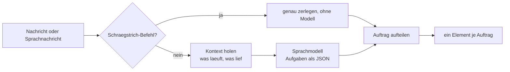

# Sprachmodell im Radiobot (Ollama auf der 3090 Ti)

Stand: 2026-09-19

Der Bot versteht freien Text und Sprachnachrichten mit einem **Sprachmodell**. Damit werden
mehrere Aufträge in einem Satz, Mengen („drei Lieder“) und Bezüge auf das Laufende
(„davon noch zwei“) möglich — Dinge, die eine Wortliste nicht kann.

## Dienst

| | |
| --- | --- |
| Ort | LXC **105** „ollama.nvidia“ auf dem ai-server (**192.168.178.187**), Port **11434** |
| Grafik | RTX 3090 Ti (24 GB) |
| Modell | **`qwen2.5:14b`** (~9 GB), Antwortzeit 0,5–0,7 s im Betrieb |
| Aufruf | `POST /api/chat` mit `format: "json"`, `temperature: 0.1`, `keep_alive: "30m"` |

Weitere Modelle im Container: `qwen3-coder:30b`, `gemma4:26b`, `phi4:14b`, `llama3.1:8b`,
`qwen3-embedding:8b` und andere. Es läuft außerdem der Whisper-Server **`whisper-stt`** (`POST /transcribe`, Port
18790) und ComfyUI (8188) auf derselben Karte.

### Spracherkennung im selben Container

> **Seit 2026-09-23** läuft die Spracherkennung des Bots über die **MI50** (LXC 112 „whisper-amd“,
> `http://192.168.178.188:8000/transcribe`, whisper.cpp `large-v3` mit Vulkan, dieselbe Schnittstelle)
> — Einrichtung und Prüfwerkzeuge: `dienst/whisper-amd/`. Umschalten = Adresse `sprache.adresse` im
> n8n-Ablauf „Konfiguration“. Der Dienst hier unten bleibt als **Ausweichweg**.

| | |
| --- | --- |
| Dienst | `whisper-stt.service` → `/usr/bin/python3 /root/whisper-stt/whisper_server.py --port 18790 --model large-v3` |
| Modell | **`large-v3`** (faster-whisper, `int8_float16` auf CUDA, ~2,9 GB auf der Platte) |
| Schnittstelle | `POST /transcribe` (multipart) mit `file`, `language` (Standard `de`), `prompt`; Antwort `{text, language}` |
| Kontrolle | `curl -s http://192.168.178.187:18790/health` → `{"status":"ok","model":true,"device":"cuda"}` |

Der `prompt` ist ein Fachhinweis für Eigennamen; beide Dienste (hier und auf der MI50)
unterstützen ihn — der Bot schickt derzeit keinen mit. `language` stand früher auf Autokennung und
ist jetzt fest `de`; kurze deutsche Sätze wurden sonst gelegentlich als Englisch erkannt.

Änderungen am Dienst (Skript und Einheit liegen **im Container**, nicht im Repo):

```bash
ssh -F $CFG ai-server "pct exec 105 -- bash -lc '
  cp /root/whisper-stt/whisper_server.py /root/whisper-stt/whisper_server.py.bak
  cat > /root/whisper-stt/whisper_server.py'" < dienst/whisper_server.py
# Modelldatei vorher laden (einmalig, ~3 GB):
#   python3 -c "from huggingface_hub import snapshot_download; snapshot_download('Systran/faster-whisper-large-v3')"
ssh -F $CFG ai-server "pct exec 105 -- bash -lc 'systemctl restart whisper-stt'"
```

Die Kopie im Repo liegt unter `dienst/whisper_server.py`.

## Wie der Bot es benutzt



* Der **Systemhinweis** wird beim Erzeugen des Arbeitsablaufs gebaut und enthält: die erlaubten
  Befehle (`sofort`, `wunsch`, `genre`, `suche`, `jetzt`, `letzte`, `hilfe`), die Feldbeschreibung
  mit `anzahl`, die **45 häufigsten Interpreten** des Archivs (`/katalog/kuenster`) und die
  Richtungswörter (`/genre/liste`). So gibt es nur eine Quelle für beide Listen.
* Die **Anfrage** enthält den Kontext: „Jetzt läuft: … (Richtung: …)“ und die letzten
  Titelanfänge. Damit löst das Modell „davon“, „der gleiche Interpret“, „nochmal“ auf.
* Die Antwort ist immer JSON: `{"aufgaben":[{"befehl":"wunsch","interpret":"…","anzahl":3}]}`.
  Unbrauchbare Antworten, Zeitüberschreitungen und ein nicht erreichbarer Dienst führen zum
  **Rückfallweg**: freier Text gilt als Musikwunsch, Richtungswörter werden erkannt — der Bot
  führt trotzdem aus.
* Die Aufgaben werden zu **einzelnen Elementen**; jedes läuft danach durch Suche, Bewertung,
  Wunschliste bzw. Sofortliste und Antwort.

## Warmhalten

Ollama entlädt das Modell nach 30 Minuten ohne Aufruf. Die nächste Nachricht wartet dann ~25 s
(Modell laden). Der Zeitplan (alle 10 Minuten) schickt deshalb einen winzigen Aufruf
(`Modell wecken`, `num_predict: 1`, `keep_alive: "30m"`). Das belegt rund **10 GB Grafikspeicher**
dauerhaft. Wer ihn für anderes braucht: Knoten entfernen, dann ist die erste Nachricht nach einer
Pause langsam.

## Prüfen

```bash
# Modelle und Dienst
curl -s http://192.168.178.187:11434/api/version
curl -s http://192.168.178.187:11434/api/ps        # was ist gerade geladen?

# Verhalten des Bots (mehrere Auftraege, Mengen, Kontext)
cat werkzeuge/kontext2-test.sh | ssh -F $CFG ai-server "pct exec 103 -- bash -s -- $SCHLUESSEL"
cat werkzeuge/sprache2-test.sh | ssh -F $CFG ai-server "pct exec 103 -- bash -s -- $SCHLUESSEL"

# was ein Lauf im Einzelnen gemacht hat
docker exec -u node n8n node /tmp/zaehlen.js <ausfuehrung>
docker exec -u node n8n node /tmp/feld.js <ausfuehrung> "Auftrag aufteilen" anzahl
```

## Fallstricke aus dem Bau

* **`format: "json"` genügt nicht.** Das Modell kann trotzdem Text drumherum schreiben; der
  Knoten `Auftrag aufteilen` schneidet darum den JSON-Teil heraus und prüft die Felder.
* **Die Menge fehlt oft.** „mehrere“ ergibt 3, „ein paar“ 2, „viele“ 6 — als Zahl oder als Wort.
  Der Bot rechnet das nach (`alsZahl`) und begrenzt auf 1…10.
* **Verhörte Namen** (`Ure mehrere Ärzten`, `Ben Zim Rammstein`) ordnet das Modell über die
  Interpretenliste zu; die unscharfe Suche des Katalogdienstes prüft danach nach.
* **Ein Modell ist kein Ersatz für Prüfungen.** Alle Angaben aus der Antwort werden gegen die
  erlaubten Befehle und Felder geprüft, bevor etwas gespielt wird.
