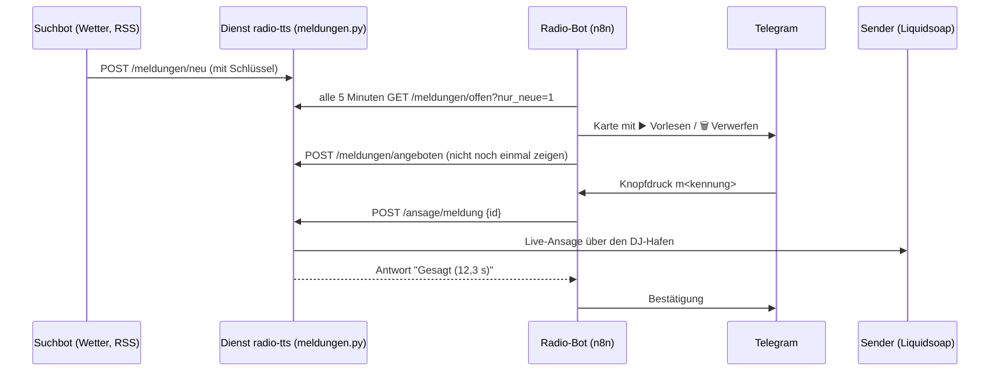

# Meldungen von außen: Schnittstelle für den Suchbot

Der Radio-Bot hat ein **Postfach**. Ein anderer Bot („Suchbot": Wetter, RSS-Feeds,
Nachrichten) legt dort Meldungen ab. Der Radio-Bot holt sie ab, legt sie dem
Betreiber im Telegram mit zwei Knöpfen vor („▶️ Vorlesen" / „🗑️ Verwerfen") und
spricht sie auf Freigabe als **Moderator live in den laufenden Sendebetrieb**
(Piper → MP3 → DJ-Hafen des Senders; danach läuft der AutoDJ weiter).

Alles steckt im Modul **`dienst/meldungen.py`** im Dienst `radio-tts`
(LXC 103, Port 8881). Der Radio-Bot benutzt nur diese Adressen; der Suchbot
braucht nichts weiter zu kennen.

## Nachsehen ist nicht Vorlesen

Fragen nach dem Postfach („was gibt es für Meldungen", „was liegt im Postfach")
beantwortet der Bot **ohne Sprachmodell** in der Vorschaltstufe `Kurz?`: er holt
`GET /meldungen/offen` und antwortet mit der Liste — ausdrücklich **ohne** Ansage.
Grund: lag die Frage beim Modell, hielt es „Meldungen" für Nachrichten und liess
ungefragt eine Nachricht im Radio sprechen (gemessen 45 s statt 0,4 s, 2026-09-20).
Zum Sprechen muss man es sagen („lies die Nachrichten vor", „lies *Titel* vor") —
dann geht es über `POST /recherche` beziehungsweise `POST /ansage/meldung`.
Prüflauf: `bash ../kurz-test.sh` (19 Fälle).

## Der Weg einer Meldung



## Recherche auf Zuruf (Wetter, Nachrichten, Feeds, Kurzinfos)

Der Betreiber muss nicht auf einen fremden Bot warten: er kann im Telegram direkt nach
etwas suchen lassen — der Bot holt es, legt es als Meldung ab und spricht es im Radio.

```
POST /recherche
{"art": "wetter", "wort": "Marbach am Neckar", "ansagen": true, "trocken": false}
```

| Feld | Bedeutung |
| --- | --- |
| `art` | `wetter`, `nachrichten`, `rss`, `wikipedia` oder `ueberblick` (Themen) |
| `wort` | Ort (Wetter), Stichwort (wikipedia), Feed-Adresse oder Kurzname (rss) |
| `ansagen` | `true` = sofort in den Sender sprechen (Standard), `false` = nur ablegen |
| `trocken` | `true` = nur den Sprechtext erzeugen, nichts senden |
| `wichtig` | Meldung wird in der Liste vorn geführt |

Quellen: **Open-Meteo** (Wetter, mit Ortssuche), **RSS-Feeds** deutscher
Nachrichtenseiten (Kurznamen: `tagesschau`, `heise`, `spiegel`, `deutschlandfunk`,
`sport`, `wetter` — oder eine beliebige Feed-Adresse). Der **Themen-Überblick**
(`ueberblick`) nimmt dazu die Presse-Suche (Google News) und Seiten **bekannter
Nachrichten-Anbieter** — ohne Wikipedia-Definitionen und ohne Werbeseiten; die
**Wikipedia-Einleitung** bleibt der Kurzinfo (`wikipedia`) vorbehalten. Alles
kostenlos und ohne Schlüssel.

Im Bot benutzt der Agent dafür das Werkzeug **`recherche`** (Auftragsart `recherche`
in der Analyse). Beispiele, die er kennt:

| Satz | Ergebnis |
| --- | --- |
| „suche nach dem Wetter für Marbach am Neckar" | Wetter holen **und ansagen** |
| „lies die Nachrichten vor" | oberste Nachrichtenmeldung ansagen |
| „suche nach dem Wetter für X, aber lies es nicht vor" | nur ablegen (`ansagen=false`) |
| „spiele Hyper Hyper von Scooter und suche nach dem Wetter für Marbach am Neckar" | Song läuft sofort, danach die Wetteransage |

Prüfen:

```bash
python3 19-meldungen-test.py     # enthält die Recherche-Proben (trocken)
```

## Meldung abgeben

```
POST http://192.168.178.53:8881/meldungen/neu
Kopfzeile: X-Meldung-Schluessel: <Schlüssel aus /daten/meldung-schluessel.txt>
Content-Type: application/json
```

```json
{
  "quelle": "wetterdienst",
  "art": "wetter",
  "titel": "Wetter Berlin",
  "text": "Heute 18°C, später Regen bei 70 % Wahrscheinlichkeit.",
  "url": "https://example.org/wetter",
  "wichtig": false,
  "von": "suchbot",
  "bis": ""
}
```

| Feld | Bedeutung |
| --- | --- |
| `art` | `wetter`, `nachrichten`, `rss`, `verkehr`, `hinweis`, `musik`, `sonstiges` — bestimmt den Vorspann („Und nun der Blick zum Himmel - ich habe für euch nachgesehen.") |
| `titel` | kurz, wird nur vorgelesen, wenn er nicht schon im Text steht |
| `text` | **Pflicht**. Wird fürs Sprechen aufbereitet (siehe unten) |
| `wichtig` | wichtige Meldungen stehen in der Liste vorn (und werden in der Karte gekennzeichnet) |
| `quelle`, `von`, `url` | nur zur Information, die `url` wird **nicht** vorgelesen |
| `bis` | frei für eine Gültigkeit (wird derzeit nicht ausgewertet) |

Mehrere Meldungen auf einmal gehen auch:

```json
{"meldungen": [ { "art": "wetter", "text": "…" }, { "art": "rss", "text": "…" } ]}
```

Antwort: `{"ok": true, "aufgenommen": [{"id": "m260920-0018", …}], "offen": 3}`

## Alle Adressen

| Adresse | Zweck |
| --- | --- |
| `POST /meldungen/neu` | Meldung(en) abgeben (Suchbot) |
| `GET /meldungen/offen?anzahl=5&nur_neue=1&art=` | offene Meldungen (Radio-Bot) |
| `GET /meldungen/alle?anzahl=&status=` | alle Meldungen (Kontrolle) |
| `GET /meldungen/text/<kennung>` | Vorschau: **was der Moderator sprechen würde** |
| `POST /meldungen/angeboten` | `{"ids": ["m…"]}` — als vorgelegt merken |
| `POST /meldungen/erledigt` | `{"ids": ["m…"], "grund": "gesagt\|verworfen\|abgelaufen"}` |
| `POST /meldungen/aufraeumen?tage=7` | erledigte Meldungen wegwerfen |
| `POST /ansage/meldung` | `{"id": "m…", "trocken": false}` — live sprechen |
| `POST /ansage/text` | `{"text": "…", "trocken": false}` — freien Text sprechen |
| `GET /meldungen/status` | Zähler, offene Liste, Live-Zugang (**ohne Schlüssel**) |
| `GET /ansage/status` | die letzten Ansagen (**ohne Schlüssel**) |

Alles außer `/meldungen/status` und `/ansage/status` verlangt die Kopfzeile
`X-Meldung-Schluessel`. Ohne sie kommt HTTP 403.

`trocken: true` erzeugt nur das Audio und nennt Länge und Text — **nichts geht auf
den Sender**.

## Was gehört in den Text?

Der Dienst bereitet den Text fürs Sprechen auf:

- **Links, Markdown und Emojis fliegen raus** (`https://…`, `**fett**`, `🌧️`).
- **Abkürzungen werden ausgeschrieben** (z. B. → zum Beispiel, bzw. → beziehungsweise,
  ca. → circa, Nr. → Nummer).
- **Einheiten werden gesprochen** (°C → Grad, % → Prozent, km/h → Kilometer pro Stunde).
- **Zu lange Texte werden an der letzten Satzgrenze gekürzt** (Standard 700 Zeichen).

Deshalb gilt für den Suchbot: Text ruhig ausführlich schicken — die Ansage klingt
trotzdem wie ein Moderator, nicht wie ein Vorleser. `GET /meldungen/text/<kennung>`
zeigt vorher genau, was gesprochen würde.

## Beispiel (Python, ohne Abhängigkeiten)

`22-suchbot-beispiel.py` in diesem Ordner ist ein lauffähiges Beispiel: es legt eine
Wetter- und eine Feed-Meldung ab und zeigt die Vorschau des Sprechtextes.

```bash
python3 22-suchbot-beispiel.py --trocken      # nur ablegen, nichts sprechen
```

Für einen Bot in n8n genügt ein **HTTP-Request-Knoten**: `POST`, JSON-Körper, und die
Kopfzeile `X-Meldung-Schluessel`. Ein Beispiel für einen Wetterabruf:

```
1. HTTP Request: https://api.open-meteo.com/v1/forecast?latitude=…&longitude=…&current=temperature_2m
2. Code-Knoten: daraus { "art": "wetter", "titel": "Wetter <Ort>", "text": "…18 Grad…" } bauen
3. HTTP Request: POST http://192.168.178.53:8881/meldungen/neu  →  fertig
```

Der Radio-Bot kümmert sich um alles Weitere (Angebot im Telegram, Ansage nach
Freigabe, Bestätigung).

## Prüfen und einspielen

```bash
cd ../../werkzeuge/meldungen
python3 19-meldungen-test.py            # Dienst: Textaufbereitung und alle Wege
python3 19-meldungen-test.py --live     # zusätzlich eine echte Ansage in den Sender
python3 21-bot-meldungen-test.py        # Bot: Knöpfe, Werkzeug, Freigabe
python3 21-bot-meldungen-test.py --live --warten   # mit Ansage und Warten auf den Zeitplan
python3 23-lautstaerke-test.py          # Lautstärke der Stimme (rechnet + fragt den Dienst)
python3 24-live-pegel.py                # Testansage + Mitschnitt: Stimme gegen Musik messen
bash 18-live-zugang-setzen.sh           # Ansage-Konto (DEINE-STIMME) in die Dienstkonfiguration eintragen
```

Einspielen des Dienstmoduls (aus `werkzeuge/`):

```bash
bash dienst-einspielen.sh      # kopiert main.py, katalog.py, playlist.py, meldungen.py + Dockerfile
```

## Fallstricke

- **Der Zeitplan legt jede Meldung nur einmal vor.** Dafür sorgt `angeboten_am`
  (`nur_neue=1`). Angebotene Meldungen bleiben aber `offen`, bis der Betreiber
  entscheidet — sie verfallen nicht.
- **Eine Ansage belegt den Bot 10–30 Sekunden** (Sprechdauer + Vorlauf). Der
  Werkzeugknoten hat dafür 5 Minuten Zeitablauf.
- **Text ohne `art`** wird als `sonstiges` gesprochen (Vorspann „Eine Meldung.").
- **Der Live-Weg braucht den Ansage-Zugang** (`LIVE_*` in `geheim.env` des Dienstes;
  eigenes Bot-Konto `deine-stimme` — im Sender erscheint beim Sprechen „DEINE-STIMME“).
  Fehlt er, antwortet `/ansage/meldung` mit HTTP 503 und einer klaren Meldung.
- **Nichts geht automatisch auf den Sender**: der Dienst spricht nur, wenn er
  ausdrücklich gerufen wird (Knopfdruck des Betreibers oder Werkzeugaufruf des Agenten).
